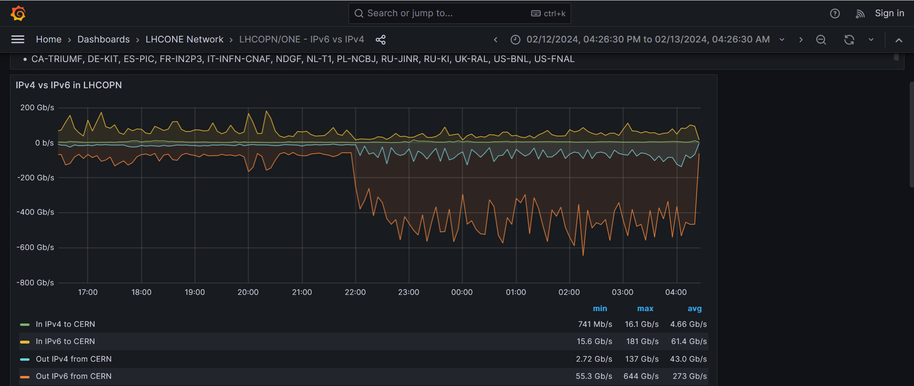

## CERN and the LHC

The [CERN laboratory](https://www.cern.ch) and the
[Worldwide Large Hadron Collide Computing Grid (WLCG)](https://home.cern/science/computing/grid)
are large users of IPv6 for massive data transfers. Some
statistics from early 2024 are shown here:

 

(Image from the February 2024 data challenge at CERN.)

The CERN site itself operates a classical IPv4 and IPv6 dual stack, and
uses DHCPv6 for IPv6 address assignment.

A detailed report on progess towards IPv6-only in the WLCG can be found
[here](https://docs.google.com/presentation/d/1riTdi7zgoJ3ig31Hp-gy4Z089PeKaoRJHALOcvjGn5E/).

<!-- Link lines generated automatically; do not delete -->

### [<ins>Next</ins>](../08.%20Deployment%20Status/08.%20Deployment%20Status.md) [<ins>Top</ins>](07.%20Case%20Studies.md)
