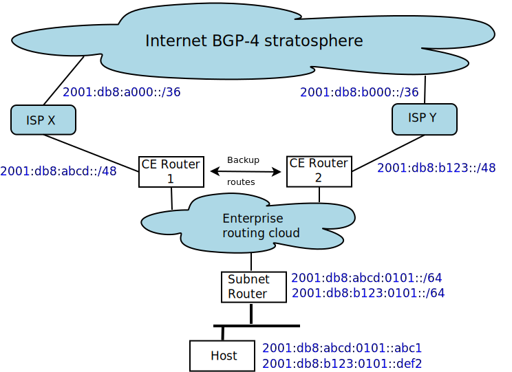

## Multi-prefix operation

As mentioned in [2. Addresses](../2.%20IPv6%20Basic%20Technology/Addresses.md), an IPv6 node may have multiple addresses. A trivial example is a home PC with both an Ethernet and a WiFi interface both connected to the same local segment. As a minimum, it will have two link-local addresses (one for each interface) and two GUA (global unicast addresses), all assigned automatically by SLAAC. In practice, this situation presents no problems: the link-local addresses will not be used for external traffic, and the two GUAs will both be assigned under the home network's IPv6 prefix assigned by its ISP. It is of little importance which of the GUAs a particular outgoing application session uses, because routing is the same for either of them. If the PC is using temporary IPv6 addresses for privacy \[[RFC8981](https://www.rfc-editor.org/info/rfc8981)], they too will be under the same prefix and will present no routing problem.

Similarly, an enterprise network with a single IPv6 prefix (typically a /48) does not have any routing problems as a result of enterprise hosts using multiple GUAs under subnet prefixes derived from that prefix. (An enterprise might have other reasons, such as logging and auditing, for wishing to avoid multiple addresses per host; such an enterprise is likely to use DHCPv6 for address configuration, rather than SLAAC.) However, a problem arises if a network operator wishes to connect to two (or more) different ISPs, each providing its own prefix. Such prefixes are known as PA (provider-assigned or sometimes provider-aggregatable) because they can be summarized into a single BGP-4 route announcement for the ISP as a whole.

Here is an illustrative example. Suppose provider X has obtained the prefix ```2001:db8:a000::/36``` from its regional registry, and provider Y has obtained ```2001:db8:b000::/36```. Suppose our enterprise has then been assigned ```2001:db8:abcd::/48``` from X, and ```2001:db8:b123::/48``` from Y. These prefixes will then flow down to the subnets within the enterprise. We will assume that a particular subnet has been given the prefixes ```2001:db8:abcd:0101::/64``` and ```2001:db8:b123:0101::/64```. Therefore, hosts on that subnet will acquire at least two GUAs, one under each of those prefixes. A particular host, for example, might end up with the addresses ```2001:db8:abcd:0101::abc1``` and ```2001:db8:b123:0101::def2```.

(To make the example more legible, we have not used randomized IID values.)

The following diagram shows the example:

If, for some reason, there is more than one subnet router on the subnet, the host can be informed which one to use as suggested in [RFC8028](https://www.rfc-editor.org/info/rfc8028).

For this to work as intended, it is necessary to configure routing so that traffic from ```2001:db8:abcd:0101::abc1``` exits the site towards ISP X, and traffic from ```2001:db8:b123:0101::def2``` exits towards ISP Y. Suitable source routing rules in the subnet router and the rest of the enterprise routing cloud will do it. Such source routing rules typically have to be set up as routing policies, including the relevant source prefixes, configured on each router by a proprietary mechanism.

But what happens if the link to ISP X goes down? Presumably the reason for having two ISP connections is precisely for backup.

We can configure low priority (high metric) routes between the two exit routers, such that when one ISP link is down, traffic is redirected to the other. However, this may fail if the backup ISP applies ingress filtering \[[BCP84](https://www.rfc-editor.org/info/bcp84)], so the enterprise needs to arrange for its ISPs to accept mutual backup traffic.

If these steps (source routing *and* backup routes *and* filtering exceptions) are not taken, a failure of one of the two ISP connections will cause the failure of all user sessions using addresses under that ISP's PA prefix.

Even with backup routes in place, there may be a problem if user client sessions originating *within* the enterprise use IPv6 source addresses under a failing PA prefix. This will happen unless the host is somehow caused to deprecate such source addresses, so that the algorithm of [RFC6724](https://www.rfc-editor.org/info/rfc6724) will not select them.

This whole topic is discussed in more depth in [RFC8678](https://www.rfc-editor.org/info/rfc8678).

The need for complex configuration and the resulting failure modes explain why many enterprises have not opted for multi-prefix PA-based multihoming. Instead, they have paid to obtain provider-independent (PI) IPv6 prefixes, typically /48 in length, from an Internet registry. However, this is expected to be problematic in the long term, since every such enterprise adds to the size of the Internet-wide BGP-4 routing table. This may be viable for a few thousand enterprises, but not for millions, i.e. not for small businesses or even home offices that might benefit from multihoming.

At the time of writing, the most practical solution for multihoming with multiple providers of IPv6 service (known as MHMP) remains under discussion in the IETF.

Another use case for multiple prefixes is an enterprise (or home) that in addition to its PA or PI prefix, which is routable anywhere on the Internet, also decides to use a Unique Local Address (ULA) prefix for strictly internal communication. Although unfamiliar to most operators, this is conceptually simple and creates a class of traffic that *by definition* cannot escape the site, which has obvious privacy and security attractions. Services that should only be accessed internally could be configured with ULAs *only* and those addresses may be entered in local split-horizon DNS (Section 4 of \[[RFC6950](https://www.rfc-editor.org/info/rfc6950)]). At the time of writing, there is an operational problem in this scenario: host computers configured with default settings from [RFC6724](https://www.rfc-editor.org/info/rfc6724) will not prefer ULAs over IPv4 addresses \[[draft-ietf-v6ops-ula](https://datatracker.ietf.org/doc/draft-ietf-v6ops-ula/)].

<!-- Link lines generated automatically; do not delete -->
### [<ins>Previous</ins>](Security%20operation.md) [<ins>Chapter Contents</ins>](6.%20Management%20and%20Operations.md)
