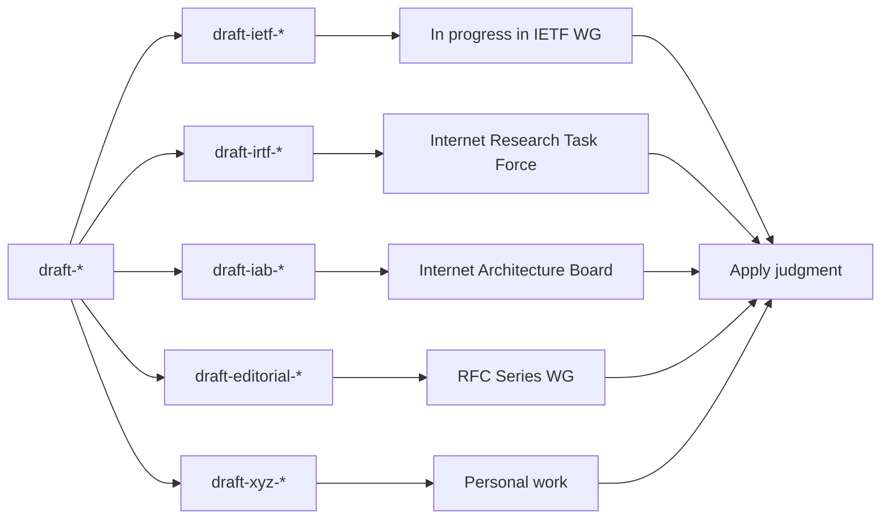

# Further Reading

There are massive amounts of information about IPv6 "out there" on the Internet. Readers should be aware that not all of it is reliable. Very often, it is out of date, because IPv6 was originally designed in the 1990s and the Internet as a whole has evolved a lot since then, and IPv6 has been updated in consequence.

The definitive source of IPv6 standards, best current practices, and other technical information is the *latest* RFCs
(Requests for Comments) from the IETF. RFCs are freely available from the [RFC Editor](https://www.rfc-editor.org/). 

*Warning:* obsolete RFCs are never modified or deleted. It is essential to look at the current status of an RFC before trusting it. For example, the current status of the 2017 version of the main IPv6 standard is shown at [this info page](https://www.rfc-editor.org/info/rfc8200). If an RFC is marked as "Obsoleted by" it should be ignored - look instead at the newer RFC that replaces it. Thus, any reference to RFC 2460 should be treated as a reference to RFC 8200.

Even if not obsoleted, an RFC may be "Updated by" one or more newer RFCs. You need to look at those too.

If an RFC is marked as "Proposed Standard" or "Internet Standard" or "Best Current Practice (BCP)" it is the result of rough consensus in the IETF and is a definitive specification. However, that doesn't override "Obsoleted by" or "Updated by".

If it's marked "Informational", "Experimental", or "Historic", those words mean exactly what they say.

Here's an attempt to explain this with a diagram:

An important RFC is the latest version of [IPv6 Node Requirements](https://www.rfc-editor.org/info/bcp220), which cites numerous other RFCs. However, at the time of this writing, there are already at least 12 more recent IPv6 RFCs from the IETF since the last update of the node requirements. The documents of the main IETF working groups concerned with IPv6 are listed at the [6MAN](https://datatracker.ietf.org/wg/6man/documents/) and [V6OPS](https://datatracker.ietf.org/wg/v6ops/documents/) web pages. Beware of the fact that these pages list unapproved drafts and obsolete RFCs as well as current RFCs.

In a few cases in this book, we refer to unapproved drafts (usually known as Internet-Drafts or I-Ds). Officially, it is inappropriate to use I-Ds as reference material. While sometimes very useful and up-to-date, such drafts do not have the same status as RFCs and should not be relied on as stable documents. They have not been thoroughly reviewed, they may be wrong, and there is a high probability that they will never be published as an RFC. A draft whose file name starts "draft-ietf-" has been adopted by an IETF working group, so it has passed a preliminary review, but it is still a draft, it may still be wrong, and may never become an RFC.

There are also numerous books, book chapters, and other documents about IPv6. Here are some of them:

- [The JANET technical guide to IPv6](https://repository.jisc.ac.uk/8349/1/janet-ipv6-technical-guide.pdf) (2021)

- Olivier Bonaventure's [Computer Networking : Principles, Protocols and Practice](https://beta.computer-networking.info/syllabus/default/protocols/ipv6.html#ip-version-6) (2019)

- ISOC's [IPv6 Security for IPv4 Engineers](https://www.internetsociety.org/resources/deploy360/ipv6/security/ipv4-engineers/) (2019)

- ISOC's [IPv6 Security FAQ](https://www.internetsociety.org/deploy360/ipv6/security/faq/) (2019)

- more TBD

However, any source that is more than one or two years old is likely to be out of date in some aspects, and discuss obsolete deployment options. 
    
<!-- Link lines generated automatically; do not delete -->
### [<ins>Back to main Contents</ins>](../Contents.md)
