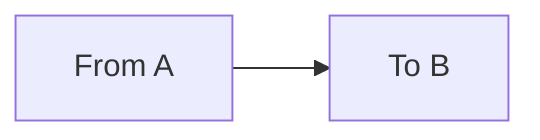

## First Section

This is a section. You can write whatever is needed, including

1. A numbered list.
2. With a few items

Or

- A bullet list.
- With various items.
- Or more.

~~~
Some ASCII
                  
     A   |R)  TTT
    / \  | \   |
~~~

or mermaid art

SVG art is also possible, but needs a separate SVG file in the same directory, and then code like

~~~

~~~

### [<ins>Next</ins>](Another%20Section.md) [<ins>Chapter Contents</ins>](99.%20Chapter%20Template.md)
