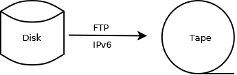

## Markdown Usage

The basics of using the GitHub dialect of markdown are
[here](https://docs.github.com/en/get-started/writing-on-github/getting-started-with-writing-and-formatting-on-github/basic-writing-and-formatting-syntax).
As a general rule, please use the simpler constructs and avoid fancy
formatting.

And don't forget, a separate .md file for each new section in any
chapter of the book.

For some markdown editing tools, flowed text with no line breaks is a
nuisance. Preferably, wrap the text at ~72 characters. makeBook will do
this whenever it needs to write a file back, using the `mdformat` tool.

Web references can be done in basic markdown form, i.e.:

```
  [text](URL)               to refer to any valid URL
```

but a feature adapted from kramdown is also available, e.g.

```
  {{RFC8200}}               to refer to an RFC
  {{BCP198}}                to refer to an IETF Best Current Practice
  {{STD86}}                 to refer to an IETF Internet Standard
  {{I-D.ietf-v6ops-xxx}}    to refer to an Internet Draft
  {{draft-ietf-v6ops-xxx}}  the same!
  {{Last Section}}          to refer to a section in the present chapter
  {{2. Addresses}}          to refer to a section in another chapter  (the single space is required) 
```

Such references will be fixed up by the next run of makeBook, since they
are unknown to GitHub's built-in markdown. There is some checking of the
RFCs, draft names, etc. (but only when makeBook has web access).

*Note 1:* References will be surrounded by square brackets thus:
\[[RFC8200](https://www.rfc-editor.org/info/rfc8200)\]. If you want them
without square brackets for grammatical reasons, such as using
[RFC 8200](https://www.rfc-editor.org/info/rfc8200) as a noun, use
*three* curly brackets:

```
  {{{RFC8200}}}
  {{{2. Addresses}}}
```

*Note 2:* If you string several references together, e.g.,

```
  {{RFC4291}}{{RFC8200}}
```

they will be shown in a single pair of square brackets with commas:
\[[RFC4291](https://www.rfc-editor.org/info/rfc4291),
[RFC8200](https://www.rfc-editor.org/info/rfc8200)\].

Diagrams can be ASCII art when applicable, using `~~~` before and after,
e.g.:

```
   +-+-+-+-+-+-+-+-+-+-+-+-+-+-+-+-+-+-+-+-+-+-+-+-+-+-+-+-+-+-+-+-+
   |Version| Traffic Class |           Flow Label                  |
   +-+-+-+-+-+-+-+-+-+-+-+-+-+-+-+-+-+-+-+-+-+-+-+-+-+-+-+-+-+-+-+-+
   |         Payload Length        |  Next Header  |   Hop Limit   |
   +-+-+-+-+-+-+-+-+-+-+-+-+-+-+-+-+-+-+-+-+-+-+-+-+-+-+-+-+-+-+-+-+
   |                              etc.                             |
```

More complex diagrams may be included using PNG generated by a separate
drawing tool such as [*mermaid*](https://mermaid.live) or
[*dia*](http://dia-installer.de/), with the PNG file also stored here on
GitHub, e.g.:

Source of *mermaid* diagram:

````

````

Embedded in markdown as a PNG file generated by
[*mermaid.live*](https://mermaid.live):

```

```

Displayed thus:


Example generated with *dia*:

```

```


Please add alternate text to help people with visual difficulties.

*Note 3:* Direct use of *mermaid* in markdown source is not recommended,
as it causes difficulty when generating a PDF version of book6.

*Note 4:* Earlier versions of this section recommended SVG format. This
has been removed since SVG causes difficulty when generating a PDF
version of book6.

Existing diagrams in JPG format can be inserted in the same way.

<!-- Link lines generated automatically; do not delete -->

### [<ins>Previous</ins>](Section%20Template.md) [<ins>Next</ins>](Last%20Section.md) [<ins>Chapter Contents</ins>](99.%20Chapter%20Template.md)
