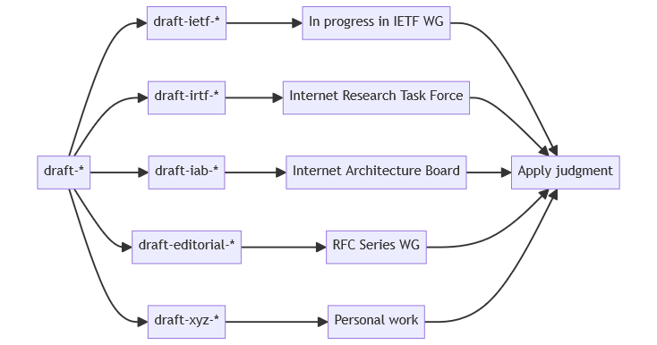
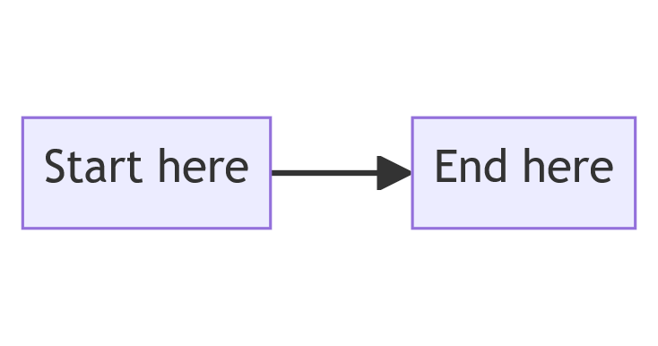

# book6


<ins>A collaborative IPv6 book.<ins>

Editors: Nick Buraglio and Brian E. Carpenter

The PDF edition has ISBN 0-979-8-89269-031-7.

© Copyright 2022 through the timestamp below by the editors and contributors.

Released under the Creative Commons Attribution 4.0 license, known as CC BY 4.0.


Version captured at 2024-09-05 11:09:54 UTC+1200

backslashpagebreak
# book6: A Collaborative IPv6 Book.


This is the current list of contents. It will change as the book evolves.
There is also an [index](#book6-main-index),
and a [citation index](#book6-citation-index).

# List of Contents

[1. Introduction](#introduction-and-foreword)
* [Foreword](#foreword)
* [How to use this book](#how-to-use-this-book)
* [How a user sees IPv6](#how-a-user-sees-ipv6)
* [How an application programmer sees IPv6](#how-an-application-programmer-sees-ipv6)
* [How a network operations center sees IPv6](#how-a-network-operations-center-sees-ipv6)
* [How to keep up to date](#how-to-keep-up-to-date)
* [How to contribute](#how-to-contribute)
* [Acknowledgments](#acknowledgments)
* [Why version 6](#why-version-6)

[2. IPv6 Basic Technology](#ipv6-basic-technology)
* [Packet Format](#packet-format)
* [Addresses](#addresses)
* [Layer 2 functions](#layer-2-functions)
* [Address resolution](#address-resolution)
* [Auto-configuration](#auto-configuration)
* [Managed configuration](#managed-configuration)
* [DNS](#dns)
* [Routing](#routing)
* [Transport protocols](#transport-protocols)
* [Extension headers and options](#extension-headers-and-options)
* [Traffic class and flow label](#traffic-class-and-flow-label)
* [Source and Destination Address Selection](#source-and-destination-address-selection)

[3. Coexistence with Legacy IPv4](#coexistence-with-legacy-ipv4)
* [Dual stack scenarios](#dual-stack-scenarios)
* [Tunnels](#tunnels)
* [Translation and IPv4 as a service](#translation-and-ipv4-as-a-service)
* [Obsolete techniques](#obsolete-techniques)
* [IPv6 primary differences from IPv4](#ipv6-primary-differences-from-ipv4)

[4. Security](#security)
* [Layer 2 considerations](#layer-2-considerations)
* [Filtering](#filtering)
* [Topology obfuscation](#topology-obfuscation)

[5. Network Design](#network-design)
* [Address Planning](#address-planning)

[6. Management and Operations](#management-and-operations)
* [Address and Prefix Management](#address-and-prefix-management)
* [Remote configuration](#remote-configuration)
* [Benchmarking and monitoring](#benchmarking-and-monitoring)
* [Routing operation](#routing-operation)
* [Security operation](#security-operation)
* [Multi-prefix operation](#multi-prefix-operation)
* [Multihoming](#multihoming)
* [Energy consumption](#energy-consumption)
* [Basic Windows commands](#basic-windows-commands)

[7. Case Studies](#case-studies)
* [CERN and the LHC](#cern-and-the-lhc)

[8. Deployment Status](#deployment-status)
* [Status](#status)
* [Deployment by carriers](#deployment-by-carriers)
* [Deployment in the home](#deployment-in-the-home)
* [Deployment in the enterprise](#deployment-in-the-enterprise)

[9. Troubleshooting](#troubleshooting)
* [Advanced Troubleshooting](#advanced-troubleshooting)
* [Tools](#tools)

[20. Further Reading](#further-reading)
* [RFC bibliography](#rfc-bibliography)

[99. Chapter Template](#chapter-template)
* [First Section](#first-section)
* [Section Template](#section-template)
* [Markdown Usage](#markdown-usage)
* [Last Section](#last-section)

backslashpagebreak
# Introduction and Foreword

[Foreword](#foreword)

[How to use this book](#how-to-use-this-book)

[How a user sees IPv6](#how-a-user-sees-ipv6)

[How an application programmer sees IPv6](#how-an-application-programmer-sees-ipv6)

[How a network operations center sees IPv6](#how-a-network-operations-center-sees-ipv6)

[How to keep up to date](#how-to-keep-up-to-date)

[How to contribute](#how-to-contribute)

[Acknowledgments](#acknowledgments)

[Why version 6](#why-version-6)

### [<ins>Back to main Contents</ins>](#list-of-contents)

backslashpagebreak
## Foreword

This book is written and maintained by a team of volunteers, who are all
actively involved as users or providers of IPv6 services. It is their
hope that the book will be useful and up to date as IPv6 usage in the
Internet continues to grow.

### [<ins>Next</ins>](#how-to-use-this-book) [<ins>Top</ins>](#introduction-and-foreword)

backslashpagebreak
## How to use this book

This book is, and we hope always will be, a work in progress. It is
intended for people who plan, deploy, maintain and operate computer
networks using Internet Protocol version 6 (IPv6). It is being written
and updated by exactly such people. IPv6 is a mature protocol but every
day we gain more experience, products are updated, and quite often the
underlying technical standards are updated too. Therefore, this book
will likewise be constantly updated. It's issued under an
[open source license](https://github.com/becarpenter/book6/blob/main/LICENSE.md).
You are welcome to make a printed copy at your own expense, but be aware
that the book will evolve constantly.

The [list of contents](#list-of-contents) should act as an on-line guide to
the topics covered. Most readers will probably not read from cover to
cover. Design your own path through the book.

There is also an [index](#book6-main-index).

A little tip if you are reading this on GitHub: For some reason, GitHub
doesn't support automatically opening a link in a new browser tab or
window, so clicking on links will always take you away from the current
page. To avoid this, with most browsers you can use CTRL+click (on
Windows and Linux) or CMD+click (on MacOS) to open a new tab.

### [<ins>Previous</ins>](#foreword) [<ins>Next</ins>](#how-a-user-sees-ipv6) [<ins>Top</ins>](#introduction-and-foreword)

backslashpagebreak
## How a user sees IPv6

The answer should be: *they don't*. In an ideal world, users would never
need to be aware of the lower layers of the protocol stack, and they
certainly should never have to see a hexadecimal number, or even be
aware that they are using IPv6. The goal of a network designer or
operator should be to make this true.

However, it's unlikely that this will always succeed. It's likely that
if a user ever does see something specific to IPv6, it's probably at the
worst possible time: when there is a fault or a system configuration
issue. That is exactly when the user is either reading on-line help
information, or in contact with a help desk. It is therefore recommended
to review any documentation you provide to users or to help desk staff
to make sure that when IPv6 is mentioned, the information is complete,
correct and up to date. It's also important that configuration tools are
designed to avoid or minimize any need for users to enter IPv6 addresses
by hand.

P.S. In case you're wondering whether you can in fact use IPv6 right
now, try https://ipv6test.google.com/. GitHub, where this book is
hosted, supports IPv6 for many things, but not everything.

### [<ins>Previous</ins>](#how-to-use-this-book) [<ins>Next</ins>](#how-an-application-programmer-sees-ipv6) [<ins>Top</ins>](#introduction-and-foreword)

backslashpagebreak
## How an application programmer sees IPv6

In a very theoretical world, an application programmer could rely on a
DNS lookup to return the best (and only) address of a remote host, and
could then pass that address directly to the network socket interface
without further ado. Unfortunately the real world is not that simple.
Even without considering the version number, there are several types of
IP address, and a DNS lookup may return a variety of addresses. In most
cases, applications will use the function `getaddrinfo()` ("get address
information") to obtain a list of valid addresses, typically containing
both IPv6 and IPv4 addresses. Which is the best one to use, and should
the program try more than one?

We do not go into this subject in detail, because this book is not aimed
primarily at application programmers. However, operators need to be
aware that the default behavior of most applications is simply to use
the *first* address returned by `getaddrinfo()`. Some applications (such
as web browsers) may use a smarter approach known as "happy eyeballs"
([RFC 8305](https://www.rfc-editor.org/info/rfc8305)) by means of a
heuristic to detect which address gives the fastest response. However,
operators need to understand the various address types in order to
configure systems optimally, including the `getaddrinfo()` precedence
table ([RFC 6724](https://www.rfc-editor.org/info/rfc6724)) in every
host.

When developing IPv6 enabled applications, keep in mind that IPv6
addresses are longer and look different than IPv4 addresses. This may
sound obvious, but the past has shown that these are two of the most
common problems, especially when you store IPv6 addresses in a database
or have an existing input field in your application that is too small.
Also, regular expressions for validating IP addresses are different. As
you will learn later in this book there are different types of IPv6
addresses and several ways to write them. Make sure your application
only accepts the correct type of addresses and is also not too strict by
only accepting one format. Users want to use copy-and-paste or
automation and the input format of an IP address may not always be what
your application expects. Always remember: "Be conservative in what you
do, be liberal in what you accept from others". And it's probably always
a good idea not to reinvent the wheel but use library functions that
your programming language of choice provides, e.g. the `ipaddress`
module for Python. And please don't hard-code IP addresses of any kind
in your code. Always make them configurable and if possible use FQDNs
(DNS names) instead of IP addresses.

Address types are discussed further in
[2. Addresses](#addresses). Address
_selection_ is discussed
[here](#source-and-destination-address-selection).
How applications relate to a mixture of IPv4 and IPv6 addresses is also
discussed in
[3. Dual stack scenarios](#dual-stack-scenarios).

<!-- Link lines generated automatically; do not delete -->

### [<ins>Previous</ins>](#how-a-user-sees-ipv6) [<ins>Next</ins>](#how-a-network-operations-center-sees-ipv6) [<ins>Top</ins>](#introduction-and-foreword)

backslashpagebreak
## How a network operations center sees IPv6

This is really the topic of this entire book. In the long term, we
expect that "running an IPv6 network" will be synonymous with "running a
network". IPv6 should not be viewed as an add-on, but as the primary
network protocol. How it coexists and interacts with IPv4 is the subject
of
[Chapter 3](https://github.com/becarpenter/book6/tree/main/3.%20Coexistence%20with%20legacy%20IPv4).
This section gives an overview of how IPv6 looks when viewed from the
NOC, and the rest of the book covers the details.

IPv6 is, at its roots, not fundamentally different from IPv4 - just
different in almost every detail. So the _nature_ of NOC design and
operation is not changed by IPv6, but existing operations and management
tools need to be updated. For example, any configuration databases,
whether home-grown or purchased, must be able to handle IPv6. For
operators, there are many new details to learn. Also, supporting IPv4
and IPv6 simultaneously is obviously more complicated than supporting
only one protocol.

Enterprise networks, carrier networks, and data center networks each
have their own requirements and challenges, with differing geographical
spreads, availability requirements, etc. Various chapters of this book
tackle different aspects of NOC operations:
[5. Network Design](#network-design),
[6. Management and Operations](#management-and-operations),
[9. Troubleshooting](#troubleshooting). The
[7. Case Studies](#case-studies) will also
be relevant to NOCs.

### [<ins>Previous</ins>](#how-an-application-programmer-sees-ipv6) [<ins>Next</ins>](#how-to-keep-up-to-date) [<ins>Top</ins>](#introduction-and-foreword)

backslashpagebreak
## How to keep up to date

The intention is for this book to be kept up to date by its user
community. However, for the very latest information on IPv6 operational
best practices and protocol details, readers may wish to track the
discussions in the relevant [IETF](https://www.ietf.org) working groups,
in particular
[IPv6 Operations (v6ops)](https://datatracker.ietf.org/wg/v6ops/about/)
and
[IPv6 Maintenance (6man)](https://datatracker.ietf.org/wg/6man/about/).
These groups are open to all, although following the discussion can be
quite time-consuming.

The final results of these working groups are published as Internet
Request for Comments documents (RFCs), freely available from the
[RFC Editor](https://www.rfc-editor.org/). *Warning:* obsolete RFCs are
never modified or deleted. It is essential to look at the current status
of an RFC before trusting it. For example, the current status of the
2017 version of the main IPv6 standard is shown at
[this info page](https://www.rfc-editor.org/info/rfc8200).

This book intends to cite the latest version of all the RFCs it
mentions, but it never hurts to check the info page.

Also see the
[Further Reading](#further-reading)
chapter for more explanation about RFCs and for other resources.

### [<ins>Previous</ins>](#how-a-network-operations-center-sees-ipv6) [<ins>Next</ins>](#how-to-contribute) [<ins>Top</ins>](#introduction-and-foreword)

backslashpagebreak
## How to contribute

If you find an error or a gap in this book, or a recommendation that you
disagree with on the basis of practical experience, you are most welcome
either to raise an issue, or even better to draft updated or new text.
We are maintaining this book using GitHub - see the
[book6 repository](https://github.com/becarpenter/book6).

You can raise issues through the book's
[issue tracker](https://github.com/becarpenter/book6/issues). General
discussions also take place
[here on GitHub](https://github.com/becarpenter/book6/discussions).

To become an active contributor
[check the conditions](https://github.com/becarpenter/book6/blob/main/CONTRIBUTING.md)
and
[instructions](https://github.com/becarpenter/book6/blob/main/99.%20Chapter%20Template/99.%20Chapter%20Template.md).
Then submit GitHub PRs. Your contributions will be reviewed by an
editorial team.

There is a short
[code of conduct](https://github.com/becarpenter/book6/blob/main/CODE_OF_CONDUCT.md)
for participants.

### [<ins>Previous</ins>](#how-to-keep-up-to-date) [<ins>Next</ins>](#acknowledgments) [<ins>Top</ins>](#introduction-and-foreword)

backslashpagebreak
## Acknowledgments

Currently the editorial committee includes Nick Buraglio and Brian
Carpenter.

Contributors via GitHub may be identified at
[Contributors](https://github.com/becarpenter/book6/graphs/contributors).

Other direct and indirect contributors, either of text or very helpful
comments (mainly via email), include:

- Tim Chown

- Gert Doering

- David Farmer

- John Klensin

- Gábor Lencse

- Jyrki Soini

(with apologies to those forgotten)

<!-- Link lines generated automatically; do not delete -->

### [<ins>Previous</ins>](#how-to-contribute) [<ins>Next</ins>](#why-version-6) [<ins>Top</ins>](#introduction-and-foreword)

backslashpagebreak
## Why version 6

This section is mainly historical. Cutting a long story short, IPv6 was
designed in the early 1990s because people knew that IPv4 was destined
to run out of addresses. But why is the version number 6?

Some people ask why IPv4 went to version 6, leaping the next number.
This was _not_ related to the programmer's superstition where odd
numbers should be beta releases. Maybe we should start by asking why
IPv4 was version 4. Stated simply, that was because versions 0 through 3
were assigned in 1977 and 1978 during the evolution from ARPANET to
TCP/IP. So version 4 was the next number available for use in the final
design [RFC 791](https://www.rfc-editor.org/info/rfc791). A rather more
subtle explanation is given by the late Danny Cohen, one of the pioneers
involved, at 38 minutes and 26 seconds into the video
[A Brief Prehistory of Voice over IP](http://www.securitytube.net/video/1978).

So why not IPv5? The answer is quite simple. The number 5 in the version
field of the IP header was already assigned for what was called the
Internet Stream Protocol, or ST. It's a bit confusing, but ST, ST-2 and
ST-2+ \[[RFC1819](https://www.rfc-editor.org/info/rfc1819)\] were
designed and proposed as protocols for applications like voice and video
that demand quality of service. As IP datagrams are delivered on a “best
effort” basis, the ST proposals were more like ATM networks, using
stateful relationships, queuing and much more. Each ST flow would hold
connection state and dynamic controls to ensure quality of service. As
we can see in [RFC 1190](https://www.rfc-editor.org/info/rfc1190), the
ST header is completely different from IPv4, except for the very first
field where is the version number 5:

```
 0                   1                   2                   3
    0 1 2 3 4 5 6 7 8 9 0 1 2 3 4 5 6 7 8 9 0 1 2 3 4 5 6 7 8 9 0 1
   +-+-+-+-+-+-+-+-+-+-+-+-+-+-+-+-+-+-+-+-+-+-+-+-+-+-+-+-+-+-+-+-+
   |  ST=5 | Ver=2 | Pri |T| Bits  |           TotalBytes          |
   +-+-+-+-+-+-+-+-+-+-+-+-+-+-+-+-+-+-+-+-+-+-+-+-+-+-+-+-+-+-+-+-+
   |              HID              |        HeaderChecksum         |
   +-+-+-+-+-+-+-+-+-+-+-+-+-+-+-+-+-+-+-+-+-+-+-+-+-+-+-+-+-+-+-+-+

   +-+-+-+-+-+-+-+-+-+-+-+-+-+-+-+-+-+-+-+-+-+-+-+-+-+-+-+-+-+-+-+-+
   |                                                               |
   +-                          Timestamp                          -+
   |                                                               |
   +-+-+-+-+-+-+-+-+-+-+-+-+-+-+-+-+-+-+-+-+-+-+-+-+-+-+-+-+-+-+-+-+
```

As ST would be incompatible with IP, the next version number was
assigned to identify its packets. Ever since then, the number 5 was
reserved for ST in the IP version field (layer 3) and protocol number
(layer 4) field. The idea is that routers could differentiate packets or
that IPv4 packets could carry encapsulated ST packets, where the number
5 would show up as an upper layer protocol. Since
[RFC 762](https://www.rfc-editor.org/info/rfc762) we can see number 5
assigned in "protocol numbers":

```
                 ASSIGNED INTERNET PROTOCOL NUMBERS

   In the Internet Protocol (IP) [44] there is a field to identify the
   the next level protocol.  This field is 8 bits in size.  This field
   is called Protocol in the IP header.

   Assigned Internet Protocol Numbers

      Decimal    Octal      Protocol Numbers                  References
      -------    -----      ----------------                  ----------
           0       0         Reserved
           1       1         raw internet datagrams                 [44]
           2       2         TCP-3                                  [36]
           3       3         Gateway-to-Gateway                     [49]
           4       4         Gateway Monitoring Message             [41]
           5       5         ST                                     [45]
           6       6         TCP-4                                  [46]
```

ST protocols never left an experimental phase, but for live experiments
on the early Internet, its own version number was needed. While (as far
as we know) there is no ST in use anywhere in the Internet today, its
version number is still assigned, so it would not make sense for the
__next generation IP__ to carry that number, so it was “skipped”. The
number 6 would only appear a few years later in an “Assigned numbers”
update \[[RFC1700](https://www.rfc-editor.org/info/rfc1700)\], then
named as "Simple Internet Protocol" (SIP). This acronym has been
recycled for the Session Initiation Protocol.

```
Assigned Internet Version Numbers

Decimal   Keyword    Version                            References
-------   -------    -------                            ----------
    0                Reserved                                [JBP]
  1-3                Unassigned                              [JBP]
    4       IP       Internet Protocol                [RFC791,JBP]
    5       ST       ST Datagram Mode                [RFC1190,JWF]
    6       SIP      Simple Internet Protocol                [RH6]
    7       TP/IX    TP/IX: The Next Internet                [RXU]
    8       PIP      The P Internet Protocol                 [PXF]
    9       TUBA     TUBA                                    [RXC]
10-14                Unassigned                              [JBP]
   15                Reserved                                [JBP]
```

Note that IANA had assigned numbers 6 through 9 for the then
“competitors” of what became IPv6. Number 7 was chosen for TP/IX
\[[RFC1475](https://www.rfc-editor.org/info/rfc1475)\], as its designer
expected ST version 2 would use number 6, which did not happen. But
unexpectedly, a different "IPv7" proposal was announced during the
Internet Society's INET conference in Kobe, Japan, in June 1992, by IAB
members. There was no consensus among IETF engineers at that time about
the new protocol, and some IAB members proposed using ISO/OSI's CLNP -
designating it as IPv7 without a formal IANA assignment. This caused
some discomfort in the Internet community and became known in technical
circles as the “Kobe incident”. Numbers 8 and 9 were used by proposals
that came to be merged into IPv6's ultimate design. As the lowest number
available after 4, and already used by the same author's SIP, number 6
was kept for the first official specification in
[RFC 1883](https://www.rfc-editor.org/info/rfc1883). Therefore, do not
expect IP versions 7 or 8 in the future, nor even 9 that also belongs to
an April fool's day joke
\[[RFC1606](https://www.rfc-editor.org/info/rfc1606)\].

<!-- Link lines generated automatically; do not delete -->

### [<ins>Previous</ins>](#acknowledgments) [<ins>Next</ins>](#ipv6-basic-technology) [<ins>Top</ins>](#introduction-and-foreword)

backslashpagebreak
# IPv6 Basic Technology

The main standard for IPv6 is
[STD 86](https://www.rfc-editor.org/info/std86), currently defined by
[RFC 8200](https://www.rfc-editor.org/info/rfc8200). Many other relevant
RFCs are cited in
[IPv6 node requirements (BCP 220)](https://www.rfc-editor.org/info/bcp220),
although this is always slightly behind the latest RFCs. Quotes from
relevant RFCs are included in this chapter.

Some generic terms that should be used precisely are given in Section 2
of STD 86. In particular:

- Node: a device that implements IPv6

- Router: a node that forwards IPv6 packets not explicitly addressed to
  itself

- Host: any node that is not a router

To avoid confusion, note that a router may receive and send its own
packets, and run IPv6 applications, just as a host does.

The rest of this chapter covers various basic aspects of IPv6. Some
topics are very closely linked, especially address resolution and
auto-configuration, so the reader is advised to read in sequence.

[Packet Format](#packet-format)

[Addresses](#addresses)

[Layer 2 functions](#layer-2-functions)

[Address resolution](#address-resolution)

[Auto-configuration](#auto-configuration)

[Managed configuration](#managed-configuration)

[DNS](#dns)

[Routing](#routing)

[Transport protocols](#transport-protocols)

[Extension headers and options](#extension-headers-and-options)

[Traffic class and flow label](#traffic-class-and-flow-label)

<!-- Link lines generated automatically; do not delete -->

[Source and Destination Address Selection](#source-and-destination-address-selection)

### [<ins>Back to main Contents</ins>](#list-of-contents)

backslashpagebreak
## Packet Format

IPv6 packets are transmitted independently of each other even if they
belong to the same application session, so they are sometimes referred
to as *datagrams*. The basic datagram header is as follows. (The diagram
is 32 bits wide and big-endian.)

```
   +-+-+-+-+-+-+-+-+-+-+-+-+-+-+-+-+-+-+-+-+-+-+-+-+-+-+-+-+-+-+-+-+
   |Version| Traffic Class |           Flow Label                  |
   +-+-+-+-+-+-+-+-+-+-+-+-+-+-+-+-+-+-+-+-+-+-+-+-+-+-+-+-+-+-+-+-+
   |         Payload Length        |  Next Header  |   Hop Limit   |
   +-+-+-+-+-+-+-+-+-+-+-+-+-+-+-+-+-+-+-+-+-+-+-+-+-+-+-+-+-+-+-+-+
   |                                                               |
   +                                                               +
   |                                                               |
   +                         Source Address                        +
   |                                                               |
   +                                                               +
   |                                                               |
   +-+-+-+-+-+-+-+-+-+-+-+-+-+-+-+-+-+-+-+-+-+-+-+-+-+-+-+-+-+-+-+-+
   |                                                               |
   +                                                               +
   |                                                               |
   +                      Destination Address                      +
   |                                                               |
   +                                                               +
   |                                                               |
   +-+-+-+-+-+-+-+-+-+-+-+-+-+-+-+-+-+-+-+-+-+-+-+-+-+-+-+-+-+-+-+-+

(Followed immediately by one or more "next headers" including the
upper layer payload.)
```

Some notes on these fixed fields:

- Version: is always 6

- Traffic class: six bits of
  [differentiated services code point](https://www.rfc-editor.org/info/rfc2474)
  (DSCP) followed by two [ECN](https://www.rfc-editor.org/info/rfc3168)
  bits. See
  [Traffic class and flow label](#traffic-class-and-flow-label).

- Flow label: 20 bits. Should be a pseudo-random value unique to a given
  traffic flow. See
  [Traffic class and flow label](#traffic-class-and-flow-label).

- Payload length: Length of the rest of the packet following this IPv6
  header, counted in bytes.

- Next header: an integer defining the type of the following header.

- Hop limit: counts down at each routing hop. The packet is discarded
  when it hits zero.

- Addresses: 128 bits; see below.

The "next headers" are an important aspect of the design. After the
fixed header just defined, there are one or more additional headers
chained together. The best description is probably in
[the standard itself](https://www.rfc-editor.org/info/rfc8200), so we
only give a summary here. Every header format has a known length, and
includes a "next header" field identifying the next header (d'oh). The
last header in a packet is usually a TCP or UDP header containing the
actual payload. The last header naturally has a "next header" field, but
it contains the magic number 59, which means "no next header", and
terminates the chain.

(The standard seems to allow a packet which has 59 as the initial "Next
header" and therefore no extension headers and no payload. There is no
reason to lose sleep over this.)

The earlier headers have functions including:

- Hop-by-hop options, for packet-level options that should be examined
  by every node on the path.

- Fragment header, when a packet has been fragmented (which happens only
  at the source, if the raw packet exceeds the known MTU of the
  transmission path, which is at least the IPv6 minimum MTU of 1280
  bytes).

- Destination options, for packet-level options only useful at the
  destination node.

- Routing header, if non-standard routing is required.

- Encapsulating security payload, if
  [IPsec](https://www.rfc-editor.org/info/rfc4303) is in use.

An interesting feature of IPv6 is that extension header types are
numbered out of the same space as IP protocol numbers. It isn't a
coincidence that the next header type for UDP is 17, the same as
IPPROTO_UDP; it's by design. The latest set of valid extension header
types is always available from
[IANA](https://www.iana.org/assignments/ipv6-parameters/ipv6-parameters.xhtml).

Extension headers and options are described in more detail in the
section
[Extension headers and options](#extension-headers-and-options). It's
also worth noting that Wireshark knows all about IPv6 header formats.

<!-- Link lines generated automatically; do not delete -->

### [<ins>Next</ins>](#addresses) [<ins>Top</ins>](#ipv6-basic-technology)

backslashpagebreak
## Addresses

A 128 bit address is big enough that, assuming the adoption of wise
allocation policies, IPv6 will [never](https://m.xkcd.com/865/) run out
of addresses. However, the reason for choosing 128 rather than 64 was
not just that: it was also to allow for some intrinsic structure to
addresses, as described below. On the other hand, a *fundamental*
property of IPv6 unicast routing is that it is
[based on all 128 bits](http://www.rfc-editor.org/info/bcp198),
regardless of any internal structure. In other words, a unicast routing
prefix is anywhere between 1 and 128 bits long. There is more about
[routing](#routing) below.

The IPv6 addressing architecture is defined by
[RFC 4291](http://www.rfc-editor.org/info/rfc4291), which has not been
fundamentally revised since 2006, although there are a number of RFCs
that partially update it.

### Notation

We'll first introduce the notation for writing down IPv6 addresses, and
then use that notation to explain the main features.

The only feasible way to write down 128 bit addresses is in hexadecimal.
There's no doubt this is less convenient than the decimal notation used
for IPv4, but that's unavoidable. Despite what you may see in older
RFCs,
[the recommendation by RFC5952 today](https://www.rfc-editor.org/info/rfc5952)
is to use lower-case letters for hexadecimal. Thus a basic example of
the notation is:

```
2001:0db8:ef01:2345:6789:abcd:ef01:2345
```

In that example, there are 8 groups of 4 hexadecimal digits, to specify
all 128 bits in 16 bit chunks. In conventional hexadecimal notation,
that would be `0x20010db8ef0123456789abcdef012345`. The colons (':') are
there to help the reader.

In each chunk of 16 bits, leading zeros are dropped, so we write:

```
2001:db8:ef01:45:6789:abcd:ef01:2345
```

**not**:

```
2001:0db8:ef01:0045:6789:abcd:ef01:2345
```

There is often a run of zero bytes in an IPv6 address. One such run can
be replaced by a double colon ('::') so that we write:

```
2001:db8::6789:abcd:ef01:2345
```

**not**:

```
2001:db8:0:0:6789:abcd:ef01:2345
```

The idea is that IPv6 addresses should be cut-and-pasted in almost all
cases. If you ever do have to enter one manually, a great deal of care
is needed. Note that not all implementations will strictly follow
RFC9592, and older documentation often uses uppercase hexadecimal.

The choice of ':' as the separator is annoying in one particular aspect
\- where a colon has another meaning and works as a separator between
address and port. This is quite common in (Web) URLs, that's why IPv6
addresses in URLs are in square brackets like this:

```
https://[2001:db8:4006:80b::200e]:443
```

### Easy addresses

The unspecified IPv6 address is simply zero, represented as `::`.

The loopback IPv6 address is 1, represented as `::1`. Note that IPv6
only has one loopback address whereas IPv4 has `127.0.0.0/8` reserved
for loopback addressing.

### Routeable unicast addresses

This is the most familiar case. A unicast address is split into a
routing prefix followed by an interface identifier (IID). The normal
case is a 64 bit prefix that identifies a subnet, followed by a 64 bit
IID. Thus:

```
 ----- prefix ----  IID
 |               |  |  |
 2001:db8:4006:80b::cafe
```

However, that's a bad example because 'cafe' might be guessable. For
privacy reasons, a pseudo-random IID is
[strongly recommended](https://www.rfc-editor.org/info/rfc8064):

```
 ----- prefix ---- ------- IID -------
 |               | |                 |
 2001:db8:4006:80b:a1b3:6d7a:3f65:dd13
```

This replaces a deprecated mechanism of forming the IID based on IEEE
MAC addresses. Many legacy products still use that mechanism.

In this example, we used a 64 bit prefix based on the `2001:db8::/32`
prefix, which is reserved for documentation use, but at present all
prefixes
[allocated to the Regional Internet Registries](https://www.iana.org/assignments/ipv6-unicast-address-assignments/ipv6-unicast-address-assignments.xhtml)
start with a 2. Often such addresses are referred to as GUAs (globally
reachable unique addresses). The background to prefix assignment
policies by the registries is covered by
[BCP 157](https://www.rfc-editor.org/info/bcp157).

(Incidentally, `2001:db8::/32` is the full notation for a 32-bit prefix,
but sometimes it is written informally as `2001:db8/32`, leaving the
reader to insert the missing '::'.)

GUAs are often described as belonging administratively to one of two
classes, PI or PA. Provider Independent (PI) address prefixes are those
that have been assigned directly to an end-user site by one of the
address registries. Provider Assigned (PA) address prefixes are those
that have been assigned to an end-user site by one of its Internet
Service Providers. PI prefixes are valid even if the site changes to a
different service provider; PA prefixes vanish if the site drops the ISP
concerned, and some ISPs change a site's PA prefix from time to time
without warning. The benefit of PA addresses is that all of a given
ISP's customer prefixes can be aggregated into a single BGP-4
announcement, thus greatly reducing growth in the Internet's global
routing tables. By contrast, each new PI prefix adds to the global
routing tables. For this reason, it is unacceptable for millions of
sites to use PI prefixes.

Another type of routeable unicast address exists, known as Unique Local
Addresses (ULA). The benefits of these are:

1. They are self-allocated by a particular network for its own internal
   use.
1. They are all under a /48 prefix that includes a locally assigned
   *pseudo-random* 40 bit part.
1. They **MUST NOT** be routed over the open Internet, so remain
   private.

An example:

```
 ----- prefix --- ------- IID -------
 |              | |                 |
 fd63:45eb:dc14:1:a1b3:6d7a:3f65:dd13
```

The 'fd' prefix is enough to identify a ULA. In this example,

- `fd63:45eb:dc14::/48` is the so-called ULA prefix.
- The locally generated pseudo-random part is `0x6345ebdc14`.
- `fd63:45eb:dc14:1::/64` is the subnet prefix.

Occasionally people use the prefix `fd00::/48` (zero instead of the
pseudo-random bits) but this is not recommended. If two such networks
are merged, things will break.

It is slightly confusing that both GUAs and ULAs are architecturally
defined as having 'global scope', but ULAs are forbidden *by rule* to be
routed globally.

In the preceding examples, the prefix boundary is shown after bit 63
(counting from zero), so the subnet prefix is `2001:db8:4006:80b/64` or
`fd63:45eb:dc14:1/64`. This is the normal setting in IPv6: subnets have
64 bit prefixes and 64 bit IIDs.
[Automatic address configuration](#auto-configuration) depends on this
fixed boundary. Links that don't use automatic address configuration are
not bound by the /64 rule, but a lot of software and configurations rely
on it.

An important characteristic of routeable IPv6 unicast addresses is that
they are assigned to interfaces (not whole nodes) and each interface may
have several addresses at the same time. For example, a host in an
enterprise network could in theory have all of the following
simultaneously:

- A fixed GUA with a DNS entry for it to act as a web server
- A temporary GUA with a random IID for it to act as a client for remote
  web access \[[RFC8981](https://www.rfc-editor.org/info/rfc8981)\]
- A fixed ULA used for transactions within the enterprise
- A second fixed GUA under a different prefix, with a DNS entry, for
  backup

You may see multiple temporary GUA addresses with random IID when you
have some long-running TCP sessions, e.g. ssh, and your system created
new addresses while the session(s) were up and running.

However, making the last two settings (GUA plus ULA, or two GUA
prefixes) work smoothly can be challenging and is discussed in
[6. Multi-prefix operation](#multi-prefix-operation).

### Anycast addresses

Syntactically, anycast addresses are identical to unicast addresses, so
any GUA or ULA may be treated as anycast. A special case is that on a
link with prefix P, the address P::/128 (i.e. with the IID set to zero)
is the subnet-router anycast address. Here is an example:

```
 ----- prefix ----
 |                |
 2001:db8:4006:80b::
```

### Link local addresses

These look like:

```
prefix ------- IID -------
 |    ||                 |
 fe80::a1b3:6d7a:3f65:dd13
```

The `fe80::/64` prefix is enough to identify a link local address.

Link local addresses (LLAs) do what it says on the can: they are *never*
forwarded by a router (but they will be forwarded by a Layer 2 switch).
They are essential during the startup phase for address allocation and
they are essential for reaching a first-hop router.

LLAs are specific to a given interface, and a host with multiple Layer 2
interfaces will have a different address on each one. There's a special
notation for this, e.g.:

```
prefix ------- IID ------- zone
 |    ||                 | |  |
 fe80::a1b3:6d7a:3f65:dd13%eth0

or

 fe80::a1b3:6d7a:3f65:dd13%7
```

The first of these would be seen on, say, a Linux host and the second on
a Windows host; the character(s) after the '%' sign are the Layer 2
interface's locally defined identifier. Unfortunately, that makes two
'identifiers' in one address. Technically, the second one can be
referred to as the 'Zone ID' according to
[RFC 4007](https://www.rfc-editor.org/info/rfc4007).

### Embedded IPv4 addresses

It's possible to embed an IPv4 address in an IPv6 address in some
circumstances. Here we'll just give the notation - the usage is
discussed in
[Chapter 3](https://github.com/becarpenter/book6/tree/main/3.%20Coexistence%20with%20legacy%20IPv4).

An IPv4-mapped IPv6 address is a way to represent an IPv4 address as if
it was an IPv6 address, e.g.

```
 96 bit
 prefix -- IPv4 ---
 |    | |         |
 ::ffff:192.0.2.123
```

That is, the prefix at full length would be `0:0:0:0:0:ffff::/96`.

(Note that `::ffff::/96` would be ambiguous. Only one '::' is allowed.)

In particular, this form of address can be used to make the IPv6 socket
interface handle an IPv4 address (see
[RFC 4038](https://www.rfc-editor.org/info/rfc4038)).

### Multicast addresses

IPv6 multicast address are all under the `ff00::/8` prefix, i.e. they
start with 0xff. The next 8 bits have special meanings, so 112 bits are
left to specify a particular multicast group. The special meanings are
well explained in Section 2.7 of
[RFC 4291](http://www.rfc-editor.org/info/rfc4291), so this is not
repeated here. Some multicast addresses are predefined; for example
`ff02::1` is the link-local "all nodes" address that every IPv6 node
must listen to, and `ff02::2` is the link-local "all routers" address
that every IPv6 router must listen to.

All the officially assigned multicast addresses may found at
[IANA](https://www.iana.org/assignments/ipv6-multicast-addresses/ipv6-multicast-addresses.xhtml#link-local).

### Literal addresses in web browsers

Browsers can recognize a literal IPv6 address instead of a host name,
but the address must be enclosed in square brackets, e.g.:

```
   https://[2001:db8:4006:80b:a1b3:6d7a:3f65:dd13]
```

Of course, literal addresses should only be used for diagnostic or
testing purposes, and will normally be cut-and-pasted rather than being
typed in by hand.

### Some addresses are special

Special-purpose IPv6 addresses and their registry are described in
[RFC 6890](https://www.rfc-editor.org/info/rfc6890).

You may have noticed that many examples above use the prefix
`2001:db8::/32`. That prefix is reserved for documentation and should
never appear on the real Internet
\[[RFC3849](https://www.rfc-editor.org/info/rfc3849)\]. For documenting
examples that need a prefix shorter than /32, the prefix `3fff::/20` has
been reserved \[[RFC9637](https://www.rfc-editor.org/info/rfc9637)\].

### Obsolete address types

- A mapping of some OSI addresses into IPv6 addresses, and of arbitrary
  OSI addresses into IPv6 destination options, was made obsolete by
  [RFC 4048](https://www.rfc-editor.org/info/rfc4048).

- A format known as "Top Level Aggregator (TLA)" was made obsolete by
  [RFC 3587](https://www.rfc-editor.org/info/rfc3587).

- A format known as "site-local" addresses was made obsolete by
  [RFC 3879](https://www.rfc-editor.org/info/rfc3879).

- A format known as "IPv4-Compatible IPv6" addresses was made obsolete
  by [RFC 4291](https://www.rfc-editor.org/info/rfc4291).

- Address prefixes previously allocated for special use are mentioned in
  the
  [unicast address registry](https://www.iana.org/assignments/ipv6-unicast-address-assignments/ipv6-unicast-address-assignments.xhtml).

<!-- Link lines generated automatically; do not delete -->

### [<ins>Previous</ins>](#packet-format) [<ins>Next</ins>](#layer-2-functions) [<ins>Top</ins>](#ipv6-basic-technology)

backslashpagebreak
## Layer 2 functions

Every IPv6 packet has to be wrapped in a Layer 2 packet (or frame) for
physical transmission on the "wire", which of course is more likely to
be an optical fibre or a radio link in many cases. This statement needs
two immediate qualifications:

1. For hardware media with very small frame sizes, an IPv6 packet may
   need to be split between several Layer 2 packets. This is *not*
   fragmementation as far as IPv6 is concerned, because it is handled as
   a Layer 2 function (sometimes called an "adaptation layer"), whether
   hardware or software.

1. For IPv6-in-IPv4 tunnels, it is IPv4 that serves as Layer 2; see
   [3. Tunnels](#tunnels).

There is a considerable difference between the mapping of IPv6 onto
Ethernet-like links (including WiFi) and the mapping onto various forms
of wireless mesh networks. An Ethernet-like link (including many
point-to-point links) is one that send or receives one complete frame at
a time with a raw size of at least 1500 bytes and a 48 bit IEEE MAC
address at Layer 2. It must provide or emulate classical Ethernet
multicasting. The IPv6 mapping then follows
[RFC 2464](https://www.rfc-editor.org/info/rfc2464) from 1998, except
for some updates to multicast address details in
[RFC 6085](https://www.rfc-editor.org/info/rfc6085) and to the interface
identifier in [RFC 8064](https://www.rfc-editor.org/info/rfc8064). IPv6
has its own Ethertype field (0x86dd), so that IPv6 and IPv4 packets can
be distinguished at driver level. Documents similar to RFC 2464 exist
for several other hardware media and are often known as "IPv6-over-foo"
documents.

Interestingly, there is *no* IPv6-over-WiFi document; IPv6 relies on
WiFi completely emulating Ethernet, including multicast. This has
consequences for the scaleability of IPv6 over WiFi which are discussed
in [RFC 9119](https://www.rfc-editor.org/info/rfc9119).

A consequence of the Ethernet legacy frame size of 1500 bytes is that
the Internet-wide required minimum transmission unit size (MTU) for IPv6
is set at **1280 bytes** (reduced from 1500 to allow for possible
encapsulation overhead). Therefore, *any* IPv6-over-foo mechanism
**MUST** provide at least this MTU, and this applies to every adaptation
layer.

IPv6 can be transmitted over PPP (Point-to-Point Protocol) links
\[[RFC5072](https://www.rfc-editor.org/info/rfc5072),
[RFC 5172](https://www.rfc-editor.org/info/rfc5172)\]. Similarly, it can
be transmitted using GRE (Generic Routing Encapsulation,
[RFC 7676](https://www.rfc-editor.org/info/rfc7676)).

IPv6 can also be transmitted over MPLS infrastructure
\[[RFC4029](https://www.rfc-editor.org/info/rfc4029)\]. Further details
can be found in
\[[3. Tunnels](#tunnels)\].

Mapping IPv6 to mesh networks, which have no native support for
multicast and no simple model of a shared link like Ethernet, is rather
different. [RFC 9119](https://www.rfc-editor.org/info/rfc9119) is
relevant here too, and
[RFC 8376](https://www.rfc-editor.org/info/rfc8376) provides general
background on the challenges involved. Operational experience is limited
today and best practices are not yet established.

<!-- Link lines generated automatically; do not delete -->

### [<ins>Previous</ins>](#addresses) [<ins>Next</ins>](#address-resolution) [<ins>Top</ins>](#ipv6-basic-technology)

backslashpagebreak
## Address resolution

When an IPv6 node "A" becomes aware of the IPv6 address of another node
"B", and requires to send a packet to B, it must first determine whether
B is directly connected to one of the same links as A. If not, it will
need to send the packet to a router (see [Routing](#routing)). This is
known as "on-link determination". The simplest case is when the address
of B is a link local address as described in [Addresses](#addresses).
In that case, it is necessarily on-link. In cases where B has a
routeable address, A can determine whether it is on-link by consulting
information received from Router Advertisement (RA) messages. This
process is well described in
[RFC 4861](https://www.rfc-editor.org/info/rfc4861), so is not repeated
here.

When A has determined that B's address is on-link, and in the process
determined which interface that link is connected to, it starts address
resolution, also known as neighbor discovery (ND). It multicasts a
Neighbor Solicitation message via that interface to the relevant link
local multicast address, which is known as the solicited-node multicast
address. This is defined in
[RFC 4291](https://www.rfc-editor.org/info/rfc4291), but explained in
[RFC 4861](https://www.rfc-editor.org/info/rfc4861). Neighbor
Solicitation is a specific form of ICMPv6 message; ICMPv6 is defined in
[RFC 8200](https://www.rfc-editor.org/info/rfc8200). Since this is a
link local multicast, such messages never escape the local link.

All IPv6 nodes **MUST** monitor multicasts sent to the solicited-node
multicast address. When B receives the Neighbor Solicitation from A, it
replies with a Neighbor Advertisement ICMPv6 message, sent unicast to
A's link local address. A will then decode that message to obtain B's
Layer 2 address (typically an IEEE MAC address), and will record the
information in its Neighbor Cache for future use. At that point, A has
all the information it needs to send packets to B.

These are the essentials of address resolution; readers who want more
detail should consult
[RFC 4861](https://www.rfc-editor.org/info/rfc4861).

This mechanism works well on a small scale, and it was designed with
full knowledge of the "ARP storms" experienced on large bridged
Ethernets running IPv4. However, it can cause significant multicast
overloads on large bridged WiFi networks, and is made worse by the need
for duplicate address detection (DAD) described in the next section.
Multicast is badly supported by large WiFi networks, as discussed in
[RFC 9119](https://www.rfc-editor.org/info/rfc9119) and in Section 4.2.1
of [RFC 5757](https://www.rfc-editor.org/info/rfc5757). As an absolute
minimum, the WiFi infrastructure switches in a large network need to
support *MLD snooping* as explained in
[RFC 4541](https://www.rfc-editor.org/info/rfc4541). "MLD" means
"Multicast Listener Discovery" and is the mechanism used by IPv6 routers
to identify which nodes require to receive packets sent to a given
multicast address. Version 2 of MLD is specified by
[RFC 3810](https://www.rfc-editor.org/info/rfc3810). Of course, all IPv6
nodes must join the `ff02::1` multicast group, as well as the relevant
solicited-node multicast group, so MLD snooping does not avoid the
scaling problem, but at least it suppresses multicasts on WiFi segments
that do not need them.

Some optimizations have been defined, such as Gratuitous Neighbor
Discovery \[[RFC9131](https://www.rfc-editor.org/info/rfc9131)\], but
further standards work is needed in this area.

Operational issues with neighbor discovery and wireless multicast have
been analyzed in the past
([RFC 6583](https://www.rfc-editor.org/info/rfc6583),
[RFC 6636](https://www.rfc-editor.org/info/rfc6636),
[RFC 9119](https://www.rfc-editor.org/info/rfc9119)), but it remains the
case that very large WiFi networks (such as the IETF builds several
times a year for its plenary meetings) are subject to significant
multicast overloads. In practice, this causes the WiFi switches to
arbitrarily throttle the rate of multicasting, so neighbor discovery
proceeds very slowly. It is **strongly** recommended to limit the size
of wireless subnets as much as practicable.

A summary of the issues and complications of neighbor discovery on
wireless networks in general (not just WiFi) can be found in
[this draft](https://datatracker.ietf.org/doc/draft-ietf-6man-ipv6-over-wireless/).

Considerable work has been done to alleviate these problems in the case
of Low-Power Wireless Personal Area Networks (6LoWPANs, using the IEEE
802.15.4 standard). Relevant RFCs include
[RFC 6775](https://www.rfc-editor.org/info/rfc6775),
[RFC 8505](https://www.rfc-editor.org/info/rfc8505),
[RFC 8928](https://www.rfc-editor.org/info/rfc8928) and
[RFC 8929](https://www.rfc-editor.org/info/rfc8929). These improvements
might be applied more generally in future.

<!-- Link lines generated automatically; do not delete -->

### [<ins>Previous</ins>](#layer-2-functions) [<ins>Next</ins>](#auto-configuration) [<ins>Top</ins>](#ipv6-basic-technology)

backslashpagebreak
## Auto-configuration

One design goal for IPv6 was that it could be used "out of the box" in
an isolated network (referred to in the early 1990s as a "dentist's
office" network). Today, of course, this is a less likely scenario if
taken literally, but all the same, isolated network segments do indeed
arise. For this scenario, IPv6 has an elegant solution: when an IPv6
node first detects an active network interface, it will automatically
configure a link local address on that interface, such as
`fe80::a1b3:6d7a:3f65:dd13`. The interface identifier is a pseudo-random
64-bit number, normally fixed for a given interface. (In legacy
implementations, it may be derived from the interface's IEEE MAC
address, but this method is now deprecated.)

Link local addresses are usable only for operations on the same link.
The most common case is for traffic between a host and its first-hop
router. Another likely case is traffic between a host and local printer.
There is nothing to stop them being used for any other type of traffic
between local nodes, but they are useless *off* the given link and
should definitely never appear in DNS.

Further details are given in
[RFC 4862](https://www.rfc-editor.org/info/rfc4862). Also, we have
skipped an important issue that will be discussed later: duplicate
address detection.

When a node has configured a link local address, it then continues a
process known as SLAAC (pronounced 'slack') -- StateLess Address
AutoConfiguration -- in order to configure at least one routeable
address \[[RFC4862](https://www.rfc-editor.org/info/rfc4862)\].
Naturally, this can only happen on a link with an IPv6 router connected
to it. If there is no such router, only link local IPv6 operation is
possible. The first step, therefore, is router discovery. IPv6 routers
supporting SLAAC **MUST** listen to the link local all-routers multicast
address, defined as `ff02::2`. The new node will send a Router
Solicitation ICMPv6 message to that address. Each SLAAC router will
respond with a Router Advertisement (RA) ICMPv6 message to the new node
at its link local address. (RA messages are also sent periodically to
`ff02::1`, the link local all-nodes multicast address. This is important
to refresh information in all nodes.)

RA messages are quite complex and are defined in detail in
[RFC 4861](https://www.rfc-editor.org/info/rfc4861). They contain one
Prefix Information Option (PIO) for each routeable IPv6 prefix that they
can handle. A PIO naturally contains the prefix itself (theoretically of
any length; in practice normally 64 bits), some lifetime information,
and two flag bits known as L and A. L=1 signifies that the prefix is
indeed supported on the link concerned -- this is needed for on-link
determination as mentioned in the previous section. A=1 signifies that
the prefix may indeed be used for stateless address auto-configuration.
A PIO with A=L=0 signifies only that the router can act as the first hop
router for the prefix concerned
\[[RFC8028](https://www.rfc-editor.org/info/rfc8028)\]. For
auto-configuration, when a node receives a typical RA/PIO with A=L=1, it
configures an address for itself, and also records the fact the the
announced prefix is on-link. For example, if the prefix announced in the
PIO is `2001:db8:4006:80b::/64`, and the pre-defined interface
identifier for the interface concerned is `a1b3:6d7a:3f65:dd13`, the
node will configure the interface's new address as
`2001:db8:4006:80b:a1b3:6d7a:3f65:dd13`.

As mentioned in
[2. Addresses](#addresses), the
interface identifier should be pseudo-random to enhance privacy, except
in the case of public servers (thus a certain large company uses
identifiers like `face:b00c:0:25de`). For practical reasons, stable
identifiers are often preferred
\[[RFC8064](https://www.rfc-editor.org/info/rfc8064)\] but privacy is
better protected by temporary identifiers
\[[RFC8981](https://www.rfc-editor.org/info/rfc8981)\].

An important step in configuring either a link local address or a
routeable address is *Duplicate Address Detection* (DAD). Before a new
address is safe to use, the node first sends out a Neighbor Solicitation
for this address, as described in the previous section. If it receives a
Neighbor Advertisement in reply, there's a duplicate, and the new
address must be abandoned. The Neighbor Solicitations sent for DAD add
to the multicast scaling issues mentioned above.

It's worth underlining a couple of IPv6 features here:

1. Several subnet prefixes can be active on the same physical link.
   Therefore, a host may receive several different PIO messages and
   configure several routeable addresses per interface. Also, for
   example when using temporary addresses
   \[[RFC8981](https://www.rfc-editor.org/info/rfc8981)\], a host may
   have several simultaneous addresses *under the same prefix*. This is
   not an error; it's normal IPv6 behavior.

1. Both GUA and ULA addresses (see
   [2. Addresses](#addresses)) are
   routeable, even though the ULA is only routeable within an
   administrative boundary. Having both a GUA and a ULA simultaneously
   is also normal IPv6 behavior.

All IPv6 nodes **MUST** support SLAAC as described above, in case they
find themselves on a network where it is the only method of acquiring
addresses. However, some network operators prefer to manage addressing
using DHCPv6, as discussed in the next section. There is a global flag
for this in the RA message format known as the M bit (see
[RFC 4861](https://www.rfc-editor.org/info/rfc4861) for details). If
M=1, DHCPv6 is in use for address assignment. However, PIOs are still
needed to allow on-link determination, and link-local addresses are
still needed.

*More details*: This section and the previous one have summarized a
complex topic. Apart from the basic specifications
[RFC 4861](https://www.rfc-editor.org/info/rfc4861) and
[RFC 4862](https://www.rfc-editor.org/info/rfc4862), many other RFCs
exist on this topic, including for example:

- Enhanced Duplicate Address Detection,
  [RFC 7527](https://www.rfc-editor.org/info/rfc7527)

- IPv6 Subnet Model: The Relationship between Links and Subnet Prefixes,
  [RFC 5942](https://www.rfc-editor.org/info/rfc5942)

The numerous options allowed in RA messages, and the other ICMPv6
messages used for address resolution and SLAAC, are documented in IANA's
[IPv6 Neighbor Discovery Option Formats registry](https://www.iana.org/assignments/icmpv6-parameters/icmpv6-parameters.xhtml#icmpv6-parameters-5).

A simple network can operate with SLAAC as the only way to configure
host IPv6 connections. DNS parameters can be configured using RA options
(Recursive DNS Server Option and DNS Search List Option)
\[[RFC8106](https://www.rfc-editor.org/info/rfc8106)\].

However, as noted in the previous section, the dependency of neighbor
discovery and SLAAC on link-layer multicast does not scale well,
particularly on wireless networks. Also, the ability of SLAAC to assign
multiple addresses per host, especially dynamic temporary addresses
\[[RFC8981](https://www.rfc-editor.org/info/rfc8981)\], can create
scaling problems for routers.

When preferred by an operator, managed configuration, especially for
large networks, can be achieved using DHCPv6, as described in the next
section.

<!-- Link lines generated automatically; do not delete -->

### [<ins>Previous</ins>](#address-resolution) [<ins>Next</ins>](#managed-configuration) [<ins>Top</ins>](#ipv6-basic-technology)

backslashpagebreak
## Managed configuration

Host addresses and other IPv6 parameters can be configured using the
Dynamic Host Configuration Protocol for IPv6 (DHCPv6). The players in
DHCPv6 are the client (the host to be configured), the server (providing
configuration data), and optionally DHCPv6 relay agents connecting a
host indirectly to the main server.

People sometimes wonder why both this and SLAAC exist. The reason is
partly historical (DHCP for IPv4 was new and not widely deployed when
IPv6 was designed). In addition, the concept of SLAAC (previous section)
was intended to avoid any need for a separate configuration protocol in
simple networks. The result is that even in a complicated network,
Neighbor Discovery and Router Advertisement messages remain necessary,
even if DHCPv6 is deployed.

The Android operating system does not support DHCPv6. This means that a
network that requires to support Android hosts must provide SLAAC as
well as DHCPv6. In an enterprise environment, that might lead an
operator to run a separate (WiFi) network that supports SLAAC, isolated
from other corporate networks managed using DHCPv6. Alternatively, they
may simply not provide IPv6 support for Android users. Cellular mobile
service providers do support SLAAC over a point-to-point 3GPP link from
the network to the mobile device. Public networks as in coffee-shops and
hotels, if they support IPv6 at all, do so via SLAAC. So the domain of
applicability for DHCPv6 is mainly enterprise networks. They tend to
prefer managed addresses because of security compliance requirements.

DHCPv6 is defined by
[RFC 8415](https://www.rfc-editor.org/info/rfc8415). It is conceptually
similar to DHCP for IPv4, but different in detail. When it is in use,
each host must contain a DHCPv6 client and either a DHCPv6 server or a
DHCPv6 relay must be available on the subnet. DHCPv6 can provide
assigned IPv6 addresses and other parameters, and new options can be
defined. (All registered DHCP parameters can be found on the
[IANA site](https://www.iana.org/assignments/dhcpv6-parameters/dhcpv6-parameters.xhtml#dhcpv6-parameters-2).)
DHCPv6 messages are transmitted over UDP/IPv6 using ports 546 and 547.

A notable feature of DHCPv6 is that it can be used *between routers* to
assign prefixes dynamically. For example, if a new segment is switched
on and its router doesn't have an IPv6 prefix, an infrastructure router
"above" it in the topology can assign it one (e.g. a /64 prefix), using
the `OPTION_IA_PD` and `OPTION_IAPREFIX` DHCPv6 options (previously
defined by RFC3633, but now covered by
[Section 6.3 of RFC8415](https://www.rfc-editor.org/rfc/rfc8415.html#section-6.3).
This process is known as DHCPv6-PD (for "prefix delegation").

However, the 3GPP specifications for IPv6 usage over cellular mobile
systems make both DHCPv6 and DHCPv6-PD optional
\[[RFC7066](https://www.rfc-editor.org/info/rfc7066)\], and experience
shows that many common 3GPP implementations do not support them. Thus
mobile devices can only rely on RA-based address and prefix mechanisms.

DHCPv6 message types include:

- SOLICIT (discover DHCPv6 servers)
- ADVERTISE (response to SOLICIT)
- REQUEST (client request for configuration data)
- REPLY (server sends configuration data)
- RELEASE (client releases resources)
- RECONFIGURE (server changes configuration data)

DHCPv6 options include:

- Client Identifier Option
- Server Identifier Option
- Identity Association for Non-temporary Addresses Option
- Identity Association for Temporary Addresses Option
- IA Address Option
- Authentication Option
- Server Unicast Option
- Status Code Option
- DNS Recursive Name Server Option
- Domain Search List Option
- Identity Association for Prefix Delegation Option
- IA Prefix Option

Readers who want more details should consult
[RFC 8415](https://www.rfc-editor.org/info/rfc8415) directly. Be warned,
this is a very complex RFC of about 150 pages. Also, the full lists of
defined messages and options may be found at
[IANA](https://www.iana.org/assignments/dhcpv6-parameters/dhcpv6-parameters.xhtml),
with citations of the relevant RFCs.

A missing DHCPv6 option is information about default routers; this is
only available via RAs, as described in the previous sections. No
consensus has been reached in the IETF to also supply this information
via DHCPv6. In fact, DHCPv6 is designed to supplement router
advertisement information and is not intended to work on a subnet that
has no router. Therefore DHCPv6 assigned addresses effectively have
prefix length /128, and clients need to combine that information with RA
information to communicate with other on-link hosts.

<!-- Link lines generated automatically; do not delete -->

### [<ins>Previous</ins>](#auto-configuration) [<ins>Next</ins>](#dns) [<ins>Top</ins>](#ipv6-basic-technology)

backslashpagebreak
## DNS

We assume that the reader has a good general understanding of the Domain
Name System (DNS). Many aspects of the DNS are unaffected by IPv6,
because it was designed on very general principles.

A specific Resource Record type is defined to embed IPv6 addresses: the
AAAA Record \[[RFC3596](https://www.rfc-editor.org/info/rfc3596)\]. This
simply provides a 128 bit IPv6 address in the same way that an A record
provides an IPv4 address. (AAAA is normally pronounced "Quad-A".)

Similarly, reverse lookup is enabled by the `IP6.ARPA` domain. This is
done using 4-byte nibbles respresented as hexadecimal characters, so the
address `2001:db8:4006:80b:a1b3:6d7a:3f65:dd13` will appear as
`3.1.d.d.5.6.f.3.a.7.d.6.3.b.1.a.b.0.8.0.6.0.0.4.8.b.d.0.1.0.0.2.IP6.ARPA.`
Clearly, these entries are for computers, not for humans.

A corollary of defining the AAAA record is that DNS lookups that
*indirectly* cause an A record lookup must also cause a AAAA lookup.
This concerns NS, SRV and MX lookups.

This change also affects API calls that involve the DNS. The old
`gethostbyname()` and `gethostbyaddr()` calls are **OBSOLETE** and
should no longer be used. They are replaced by `getaddrinfo()` and
`getnameinfo()`, which handle IPv6 as well as IPv4. In particular,
`getaddrinfo()` provides the programmer with a list of both IPv6 and
IPv4 addresses, and it is the programmer's job to decide which one to
use. The order in which addresses are presented to the programmer is
determined by a local configuration table on the host, in a way
described by [RFC 6724](https://www.rfc-editor.org/info/rfc6724).
Unfortunately the standard DHCPv6 mechanism for remote configuration of
this table \[[RFC7078](https://www.rfc-editor.org/info/rfc7078)\] is not
widely used. Operators need to be aware of this complexity when
attempting to cause users to favor IPv6 over IPv4 (or the converse).

Apart from this, in an ideal world DNS for IPv6 should not cause extra
operational issues. However, in practice, there are some matters of
concern:

- As noted in
  [2. Managed configuration](#managed-configuration),
  the DNS server for a subnet must be announced by a Router
  Advertisement even if DHCPv6 is in use.

- DNS IPv6 Transport Operational Guidelines are documented in
  [BCP 91](https://www.rfc-editor.org/info/bcp91).

- Considerations for Reverse DNS in IPv6 for Internet Service Providers
  are documented in [RFC 8501](https://www.rfc-editor.org/info/rfc8501).

- It is not unknown for some sites to register IPv4-mapped IPv6
  addresses, e.g. `::ffff:198.51.100.99`, with AAAA records. While this
  seems to work in most cases, it is inappropriate if the host in
  question has a valid IPv6 address, and pointless otherwise.

- Certain IPv6 address types should __never__ be visible in global DNS:
  ULAs (starting with `fdxx:` or even `fcxx:`) or link-local (starting
  with `fe80::`). Beware that automated mechanisms like Active Directory
  might add ULAs to global DNS by default. Of course, it is OK to
  include ULAs in _local_ DNS if a split DNS configuration is used.

  _Note:_ Some AAAA records for ULA addresses do exist in the DNS, and
  are not a security risk, but they may cause unexpected failures from a
  user's standpoint.

Some statistics on AAAA records and reachability may be found at
[Dan Wing's site](https://www.employees.org/~dwing/aaaa-stats/).

<!-- Link lines generated automatically; do not delete -->

### [<ins>Previous</ins>](#managed-configuration) [<ins>Next</ins>](#routing) [<ins>Top</ins>](#ipv6-basic-technology)

backslashpagebreak
## Routing

This section is a short introduction to a complex topic. IPv6 packets
are routed individually and statelessly, like any datagram protocol.
Consecutive packets may follow different routes, may be lost on the way,
may arrive out of order, and transit times are variable. In practice,
operators attempt to minimize these effects but upper layer protocols
cannot rely on this. In some cases, quality of service mechanisms such
as differentiated services
\[[2. Traffic class and flow label](#traffic-class-and-flow-label)\]
may help, but packet delivery remains statistical.

IPv6 routing in general operates by longest-match, i.e. each router
forwards each packet to another router known to handle an address prefix
that is the longest one (up to 128 bits) that matches the packet's
destination address
\[[BCP198](https://www.rfc-editor.org/info/bcp198)\]. Routers use
various routing protocols among themselves to distribute information
about which prefixes they handle. Common routing protocols are:

*For site and enterprise networks:*

- OSPFv3 \[[RFC5340](https://www.rfc-editor.org/info/rfc5340)\] is most
  common.

- IS-IS \[[RFC5308](https://www.rfc-editor.org/info/rfc5308),
  [RFC 7775](https://www.rfc-editor.org/info/rfc7775)\].

- RIPng \[[RFC2080](https://www.rfc-editor.org/info/rfc2080),
  [RFC 2081](https://www.rfc-editor.org/info/rfc2081)\] is defined but
  seems to be little used.

*Small enterprise and home networks*

- The Babel Routing Protocol
  \[[RFC8966](https://www.rfc-editor.org/info/rfc8966)\].

*Inside carrier (ISP) networks or very large enterprise networks:*

- IBGP (internal use of BGP-4) optimized by route reflection
  \[[RFC4456](https://www.rfc-editor.org/info/rfc4456)\].

- IS-IS \[[RFC5308](https://www.rfc-editor.org/info/rfc5308),
  [RFC 7775](https://www.rfc-editor.org/info/rfc7775)\]

- OSPFv3 \[[RFC5340](https://www.rfc-editor.org/info/rfc5340)\].

*Between carrier (ISP) networks (inter-domain routing):*

- Border Gateway Protocol 4 (BGP-4) in its multiprotocol form
  \[[RFC2545](https://www.rfc-editor.org/info/rfc2545),
  [RFC 4271](https://www.rfc-editor.org/info/rfc4271),
  [RFC 4760](https://www.rfc-editor.org/info/rfc4760)\]. Autonomous
  System numbers work the same way for IPv6 and IPv4.

*For emerging mesh networks:*

- RPL (IPv6 Routing Protocol for Low-Power and Lossy Networks)
  \[[RFC6550](https://www.rfc-editor.org/info/rfc6550),
  [RFC 9008](https://www.rfc-editor.org/info/rfc9008),
  [RFC 9010](https://www.rfc-editor.org/info/rfc9010)\].

- The Babel Routing Protocol
  \[[RFC8966](https://www.rfc-editor.org/info/rfc8966)\].

IPv6 routers can be placed in various categories, each of which requires
different features to be active. These categories may overlap:

- Customer Edge (CE) routers (enterprise): These are routers that
  connect an enterprise network to one or more ISPs
  \[[RFC7084](https://www.rfc-editor.org/info/rfc7084),
  [RFC 8585](https://www.rfc-editor.org/info/rfc8585),
  [RFC 9096](https://www.rfc-editor.org/info/rfc9096)\].

- Enterprise routers: Internal routers within a large enterprise
  network.

- Subnet routers: Internal routers that support one or more links
  connecting end hosts (typically Ethernet or WiFi). Such a router will
  be the last-hop router for incoming traffic and the first-hop router
  for outgoing traffic. It must also provide Router Advertisement
  services for the end hosts, and either SLAAC or DHCPv6 or both \[See
  [2. Address resolution](#address-resolution)
  etc.\].

- Customer Edge (CE) routers (domestic): These are cheap routers
  connecting home or small office networks to an ISP. They typically act
  as subnet routers too, but are unlikely to provide the full set of
  enterprise CE router services. They need little or no configuration
  for basic operation.

- Provider Edge routers. These are routers within ISP networks that
  directly connect to CE routers.

- Transit routers within ISPs.

- Inter-domain routers connecting ISPs to peer ISPs and/or Internet
  Exchange Points.

A general comment is that IPv6 prefixes being longer than IPv4 prefixes
(up to 64 bits instead of, say, 24 bits), one might expect routing
tables to require much more memory space. While this is true, IPv6 was
designed for classless route aggregation from the beginning, which
generally permits there to be fewer IPv6 prefixes, mitigating the table
size issue. (Nevertheless, the BGP-4 table for IPv6 continues to grow,
as discussed in
[this CCR paper](https://dl.acm.org/doi/10.1145/3477482.3477490).)
Interested readers can find exhaustive data on BGP-4 table sizes at
[Geoff Huston's site](https://bgp.potaroo.net/index-bgp.html). For a
deep dive on BGP-4 itself, with much focus on IPv6, see the e-book by
Iljitsch van Beijnum:
[Internet Routing with BGP](https://www.iljitsch.com/2022/11-18-new-e-book-internet-routing-with-bgp.html)
(2022).

As explained in
[3. Dual stack scenarios](#dual-stack-scenarios),
IPv6 routing generally works independently of IPv4 routing, which was
indeed a fundamental design choice. However, if necessary, encapsulated
IPv4 traffic can be carried over an IPv6-only path. To enable this,
multiprotocol BGP-4 has provisions to advertise IPv4 reachability over
an IPv6-only path
\[[RFC8950](https://www.rfc-editor.org/info/rfc8950)\].

Finally, IPv6 allows routing headers, interpreted by intermediate nodes
along a packet's path. These are briefly explained in
[Extension headers and options](#extension-headers-and-options).

<!-- Link lines generated automatically; do not delete -->

### [<ins>Previous</ins>](#dns) [<ins>Next</ins>](#transport-protocols) [<ins>Top</ins>](#ipv6-basic-technology)

backslashpagebreak
## Transport protocols

Applications can readily be updated to work in dual stack mode, because
the transport layer is affected very little by IPv6. Therefore, IPv6
supports all the common transport protocols:

- UDP. There is no separate specification for UDP over IPv6;
  [RFC 768](https://www.rfc-editor.org/info/rfc768) still applies!
  However, the UDP checksum is mandatory for IPv6 (since the IPv6 header
  itself has no checksum), except as allowed by
  [RFC 6936](https://www.rfc-editor.org/info/rfc6936).

- UDP-lite \[[RFC3828](https://www.rfc-editor.org/info/rfc3828)\] also
  supports IPv6. There is interesting background on UDP and UDP-lite in
  [RFC 8304](https://www.rfc-editor.org/info/rfc8304).

- TCP. IPv6 support is fully integrated in the latest TCP standard
  \[[STD7](https://www.rfc-editor.org/info/std7)\].

- RTP fully supports IPv6
  \[[RFC3550](https://www.rfc-editor.org/info/rfc3550)\].

- QUIC fully supports IPv6
  \[[RFC9000](https://www.rfc-editor.org/info/rfc9000)\].

- SCTP fully supports IPv6
  \[[RFC4960](https://www.rfc-editor.org/info/rfc4960)\].

- MPTCP fully supports IPv6
  \[[RFC8684](https://www.rfc-editor.org/info/rfc8684)\].

Also, the secure transports TLS, DTLS and SSL all work normally with
IPv6. So does SIP (Session Initiation Protocol
\[[RFC3261](https://www.rfc-editor.org/info/rfc3261)\]), which does not
require NAT traversal support (STUN) in the case of IPv6.

All quality of service and congestion control considerations should be
approximately the same for IPv4 and IPv6. This is why
[RFC 2474](https://www.rfc-editor.org/info/rfc2474) defined
differentiated services identically for both versions of IP, and the
same applies to ECN (Explicit Congestion Notification
\[[RFC3168](https://www.rfc-editor.org/info/rfc3168)\]).

<!-- Link lines generated automatically; do not delete -->

### [<ins>Previous</ins>](#routing) [<ins>Next</ins>](#extension-headers-and-options) [<ins>Top</ins>](#ipv6-basic-technology)

backslashpagebreak
## Extension headers and options

As explained in
[2. Packet Format](#packet-format),
every IPv6 packet may include one or more extension headers before the
transport layer payload (UDP, TCP, etc.). For the precise rules of how
extension headers and options are encoded, see
[STD 86](https://www.rfc-editor.org/info/std86). The current set of
standardized extension headers is listed at
[IANA](https://www.iana.org/assignments/ipv6-parameters/ipv6-parameters.xhtml#extension-header).
Here are some notes on the most common ones:

- Hop-by-Hop (HBH) options, for packet-level options that should be
  examined by every node on the path. The defined options are listed,
  with references, at
  [IANA](https://www.iana.org/assignments/ipv6-parameters/ipv6-parameters.xhtml#ipv6-parameters-2).
  Option 0x05 "Router Alert" is perhaps the most interesting; it is
  intended to warn every router on the path that the packet may need
  special handling. Unfortunately, experience shows that this extension
  header can be problematic, and that many routers do not in fact
  process it. Indeed,
  [RFC 8200](https://www.rfc-editor.org/info/rfc8200) states that "it is
  now expected that nodes along a packet's delivery path only examine
  and process the Hop-by-Hop Options header if explicitly configured to
  do so."

  Router Alert types have their own registry at
  [IANA](https://www.iana.org/assignments/ipv6-routeralert-values/ipv6-routeralert-values.xhtml).

- Fragment header, when a packet has been fragmented (which happens only
  at the source, if the raw packet exceeds the known MTU of the
  transmission path, which is at least the IPv6 minimum MTU of 1280
  bytes). IPv6 fragmentation is significantly different from IPv4
  fragmentation, which may occur anywhere along the path. The technical
  details are described in
  [STD 86](https://www.rfc-editor.org/info/std86). Of course,
  fragmentation interacts with PMTUD (Path Maximum Transmission Unit
  Determination) so the lazy solution is to never exceed the 1280 byte
  limit. For PMTUD, see [STD 87](https://www.rfc-editor.org/info/std87),
  [RFC 8899](https://www.rfc-editor.org/info/rfc8899), and (for horror
  stories) [RFC 7690](https://www.rfc-editor.org/info/rfc7690). Also see
  "IP Fragmentation Considered Fragile" for operational recommendations
  \[[BCP230](https://www.rfc-editor.org/info/bcp230)\].

- Destination options, for packet-level options only useful at the
  destination node. These are also listed at
  [IANA](https://www.iana.org/assignments/ipv6-parameters/ipv6-parameters.xhtml#ipv6-parameters-2).

- Routing header, if non-standard routing is required. There are various
  [routing header types](https://www.iana.org/assignments/ipv6-parameters/ipv6-parameters.xhtml#ipv6-parameters-2).
  An important current one is the Segment Routing Header (type 4,
  [RFC 8754](https://www.rfc-editor.org/info/rfc8754)). A router that
  acts as an intermediate destination and therefore processes routing
  headers is known as an 'intermediate node' in
  [STD 86](https://www.rfc-editor.org/info/std86).

- Encapsulating security payload, if
  [IPsec](https://www.rfc-editor.org/info/rfc4303) is in use. This is
  the defined mechanism for IPv6 security at layer 3. This is probably
  the most widely used IPv6 extension header.

Both hop-by-hop and destination options include flag bits in the option
type for nodes that may not understand the option, telling the node
whether to simply ignore the unknown option, or whether to drop the
whole packet and possibly send an ICMP response.

There is a recognized operational problem with IPv6 extension headers:
while they work well within a limited domain with consistent
administration and security rules, they are not reliably transmitted
across the open Internet, presumably due to firewall and router
filtering rules. [RFC 7872](https://www.rfc-editor.org/info/rfc7872)
reported on the situation in 2015, and there is ongoing work to update
similar measurements. The operational implications are described in
[RFC 9098](https://www.rfc-editor.org/info/rfc9098) and filtering
recommendations are in
[RFC 9288](https://www.rfc-editor.org/info/rfc9288).

<!-- Link lines generated automatically; do not delete -->

### [<ins>Previous</ins>](#transport-protocols) [<ins>Next</ins>](#traffic-class-and-flow-label) [<ins>Top</ins>](#ipv6-basic-technology)

backslashpagebreak
## Traffic class and flow label

The Traffic Class in every IPv6 packet is a byte also known as the
Differentiated Services field. It is treated in every respect exactly
like the same field in every IPv4 packet (originally named the TOS octet
in [RFC 791](https://www.rfc-editor.org/info/rfc791)). It contains six
bits of
[differentiated services](https://www.rfc-editor.org/info/rfc2474) code
point followed by two
[ECN (Explicit Congestion Notification)](https://www.rfc-editor.org/info/rfc3168)
bits. [RFC 8100](https://www.rfc-editor.org/info/rfc8100) gives a good
overview of current differentiated service interconnection practices for
ISPs. [RFC 5127](https://www.rfc-editor.org/info/rfc5127),
[RFC 4594](https://www.rfc-editor.org/info/rfc4594),
[RFC 5865](https://www.rfc-editor.org/info/rfc5865),
[RFC 8622](https://www.rfc-editor.org/info/rfc8622) and
[RFC 8837](https://www.rfc-editor.org/info/rfc8837) also describe
current practice.

ECN is intended for use by transport protocols to support congestion
control.

The Flow Label is a 20 bit field in every IPv6 packet, although as its
name indicates, it is only relevant to sustained traffic flows. The
sender of a packet should fill it with a pseudo-random non-zero value
unique to a given traffic flow, such as a given TCP connection. It can
then be used downstream in support of load balancing. By definition, the
20 bits have no semantics, although some deployments are known to have
broken this guideline, which would interfere with load balancing. See
[IPv6 Flow Label Specification](https://www.rfc-editor.org/info/rfc6437),
[Using the IPv6 Flow Label for Equal Cost Multipath Routing and Link Aggregation in Tunnels](https://www.rfc-editor.org/info/rfc6438)
and
[Using the IPv6 Flow Label for Load Balancing in Server Farms](https://www.rfc-editor.org/info/rfc7098).

<!-- Link lines generated automatically; do not delete -->

### [<ins>Previous</ins>](#extension-headers-and-options) [<ins>Next</ins>](#source-and-destination-address-selection) [<ins>Top</ins>](#ipv6-basic-technology)

backslashpagebreak
## Source and Destination address selection

As described in
\[[2. Addresses](#addresses)\], a
host will have more than one IPv6 address per interface. Because of the
presence of multiple addresses in the same address family, there must be
a process for selecting the source and destination address pair for
general use. This address selection is described in
[RFC 6724](https://www.rfc-editor.org/info/rfc6724) and further, more
complex topics and scenarios can be found in the
\[[6. Multi-prefix operation](#multi-prefix-operation)\]
section. Address selection is complicated by the flexibility that is
afforded by the multi-addressing nature of IPv6, and the ability for a
given host and applications ability to further define behavior. Server
applications are the best example of an application prescriptively
defining a specific address with which to source traffic. In the case
that an application specifies a specific address, then the process
generally stops there for that particular traffic, the host is not
required to further evaluate and the traffic in question is sourced from
the address specified by the given application.

In cases where there is no specificity by a given application, the
operating system will evaluate the available addresses of both IPv4 and
IPv6 address families and sort them according to a set of rules,
returning the top address from its evaluated list based on the pair of
source address and destination addresses, often shortened to "SA/DA" for
documentation and brevity. The sorting is done in order, and ceases once
a match is made. Address pairs for given traffic is evaluated in the
following order:

1. Prefer same address contacted
1. Prefer appropriate address scope
1. Avoid deprecated addresses
1. Prefer home addresses
1. Prefer outgoing interface
1. Prefer matching address label
1. Prefer privacy addresses
1. Use longest matching prefix

The default sorting behavior is generally defined by the following
table:

```
Prefix                            Prec   Label      
::1/128                           50     0    
::/0                              40     1  
::ffff:0.0.0.0/96                 35     4   
2002::/16                         30     2        
2001::/32                          5     5        
fc00::/7                           3    13   
::/96                              1     3       
fec0::/16                          1    11        
3ffe::/16                          1    12        
```

### Destination address selection

Destination address selection is somewhat complex, and it should be
understood that it is configurable and may be somewhat inconsistent
based on the implementation of a given IPv6 network stack and the age of
the operating system. At the time of this writing there are still
operating systems that employ aspects of or full implementations of
[RFC 3484](https://www.rfc-editor.org/info/rfc3484), which was obsoleted
by [RFC 6724](https://www.rfc-editor.org/info/rfc6724) in 2012. To fully
understand address selection, one can reference the file _/etc/gai.conf_
in a modern Linux system as it has the most succinct example of the
rules governing the process.

### Changing address selection policy

In the vast majority of use cases, the default policy table is unchanged
and consistent. However, on platforms such as Linux and Microsoft
Windows, it is possible to adjust this table to create desired behavior,
up to and including creating address pairings, adjusted preferences, and
unique traffic SA/DA characteristics.

A site using DHCPv6 options 84 and 85 can change the default settings
for address selection via
[RFC 7078](https://www.rfc-editor.org/info/rfc7078), but unfortunately
this is not widely implemented. In principle this can also be achieved
by system commands in each host (e.g. _netsh interface ipv6 add
prefixpolicy_ in Windows and _ip addrlabel add prefix_ in Linux) but
this is rarely done. The result is that hosts generally apply the
default policy for their operating system release, even when a different
policy would work better.

### ULA considerations

In default situations where both IPv4 and ULA are present, IPv4 will be
the preferred protocol. This is often counter to general understanding
of how IPv6 behavior works in a dual stacked environment and can be
observed in the aforementioned _gai.conf_ file with the following line:

```
Prefix                            Prec   Label      
...
::ffff:0.0.0.0/96                 35     4
```

This is the IPv6 conversion of IPv4 address space. Because this block of
addresses has a higher preference value than ULA addressing, it will be
preferred by default by the operating system and application due to its
preference value.

[draft-ietf-v6ops-ula](https://datatracker.ietf.org/doc/draft-ietf-v6ops-ula/)
described in detail many of the considerations for use of ULA,
specifically in a dual stacked environment. It should be noted that in
an IPv6-only environment, the address selection process is generally
problem free, leveraging the above process.

### Labels

Not to be confused with flow labels, address labels are a powerful and
often overlooked tool in the selection process. Address labels allow for
prefix or address pairings thus forcing traffic pairs to act in
consistent or desirable ways that may differ from default for technical,
security, or policy reasons. Taking a basic Linux system and creating an
address pair with matching labels will cause the system to act on the
labels and generate traffic between the SA/DA pairs as determined by the
operator.

Using a vanilla linux system the following changes can be made using the
ip command `{ip addrlabel add prefix <PREFIX> label <LABEL>}` easily
creating a working SA/DA pair.

For example:

```
sudo ip addrlabel add prefix fd68:1e02:dc1a:9:ba27:ebff:fe84:781c/128 label 97
sudo ip addrlabel add prefix 2001:db8:4009:81c::200e/128 label 97
```

Yields:

```
user@v6host:~$ sudo ip addrlabel list
prefix 2001:db8:4009:81c::200e/128 label 97
prefix fd68:1e02:dc1a:9:ba27:ebff:fe84:781c/128 label 97
prefix ::1/128 label 0
prefix ::/96 label 3
prefix ::ffff:0.0.0.0/96 label 4
prefix 2001::/32 label 6
prefix 2001:10::/28 label 7
prefix 3ffe::/16 label 12
prefix 2002::/16 label 2
prefix fec0::/10 label 11
prefix fc00::/7 label 5
prefix ::/0 label 1
```

### Source address selection

In practice, source address selection is difficult to configure outside
of link local, GUA, and ULA default preferences, and varies by host and
application implementations. It is possible to create address pairings
using the IPv6 address label mechanisms, however.

<!-- Link lines generated automatically; do not delete -->

### [<ins>Previous</ins>](#traffic-class-and-flow-label) [<ins>Next</ins>](#coexistence-with-legacy-ipv4) [<ins>Top</ins>](#ipv6-basic-technology)

backslashpagebreak
# Coexistence with Legacy IPv4

The notion of a utopian IPv6-only world is a noble goal. However, as
with any tectonic change, it happens slowly, and differing elements
exist simultaneously. As such, expectations should be set that in many
cases coexistence with legacy IPv4 is the norm, and while it should be
considered a transitional state, it may exist for extended or indefinite
periods of time. Since 2012, the IETF has therefore required all new or
updated Internet Protocol implementations to support IPv6
\[[BCP177](https://www.rfc-editor.org/info/bcp177)\].

Reasoning for coexistence will vary and is typically
only locally relevant to a given environment. It may be due to the
requirement for legacy hardware with no IPv6 support that requires
capital expenditure beyond the budget of an organization, such as a
specialized piece of operational technology, or it may be due to lagging
compliance regulations that have not tracked current technology
standards. It may simply be the conclusion from a cost/benefit analysis.
Regardless, the reasonings are less important than the details necessary
to support a dual-stacked environment.

Before describing the specific techniques for IPv6/IPv4 coexistence --
dual stacks, tunnels, and translators -- it is useful to answer a basic
question that newcomers sometimes have: _Why isn't IPv6 backwards
compatible with IPv4?_ The answer is quite simple: this is a
mathematical impossibility. IPv4 contains no provision for any address
length other than 32 bits. Stretching the address length by only one
bit, let alone by 32 or more bits, would completely break all existing
IPv4 implementations. Therefore, __backwards compatibility at the IP
packet level was impossible, so was not a design goal.__

Given that fundamental incompatibility, the designers of IPv6 decided to
meet a number of requirements that IPv4 could never satisfy. As a result,
the IP packet header was redesigned in the light of experience. This has
no impact except on the low-level code that actually processes
a raw packet.

Another basic decision was to develop a co-existence model from the start,
since it was clear that a quick transition to a new version of IP
was unthinkable. In short, a *dual stack*
originally meant that hosts and routers were able to handle both IPv4
and IPv6 at the same time. Recently, this simple view of dual stacks has
been complicated by the introduction of "IPv4 as a service", as
discussed below. *Tunnels* means that IPv6 hosts can talk to each other
over an IPv4 network, by encapsulating their packets, and vice versa.
*Translation* means that, in a limited way, an IPv6 host can talk to an
IPv4 host via a translation mechanism. The following sections discuss
those three methods of co-existence in more detail. Later sections
list some mechanisms that are no longer recommended, and the main
differences between IPv4 and IPv6.

We first give two quite general references for this complex topic:

1. Although a few years old,
   [RFC 6180](https://www.rfc-editor.org/info/rfc6180) gives useful
   guidelines for deploying various IPv6 transition mechanisms.

1. A common tactic today for operators wishing to simplify their
   infrastructure is to provide IPv4 as a *service* over the top of an
   underlying IPv6 layer. Various ways to achieve this are described in
   [RFC 9313](https://www.rfc-editor.org/info/rfc9313).

As networks migrate away from IPv4 and into an IPv6-only environment,
they will undoubtedly discover unexpected hurdles consisting of
half-completed protocol stacks, lack of capabilities, and unexposed
configuration knobs. These will almost certainly be discovered in the
periphery of the network. Elements such as power controllers, optical
multiplexing platforms, mechanical control systems, and other speciality
hardware tend to possess a very long mean time to replacement, and a
slow to modernize firmware offering. Operational technologies and SCADA
systems are also very slow to update and may also live in the network
for many years, if not decades. In domestic networks, old network
appliances may persist for many years. With that acknowledgment, it
should be expected that there will exist one or more enclaves that
differ in their network addressing schema.

To summarize the coexistence scenarios, we have:

- IPv4 only enclaves:

  Areas where IPv6 simply is not possible or
  desirable for compliance, technological, policy, budgetary, or other
  strategic reasons may operate as an IPv4-only or Legacy IP enclave.
  This may be the result of migration happening around the enclave, or
  it may be an intentionally created segment for housing legacy
  services, devices, or application stacks. It is important to accept
  that there may be long-lived enclaves where legacy IPv4 is a hard
  requirement. This fact should inform policy, however, but in an ideal
  situation will not necessarily define it.

- IPv4-IPv6 dual stack "on the wire"

  - Supporting "ships in the night" protocols
    - Consistent policy
    - Monitoring and measurement
    - Multi-topology within the Internet
  - Widely deployed but requires dual management

- IPv6 only infrastructure networks

  - Native access to IPV6 resources
  - Requiring access to IPv4-only resources via IPv4 as a service
  - Reduced management complexity
  - Still presents a dual stack to the upper layer API

In the long term, it is conceivable that all useful resources on the
Internet will be accessible by IPv6, in which case IPv4 as a service
could be discontinued, leaving IPv4-only enclaves to fend for
themselves. However, there is no time scale for when this might occur.

This chapter is about IPv6/IPv4 coexistence, because
IPv6-only enclaves can only be part of the whole Internet if
they support at least one coexistence mechanism. Theoretically,
such an enclave could be connected to the Internet by an
application layer gateway, but we do not describe this further.
An IPv6 network where there is no coexistence mechanism whatsoever
is out of scope.


<!-- Link lines generated automatically; do not delete -->

[Dual stack scenarios](#dual-stack-scenarios)

[Tunnels](#tunnels)

[Translation and IPv4 as a service](#translation-and-ipv4-as-a-service)

[Obsolete techniques](#obsolete-techniques)

[IPv6 primary differences from IPv4](#ipv6-primary-differences-from-ipv4)

### [<ins>Back to main Contents</ins>](#list-of-contents)

backslashpagebreak
## Dual stack scenarios

We must distinguish the original model of dual stack deployment from the
new concept of presenting a dual stack to the upper layer protocols
while providing IPv4 as a *service* over an IPv6 infrastructure.

### Original dual stack model

Dual-Stack was originally described (along with basic tunneling) in
[RFC 4213](https://www.rfc-editor.org/rfc/rfc4213). In 2020, it appeared
to be the most widely deployed IPv6 solution (about 50%, see the
statistics reported in
[ETSI-IP6-WhitePaper](https://www.etsi.org/images/files/ETSIWhitePapers/etsi_WP35_IPv6_Best_Practices_Benefits_Transition_Challenges_and_the_Way_Forward.pdf)).

In a classical dual stack deployment, packets on the link are either
native IPv6 or native IPv4. All routers support IPv6 and IPv4
simultaneously, with separate routing tables: this is known as "ships in
the night".

```
Ships that pass in the night, and speak [to] each other in passing,
only a signal shown, and a distant voice in the darkness
  --  Henry Wadsworth Longfellow, 1863
```

Today, the core of the Internet - all the major international transit
providers and all major Internet Exchange Points - support dual stack
routing. So do many local ISPs.

Also, all hosts in a dual stack network should support IPv6 and IPv4
simultaneously, with IPv6 preferred. Such a deployment can tolerate the
presence of legacy IPv4-only hosts and applications, and can reach
external IPv4-only services, with no special arrangements. An essential
part of this model is that applications using the network see a version
of the socket API that intrinsically supports both IPv4 and IPv6. Thus,
\[[RFC3542](https://www.rfc-editor.org/info/rfc3542)\] introduced a
dual-stack API, including the important `getaddrinfo()` ("get address
information") function, which has since been adopted by both POSIX and
Windows operating systems.

[RFC 8305](https://www.rfc-editor.org/info/rfc8305) explains the "Happy
Eyeballs" technique for applications seeking to optimize dual-stack
performance.

With Dual-Stack, IPv6 can be introduced together with other network
upgrades and many parts of network management and Information Technology
(IT) systems can still work in IPv4. As a matter of fact, IPv4
reachability can be provided for a long time and most Internet Service
Providers (ISPs) are leveraging Carrier-Grade NAT (CGN,
[RFC 6888](https://www.rfc-editor.org/info/rfc6888)) to extend the life
of IPv4. However, large ISPs have discovered the scaling limits and
operational costs of CGN.

A gap in this classical dual stack approach is that it does not allow an
IPv6-only client to communicate with an IPv4-only server. IPv6-only
devices do exist, e.g.
[Thread](https://www.threadgroup.org/What-is-Thread/Overview) devices,
and more are to be expected in future. This situation requires a
translation mechanism, such as NAT64 + DNS64 (see
\[[Translation and IPv4 as a service](#translation-and-ipv4-as-a-service)\]),
which will allow IPv6 only devices, on a dual stack network, to access
IPv4 hosts. Typically, dual stack clients on the same network will also
use NAT64 (instead of
[RFC 1918](https://www.rfc-editor.org/info/rfc1918) addresses and NAT44)
to access IPv4 only hosts, but they are using NAT either way. See this
helpful
[blog article](https://sgryphon.gamertheory.net/2022/12/14/running-nat64-in-a-dual-stack-network/).

A specific issue is that SIP (Session Initiation Protocol for IP
telephony) will not work without provision for IPv6/IPv4 coexistence
\[[RFC6157](https://www.rfc-editor.org/info/rfc6157)\].

Although Dual-Stack provides advantages in the initial phase of
deployment, it has some disadvantages in the long run, like the
duplication of network resources and states. It also requires more IPv4
addresses, thus increasing both Capital Expenses (CAPEX) and Operating
Expenses (OPEX). To be clear, a network (whether a home network or an
office network) can today work very smoothly with every host having both
an IPv4 address and an IPv6 address, and using whichever works best for
a particular application.

### IPv6-Mostly Networks

With the standardization of
[RFC 8925](https://www.rfc-editor.org/info/rfc8925) ("IPv6-Only
Preferred Option for DHCPv4") there now exists a supportable, standard
mechanism for gracefully migrating off of legacy IP while preserving
access for systems and network stacks that either do not support IPv6 or
only support classical dual-stack. (Such systems do not automatically
support the 464XLAT technique described below, or are otherwise unable
to operate without legacy IPv4 for application or internal operating
system requirements). What IPv6-mostly provides is a low risk mode of
converting legacy IPv4 or existing dual stack networks to IPv6-only in a
very measured manner. By leveraging the IPv6-only-preferred option for
legacy IPv4 (DHCP option 108) an operator is able to signal via a
network protocol that is likely already in use (DHCP for IPv4) that the
network is able to support IPv6-only mechanisms if the host is capable
of utilizing them. Conversely, if a device does not implement and
understand DHCP option 108, they happily move on with a dual-stack
IPv4/IPv6 experience, again, with no user intervention.

This methodology holds several advantages, notably the simplification of
network segments and protocol deployment. This deployment model allows
for the host stacks to "operate at their highest level of evolution"
insomuch that they are able to, and based on the signal from the DHCP
server, disable their legacy IP stack for the duration of time
communicated in the DHCP transaction. This "timed disablement"
methodology also allows for measured testing, should there be a need to
test disabling legacy IPv4 for a short period of time, and guarantee
that it will be re-enabled. Additionally, this allows for an operator to
slowly migrate off of legacy IPv4 at the pace of the evolution of the
operating systems within their operational domain and allows for the
coexistence of a wide variety of hosts on a given network segment:
IPv4-only hosts, IPv6-only hosts, and dual-stacked hosts. As operating
systems add support for DHCP option 108, reliance on legacy IPv4
naturally becomes smaller and smaller until it can eventually be
disabled or is diminished enough that it can be removed.

One operational glitch has been observed in this scenario. If a host
that supports DHCP option 108 has any kind of misconfiguration that
prevents IPv6 from working properly, it can enter a state where it
disables IPv4 but has no IPv6 connectivity either. For example, if a
host's intrinsic firewall is configured to block incoming ICMPv6 and
IPv6 packets, yet the host respects option 108, it will fail to connect
to either version of IP when it encounters an IPv6-mostly network. This
misconfiguration has been observed in laptop computers with a mandatory
corporate security configuration, when they roam to an IPv6-mostly
network outside the corporate network.

Apart from this problem, controlled and deliberate migration via
IPv6-mostly allows the operating system to decide how much or how little
it can support without needing input from the user, making the network
fit the capabilities of the host, thus lowering the risk of
incompatibility (and lowering the rate of problem reports). Like most
existing IPv6-only networks, IPv6-mostly will nevertheless require
packet and DNS translation services
([discussed later](#translation-and-ipv4-as-a-service)) as
well as knowledge of the IPv6 prefix used for translation
([ditto](#translation-and-ipv4-as-a-service)). With these
features suppported, hosts on an IPv6-mostly network will have a full
suite of capabilities.

There is a great deployment report on IPv6-mostly
[at a large conference](https://nsrc.org/blog/apricot-ipv6-only).

### The need for IPv4 as a service

Globally unique IPv4 addresses are now scarce and have significant
commercial value. Indeed, even if private IPv4 addresses are used with
CGN, global IPv4 addresses for the CGN systems must be paid for by
somebody.

For this reason, when IPv6 usage exceeds a certain threshold, it may be
advantageous to start a transition to the next phase and move to a more
advanced IPv6 deployment, also referred to as IPv6-only. To be clear,
that does not mean removing access to IPv4-only resources. Some method
of access to IPv4 resources must be retained, as the primary network
infrastructure is switched from a dual stack. In effect the *application
layer* in a host will still see a dual stack environment, even if the
packets on the link are no longer a mixture of native IPv6 and native
IPv4.

Such solutions are known as "IPv4 as a Service" (IPv4aaS) and can be
used to ensure IPv4 support and coexistence when starting the IPv6-only
transition for the infrastructure. This can be a complex decision. As
mentioned in [RFC 9386](https://www.rfc-editor.org/info/rfc9386),
IPv6-only is generally associated with a scope, e.g. IPv6-only overlay
or IPv6-only underlay.

"IPv6-only overlay" denotes that the overlay tunnel between the end
points of a network domain is based only on IPv6. IPv6-only overlay in a
fixed network means that IPv4 is encapsulated in IPv6 (or translated) at
least between the interfaces of the Provider Edge (PE) nodes and
Customer Edge (CE) node (or the Broadband Network Gateway (BNG)). As
further mentioned in [Tunnels](#tunnels), tunneling provides a way to
use an existing IPv4 infrastructure to carry IPv6 traffic. There are
also translation options described in
[Translation and IPv4 as a service](#translation-and-ipv4-as-a-service).
This approach with IPv6-only overlay helps to maintain compatibility
with the existing base of IPv4, but it is not a long-term solution

"IPv6-only underlay" relates to the specific domain, such as IPv6-only
access network or IPv6-only backbone network, and means that IPv6 is the
network protocol for all traffic delivery. Both the control and data
planes are IPv6-based. For example, IPv6-only underlay in fixed network
means that the underlay network protocol is only IPv6 between any
Provider Edge (PE) nodes.

To ensure IPv4 support, the concept of IPv4aaS is introduced and means
that IPv4 connection is provided by means of a coexistence mechanism,
therefore there is a combination of encapsulation/translation +
IPv6-only underlay + decapsulation/translation. IPv4aaS offers
Dual-Stack service to users and allows an ISP to run IPv6-only in the
network, typically the access network. Some network operators already
started this process, as in the case of
[T-Mobile US](https://pc.nanog.org/static/published/meetings/NANOG73/1645/20180625_Lagerholm_T-Mobile_S_Journey_To_v1.pdf),
[Reliance Jio](https://datatracker.ietf.org/meeting/109/materials/slides-109-v6ops-ipv6-only-adoption-challenges-and-standardization-requirements-03)
and
[EE](https://indico.uknof.org.uk/event/38/contributions/489/attachments/612/736/Nick_Heatley_EE_IPv6_UKNOF_20170119.pdf).

[RFC 9313](https://www.rfc-editor.org/info/rfc9313) compares the merits
of the most common IPv6 transition solutions, i.e. 464XLAT
\[[RFC6877](https://www.rfc-editor.org/info/rfc6877)\], DS-lite
\[[RFC6333](https://www.rfc-editor.org/info/rfc6333)\], Lightweight
4over6 (lw4o6) \[[RFC7596](https://www.rfc-editor.org/info/rfc7596)\],
MAP-E \[[RFC7597](https://www.rfc-editor.org/info/rfc7597)\], and MAP-T
\[[RFC7599](https://www.rfc-editor.org/infoc/rfc7599)\].

A framework for carriers is proposed in a current draft
\[[draft-ietf-v6ops-framework-md-ipv6only-underlay](https://datatracker.ietf.org/doc/draft-ietf-v6ops-framework-md-ipv6only-underlay/)\].
Customer edge routers need to support
[RFC 8585](https://www.rfc-editor.org/info/rfc8585). The reader will
notice that the solutions most commonly adopted today, such as this one,
exploit both the use of tunnels (IPv4 carried over IPv6) and translation
(IPv4 re-encoded as IPv6). The following two sections separate out these
two techniques.
\[[3. Translation](#translation-and-ipv4-as-a-service)\]
also gives more detail on IPv4aaS.

<!-- Link lines generated automatically; do not delete -->

### [<ins>Next</ins>](#tunnels) [<ins>Top</ins>](#coexistence-with-legacy-ipv4)

backslashpagebreak
## Tunnels

At its simplest, two IPv6 hosts or networks can be joined together via
IPv4 with a tunnel, i.e. an arrangement whereby a device at each end
acts as a tunnel end-point. Typically such a tunnel connects two IPv6
routers, using a very simple IPv6-in-IPv4 encapsulation described in
[RFC 4213](https://www.rfc-editor.org/info/rfc4213), with IP Protocol
number 41 to tell IPv4 that the payload is IPv6. Conversely,
IPv4-in-IPv6 tunnels are also possible, with IPv6 Next Header value 4 to
tell IPv6 that the payload is IPv4. This would allow an operator to
interconnect two IPv4 islands across an IPv6 backbone. (Naturally,
IPv6-in-IPv6 tunnels are also possible, if needed.)

However, such simple encapsulation is rarely needed today, with direct
IPv6 transit being widely available from major ISPs. Tunnels are used in
other co-existence scenarios, some of which we will now describe.

Early solutions assumed that an ISP's infrastructure was primarily IPv4;
[RFC 6264](https://www.rfc-editor.org/info/rfc6264) is no longer up to
date, but it provided background on how IPv6-in-IPv4 tunnels would be
used in such cases. Today, the picture is reversed, and the emphasis is
on ISP infrastructure which is primarily IPv6.

DS-Lite (Dual-Stack Lite Broadband Deployments Following IPv4
Exhaustion) \[[RFC6333](https://www.rfc-editor.org/info/rfc6333)\] uses
an IPv4-in-IPv6 tunnel between the the ISP's carrier-grade NAT (CGN) and
the customer's Customer Edge (CE) router. The customer is given a
private IPv4 prefix
\[[RFC1918](https://www.rfc-editor.org/info/rfc1918)\] and the CGN
translates IPv4 traffic to and from a public IPv4 address. Thus, the
infrastructure between the CGN and the CE router can be pure IPv6.

IPv6 can be tunneled using GRE (Generic Routing Encapsulation,
[RFC 7676](https://www.rfc-editor.org/info/rfc7676)).

IPv6 can be tunneled over MPLS
\[[RFC4029](https://www.rfc-editor.org/info/rfc4029)\]; for example, see
"Connecting IPv6 Islands over IPv4 MPLS Using IPv6 Provider Edge Routers
(6PE)" \[[RFC4798](https://www.rfc-editor.org/info/rfc4798)\]. A common
solution is to connect IPv6 networks over IPv4 MPLS via IPv6 Provider
Edge routers (6PE)
\[[RFC4798](https://www.rfc-editor.org/info/rfc4798)\].
[RFC 7439](https://www.rfc-editor.org/info/rfc7439) provided a gap
analysis for IPv6-only MPLS networks.
[RFC 7552](https://www.rfc-editor.org/info/rfc7552) closed many of those
gaps. Interested readers can study a 125 page
[NANOG tutorial](https://pc.nanog.org/static/published/meetings/NANOG76/1993/20190612_Agahian_Demystifying_Ipv6_Over_v1.pdf).

<!-- Link lines generated automatically; do not delete -->

### [<ins>Previous</ins>](#dual-stack-scenarios) [<ins>Next</ins>](#translation-and-ipv4-as-a-service) [<ins>Top</ins>](#coexistence-with-legacy-ipv4)

backslashpagebreak
## Translation and IPv4 as a service

When an operator wants to reduce infrastructure costs by running a
single protocol, IPv6, instead of a dual stack, the strategic approach
is to minimize IPv4 presence in the network. Unfortunately, some
resources are available only on IPv4 and some client applications may
*require* IPv4. Hence, a pure IPv6-only environment is unrealistic for
the foreseeable future. In some situations, tunneling (as described
above) is sufficient, but typically translation between IPv6 and IPv4 is
unavoidable. Especially, when providing IPv4 as a Service (IPv4aaS), a
typical scenario will:

1. Let IPv6 native traffic flow directly between the client and the
   server.
1. Translate the traffic of local IPv6 clients to remote IPv4-only
   servers, using a centralized NAT64 device.
1. Encapsulate literal IPv4 address requests into IPv6 on the client
   then decapsulate and translate it on the centralized NAT to access
   the IPv4 server.

Because of this, it is essentially impossible to separate the discussion
of translation techniques from the discussion of IPv4 as a service.

### Terminology

- SIIT (Stateless IP/ICMP Translation Algorithm). This is also known
  simply as "IP/ICMP Translation Algorithm"
  \[[RFC7915](https://www.rfc-editor.org/info/rfc7915),
  [RFC 6144](https://www.rfc-editor.org/info/rfc6144)\]. It translates
  IPv4 packets to IPv6 format and the opposite. Note that translation is
  limited to basic functionality, and does not translate any IPv4
  options or any IPv6 extension headers except the Fragment Header.
  Technically the mechanism is stateless (i.e., it relies on no stored
  information) but in practice it is used as part of stateful
  mechanisms.

- NAT64 refers to address translation between IPv6 clients and IPv4
  servers, using the SIIT mechanism.

  - [RFC 6146](https://www.rfc-editor.org/info/rfc6146) defines
    _stateful_ NAT64, which (like IPv4 NAT) includes port translation
    and supports two-way transport sessions.
  - DNS64 \[[RFC6147](https://www.rfc-editor.org/info/rfc6147)\]
    supports DNS extensions for clients of stateful NAT64.
  - PREF64 refers to the IPv6 prefix used "outside" the NAT64
    translator. [RFC 8781](https://www.rfc-editor.org/info/rfc8781) and
    [RFC 8880](https://www.rfc-editor.org/info/rfc8880) are mechanisms
    by which a host can learn the PREF64 in use.

- 464XLAT (Combination of Stateful and Stateless Translation)
  \[[RFC6877](https://www.rfc-editor.org/info/rfc6877)\] is SIIT plus
  address translation *from* IPv4 clients to IPv6 transport and *back
  to* IPv4 servers. This is used for IPv4 traffic to cross an IPv6-only
  network.

  - CLAT is the client side translator in 464XLAT. It implements
    stateless NAT46 (SIIT) translation.
  - PLAT is the provider side translator in 464XLAT. It is nothing else
    than a stateful NAT64 gateway.
  - This is the only well-defined model for NAT464 translation.

- The final two items have nothing to do with IPv6/IPv4 co-existence but
  are included here for completeness:

  - NPTv6 (IPv6-to-IPv6 Network Prefix Translation) is an *experimental*
    technique \[[RFC6296](https://www.rfc-editor.org/info/rfc6296)\]
    whose applicability is debated.

  - NAT66 is not defined by the IETF and, given the vast supply of IPv6
    addresses, is not generally considered useful enough to overcome its
    disadvantages, which it shares with classical IPv4 NAT
    \[[RFC5902](https://www.rfc-editor.org/info/rfc5902)\]. Like IPv4
    NAT, it may be implemented with support of port translation (i.e.,
    NAPT66), but as there is no shortage of IPv6 addresses, port
    translation is unnecessary.

### Further details of IPv4 as a service

Point 2 listed above evidently needs stateful NAT64
\[[RFC6146](https://www.rfc-editor.org/info/rfc6146)\].

Additionally, the client could be triggered to start a cross-protocol
connection. For this, the client should be told that the server is
available on the IPv6 Internet. DNS64
\[[RFC6147](https://www.rfc-editor.org/info/rfc6147)\] can do this on
the ISP side. It can synthesize an IPv6 address from an IPv4 address, by
adding a particular static prefix. When the client asks for
`www.example.net` (which only has an A record in the global DNS), DNS64
will synthesize and return an AAAA record. Deployment of DNS64 involves
complications and is not necessary in the presence of IPv4-as-a-service.

Point 3 above may be implemented (in addition to points 1 and 2) by
various technologies:

- 464XLAT (Combination of Stateful and Stateless Translation)
  \[[RFC6877](https://www.rfc-editor.org/info/rfc6877)\]
- DS-Lite (Dual-Stack Lite)
  \[[RFC6333](https://www.rfc-editor.org/info/rfc6333)\]
- lw4o6 (Lightweight 4over6)
  \[[RFC7596](https://www.rfc-editor.org/info/rfc7596)\]
- MAP E (Mapping of Address and Port with Encapsulation)
  \[[RFC7597](https://www.rfc-editor.org/info/rfc7597)\]
- MAP T (Mapping of Address and Port using Translation)
  \[[RFC7599](https://www.rfc-editor.org/info/rfc7599)\].

[RFC 9313](https://www.rfc-editor.org/info/rfc9313) has a good overview
and comparison of these technologies.

The following figure illustrates such a scenario.


- 464XLAT is the widely preferred translation technology now because it
  has a natural synergy with NAT64 (which is highly desirable by itself)
  and because it is the only solution supported on mobile devices. The
  centralized NAT64 engine is called PLAT, and is the same
  \[[RFC6146](https://www.rfc-editor.org/info/rfc6146)\] as for ordinary
  NAT64. The client side is called CLAT, and is typically a stateless
  NAT46 translation
  \[[RFC7915](https://www.rfc-editor.org/info/rfc7915)\]. A good
  analysis of deployment considerations is in
  [RFC 8683](https://www.rfc-editor.org/info/rfc8683), from which an
  operator might conclude *not* to implement DNS64, since IPv4 clients
  can simply use the normal DNS A records and the IPv4 service as if it
  was native.

- DS-Lite was the most popular technology for a considerable period of
  time.

- Lw6o4 has not gained significant market adoption.

- Technically, MAP-E and MAP-T are stateless with significant related
  advantages: no need for logs, possible to implement on routers. But
  MAP needs a rather big IPv4 address space to be reserved for all
  clients (even when disconnected) and MAP is not available by default
  on the majority of Mobile OSes. As a result, MAP has a small market
  share.

### IPv4 as a service for mobile devices

The diagram above covers IPv4aaS for a network. A special case is
IPv4aaS for a mobile device, especially when the device has only been
provided with a single /64 prefix, as is the case in most 3GPP
deployments. In this case, 464XLAT is the only available solution, and
as described in Section 6.3 of
[RFC 6877](https://www.rfc-editor.org/info/rfc6877), the CLAT will use a
specific address from that /64 prefix.

### Further details of NPTv6

Network Prefix Translation (NPTv6)
\[[RFC6296](https://www.rfc-editor.org/info/rfc6296)\] is a special
technology available only in IPv6. It exchanges prefixes between
“inside” (private network) and “outside” (public network) of the
translation engine and modifies the IID. The IID is changed so as
preserve the transport layer checksum despite the prefix change. Hence,
it is transparent for all transport layer protocols. In principle it
would, for example, allow a site using ULA addresses
\[[2. Addresses](#addresses)\] to
communicate with global IPv6 addresses, but with some of the
disadvantages of classical IPv4 NAT, sometimes referred to as 1:1 NAT,
and not to be confused with masquerading address translation. The
principal difference between NPTv6 and classical NAT is that it permits
connection initiation in both directions. However, it is not fully
transparent for applications that embed IP addresses at high layers
(so-called “referrals”). Hence, it cannot be considered end-to-end
transparent.

A particular difficulty is that SIP (Session Initiation Protocol for IP
telephony) will not work behind NPTv6 without the support of a proxy
mechanism \[[RFC6314](https://www.rfc-editor.org/info/rfc6314)\].

As stated above, NPTv6 is outlined in
[RFC 6296](https://www.rfc-editor.org/info/rfc6296); however, although
there is significant commercial support, it should be noted that the RFC
is experimental as of the time of this writing, so it is not considered
standards track.

It goes without saying that NPTv6 is _never_ justified by a shortage of
IPv6 addresses. Nevertheless, while there is controversy about breaking
end-to-end address transparency in IPv6, there are valid use cases for
such architectures, and breaking the end-to-end model is more of an
unfortunate side effect than a feature of such tools. Some details on
the "breakage" caused by NPTv6, and a comparison with classical NAT, are
given in
[Section 5 of RFC 6296](https://www.rfc-editor.org/rfc/rfc6296.html#section-5).

In large scale deployments of wide area architectures, NPTv6 does enable
some compelling use cases which enable diversity in security platforms
such as stateful unified threat management devices (UTMs). These are
positioned in geographically and topologically diverse locations, but
require flexibility of _external_ layer 3 addressing to support flow
identification. Using NPTv6 to perform re-mapping of addressing allows
inspection engines to maintain the flow symmetry that is required for
stateful deep packet inspection engines to operate, as asymmetry will
cause them to mark all flows as incomplete. It is in this model that it
can be GUA to GUA, and this is a valid, supportable, and definitely
production deployed architecture.

In smaller deployments, NPTv6 can be leveraged to create stable
addressing inside a network that may be too small for PI address space,
but too large to operate without service provider diversity. In this
model, such as an SD-WAN deployment, a GUA or ULA prefix may be
deployed, delegated by a home office, other IT governance body, or a
local administrator, and mapped to one or more PA prefixes provided by
lower cost commercial internet services. This allows for internal
addressing to be stable, while providing a more robust connectivity
model, and the ability to more quickly switch providers if required by
leveraging dynamic addressing externally mapped to stable addressing
internally. This model more closely aligns with the current IPv4
architectures pervasively deployed nearly everywhere with stable
internal IPv4 addressing masqueraded to one or more PA addresses
provided by an upstream ISP.

### Further details on NAT66

NAT66 is currently a non-standards based mechanism for statefully
translating one or more IPv6 addresses to one or more other IPv6
addresses. When port translation is also provided (as is very common for
IPv4 NAT), the term NAPT66 may also be used.

It goes without saying that NAT66 is _never_ justified by a general
shortage of IPv6 addresses. Like NPTv6, NAT66 should be used only when
necessary or required. Moreover, is is also very important to understand
that the intent of these tools is to translate, hence the names. They
may play a part in compliance requirements, but they are - at their core
\- translation tools and not security mechanisms. Address translation is
often deployed alongside stateful packet filtering, but the two are, in
actuality, exclusive toolkits. That is to say, they are not tied to each
other, and should be considered distinct - address translation is not a
security tool.

<!-- Link lines generated automatically; do not delete -->

### [<ins>Previous</ins>](#tunnels) [<ins>Next</ins>](#obsolete-techniques) [<ins>Top</ins>](#coexistence-with-legacy-ipv4)

backslashpagebreak
## Obsolete techniques

As IPv6 has matured and people have gained operational experience,
various co-existence and transition techniques have either been shown to
be unsatisfactory or have simply been overtaken by events. This section
simply lists such techniques, with minimal explanation. Readers are
advised to ignore these techniques for new deployments, and to consider
removing them from existing deployments.

Tunneling IPv6 over IPv4, or the converse, remains fundamental to
co-existence, although various specific tunnel mechanisms are listed
below as obsolete.

Note that three such mechanisms (6to4, Teredo and ISATAP) have left
behind them some operational security risks related to IPv4 protocol
type 41, as described in
[Plight at the End of the Tunnel - Legacy IPv6 Transition Mechanisms in the Wild](https://doi.org/10.1007/978-3-030-72582-2_23),
preprint [here](https://dataplane.org/jtk/publications/kgkp-pam-21.pdf).

- Transmission of IPv6 over IPv4 Domains without Explicit Tunnels
  \[[RFC2529](https://www.rfc-editor.org/info/rfc2529)\]. As far as is
  known, this was never deployed in practice.

- IPv6 Tunnel Broker
  \[[RFC3053](https://www.rfc-editor.org/info/rfc3053)\].

- Connection of IPv6 Domains via IPv4 Clouds ("6to4")
  \[[RFC3056](https://www.rfc-editor.org/info/rfc3056)\]
  \[[RFC3068](https://www.rfc-editor.org/info/rfc3068)\]. The problems
  with this are documented in
  [RFC 6343](https://www.rfc-editor.org/info/rfc6343) and it was largely
  deprecated by [RFC 7526](https://www.rfc-editor.org/info/rfc7526).

- Teredo: Tunneling IPv6 over UDP through Network Address Translations
  (NATs) \[[RFC4380](https://www.rfc-editor.org/info/rfc4380)\].

- SOCKS-based IPv6/IPv4 Gateway
  \[[RFC3089](https://www.rfc-editor.org/info/rfc3089)\].

- ISATAP \[[RFC5214](https://www.rfc-editor.org/info/rfc5214)\].

- 6rd \[[RFC5569](https://www.rfc-editor.org/info/rfc5569)\].

- An Incremental Carrier-Grade NAT (CGN) for IPv6 Transition
  \[[RFC6264](https://www.rfc-editor.org/info/rfc6264)\].

- 6a44 \[[RFC6751](https://www.rfc-editor.org/info/rfc6751)\].

<!-- Link lines generated automatically; do not delete -->

### [<ins>Previous</ins>](#translation-and-ipv4-as-a-service) [<ins>Next</ins>](#ipv6-primary-differences-from-ipv4) [<ins>Top</ins>](#coexistence-with-legacy-ipv4)

backslashpagebreak
## IPv6 primary differences from IPv4

This book intentionally describes IPv6 as the "new normal" IP protocol,
but this section mentions the main ways that it differs from IPv4, using
terminology from
[2. IPv6 Basic Technology](#ipv6-basic-technology).

IPv6 is very similar for transit routing, but has some considerable
differences on the first hop for hosts as well as for routers that do
more than pure routing.

The primary differences are:

- The first difference is desirable and expected: IPv6 has a four times
  bigger address size (128 bits against 32 bits).

  SLAAC is more used on IPv6 than DHCPv6. A SLAAC subnet prefix is 64
  bits for historical reasons that are fixed in many standards. 2^64
  hosts are of course not possible in one subnet, but the address space
  is reserved even for a smartphone. Hence, it is disputable what is the
  effective IPv6 address space. It is bigger than 2^64 bits but the 64
  IID bits are utilized for privacy and security, not for addressing
  *per se*.

- NAT44 is a common solution in IPv4 networking.

  NAT66 is discouraged by IETF and not specified as a standard. IPv6
  end-to-end connectivity is considered a big value.

- IPv4 has only one address per interface (without special hacks).

  Many IPv6 addresses on every interface are the norm. It is not just
  different address types (LLA, ULA, and GUA) but additionally many
  instances of GUA and ULA for security or virtualization reasons. The
  popular ChromOS has seven IPv6 addresses as the minimum. Additionally,
  the number of IPv6 addresses per interface could almost double in the
  case of link renumbering.

- IPv4 has only centralized DHCPv4 address acquisition.

  IPv6 has additionally distributed address acquisition by SLAAC which
  is widely adopted. SLAAC considerably changes the logic of the link
  operation. (The problems caused by broadcast IPv4 ARP are replaced by
  the problems caused by multicast IPv6 Neighbor Solicitation!)

- IPv4 has a complex (many fields) and theoretically variable header
  that is practically fixed because options are not widely used.

  IPv6 has a simple and fixed header. Additionally, IPv6 could have
  extension headers that permit unlimited protocol extensibility at the
  data plane. Many extension headers are already used in limited
  domains. Just like IPv4 options, deployment of new IPv6 extensions
  headers and options across the open Internet is problematic.

- IPv4 fragmentation is in the basic header and permitted in transit.

  IPv6 fragmentation uses an extension header and is prohibited in
  transit.

- IPv4 address resolution on the link by ARP protocol is at layer 2 (for
  the IEEE 802 media it is an IEEE 802 frame). IPv6 address resolution
  on the link by ND protocol is at layer 3 (IPv6 packet over LLA or
  other IP addresses).

- Multicast is not needed for IPv4 itself.

  Multicast is mandatory for the IPv6 link operation. Many ND functions
  are using multicast. That may create advantages (for Ethernet) and
  disadvantages (for many types of wireless).

The list above is not comprehensive, but the other differences are
probably smaller.

An obvious question is: With all these differences, what is the
difference in performance between IPv6 and IPv4? There is no simple
answer to this question. Since the IPv6 packet header is 20 bytes larger
than for IPv4, the raw payload throughput of a link carrying full sized
IPv6 packets is slightly less than for IPv4 (about 1.3% less for 1500
byte packets). However, many other factors come into play and
measurements often show better end-to-end performance for IPv6. For
example, in most countries
[Google statistics](https://www.google.com/intl/en/ipv6/statistics.html#tab=per-country-ipv6-adoption)
show lower latency (transit time) for IPv6. The safest summary is that
there is no significant performance difference.

<!-- Link lines generated automatically; do not delete -->

### [<ins>Previous</ins>](#obsolete-techniques) [<ins>Next</ins>](#security) [<ins>Top</ins>](#coexistence-with-legacy-ipv4)

backslashpagebreak
# Security

Security has ever-growing importance in general and the IP protocol has
been a big area for security research and development. The majority of
IPv4 practices remain applicable to IPv6. Exceptions exist for aspects
of the first hop and for extension headers that are significantly
different in IPv6. Distributed address acquisition (SLAAC,
[2. Auto-configuration](#auto-configuration))
creates its own additional security challenges. Multiple addresses per
host improve privacy, but not without complications. Extension headers
give IPv6 great flexibility and extensibility that may be abused,
leading to additional security precautions.

Initially, it was expected that end-to-end cryptography (encryption and
authentication) would be a mandatory part of IPv6 (IPsec,
[RFC 4301](https://www.rfc-editor.org/info/rfc4301) and SEND,
[RFC 3971](https://www.rfc-editor.org/info/rfc3971)). This proved
unrealistic, so cryptography has been accepted as optional at the
networking layer, exactly as it is for IPv4. At the same time,
cryptography has become widespread at the transport or application
layers.

IPv6 aims at restoring end-to-end connectivity to the networking layer.
Therefore, IPv6 security in no way relies on the presence of network
address translation. IPv6 has no standardized NAT66 and even network
prefix translation (NPTv6,
[RFC 6296](https://www.rfc-editor.org/info/rfc6296)) is little used. NAT
or NPTv6 provide at best weak security protection at the network
boundary, so this is not seen as a defect. The normal approach to
boundary security for IPv6 is a firewall; most firewall products support
IPv6 as well as IPv4. Topology hiding is addressed in a later section of
this chapter.

Today, the “Zero-trust” approach in security tends to move the stress
from perimeter protection to the authentication and encryption for all
traffic (including internal for any perimeter). If this approach
succeeds, some enterprises may choose to reduce the role of firewalls in
future. IPv6 is well positioned for this change.

A good design and policy rule to follow is that in a dual-stacked
deployment, which is by and large the largest percentage of IPv6 deployments,
security policy for IPv4 and IPv6 should match in order to ensure consistency
of operational and user experience. In an IPv6-only deployment, implementation of
policy should be derived from overall network security policy, taking into account
protocol specifications that may require adjustments from legacy IP (i.e. differences
in ICMP handling between IPv4 and IPv6).

There is a good overview of IPv6 security in
[RFC 9099](https://www.rfc-editor.org/info/rfc9099). This is a good
repository of references to many documents on various IPv6 security
aspects.

<!-- ## Name (add plain section names like that) -->

<!-- Link lines generated automatically; do not delete -->

[Layer 2 considerations](#layer-2-considerations)

[Filtering](#filtering)

[Topology obfuscation](#topology-obfuscation)

### [<ins>Back to main Contents</ins>](#list-of-contents)

backslashpagebreak
## Layer 2 considerations

IPv6 is comparatively flexible at the link layer. Flexibility typically
comes with complexity, which can drive security challenges.

Initially, there was a belief that cryptographic SEcure Neighbor
Discovery (SEND, [RFC 3971](https://www.rfc-editor.org/info/rfc3971))
would resolve the majority of neighbor discovery risks. Unfortunately,
SEND was not accepted by the market. Hence, the security problems
discussed in [RFC 3756](https://www.rfc-editor.org/info/rfc3756) section
4.1 are still active:

- A malicious node could answer to Duplicate Address Discovery (DAD) for
  any request of a legitimate node, amounting to a denial of service
  attack;
- A malicious node could poison the neighbor cache of another node
  (especially the router) to intercept traffic directed to another node
  (man-in-the-middle attack); it is possible for neighbor solicitation
  and neighbor advertisement in many different cases.

There is no big difference here from IPv4 ARP spoofing. Of course, the
danger only exists if a bad actor succeeds in implanting a malicious
node. Where this is felt to be a significant risk, the strongest
protection method is host isolation on a separate link with a separate
dedicated /64 prefix. IPv6 has enough address space to follow this
strategy. All subscribers (including mobile) already have at least one
/64 prefix. A /56 prefix is considered as the minimum for ordinary
domestic subscribers with the possibility for /48 for even a small
business. The latter would theoretically allow 65,535 hosts each to have
their own /64.

An alternative method of protection is Source Address Validation
Improvement (SAVI) - see
[RFC 6620](https://www.rfc-editor.org/info/rfc6620) which is based on
the full Neighbor Discovery (ND) exchange monitoring by the switch to
dynamically install filters. Like SEND, it is not a very popular
solution.

Cellular mobile links (3GPP etc.) are always a point-to-point tunnel.
Hence, it was possible to greatly simplify the ND protocol (address
resolution and DAD are unnecessary) to avoid complexity and the majority
of security threats – see
[RFC 7849](https://www.rfc-editor.org/info/rfc7849).

It is of the same importance as for IPv4 to restrict who could claim the
default router and DHCP server functionality because it is the best way
to organize man-in-the-middle attacks. Hence, RA-Guard
[RFC 6105](https://www.rfc-editor.org/info/rfc6105) and DHCPv6-Shield
[RFC 7610](https://www.rfc-editor.org/info/rfc7610) are defined.
Unfortunately, there is a possibility to hide the purpose of a packet by
prepending the transport layer with extension headers (especially
dangerous fragmentation). Hence,
[RFC 7113](https://www.rfc-editor.org/info/rfc7113) and
[RFC 7112](https://www.rfc-editor.org/info/rfc7112) are additionally
needed for protection against rogue Router or DHCP.

There is a new security attack vector related to IPv6 specifically.
SLAAC address acquisition is distributed, so the router may not know all
addresses configured on the link even if all ND exchange is monitored by
the router. Hence, the router needs to request address resolution after
the first packet of a new session is received from an external source.
At the same time, the IPv6 link address space is huge (2^64) by default.
Hence, it is potentially possible to force the router to perform address
resolution a huge number of times (even from an external network). It is
an effective DoS attack that has simple protection measures.
[RFC 6583](https://www.rfc-editor.org/info/rfc6583) discusses how to
rate-limit the number of address resolution requests or minimize subnet
size.

ND heavily relies on multicast which may create problems in the wireless
environment. See
[2. Address resolution](#address-resolution)
and
[Multicast efficiency](https://datatracker.ietf.org/doc/draft-vyncke-6man-mcast-not-efficient).
ND DoS activity may be effective for that reason but the attacker should
be local to the link. Hence, perimeter security may help. The multicast
storm is less of a problem in a wired environment because of MLD
snooping typically implemented on the link
([RFC 4541](https://www.rfc-editor.org/info/rfc4541)).

IPv6 has a new feature that improves privacy. It is normal for an IPv6
host to have many IP addresses for the same interface, often with
unpredictable (pseudo-random) IID values. Some IP addresses may be used
temporarily ([RFC 8981](https://www.rfc-editor.org/info/rfc8981)) which
creates a challenge for intermediate Internet nodes to trace suspicious
user activity, for the same reason that it protects privacy.

<!-- Link lines generated automatically; do not delete -->

### [<ins>Next</ins>](#filtering) [<ins>Top</ins>](#security)

backslashpagebreak
## Filtering

Filtering is a big part of safe Internet connection. IPv6 filtering in
general may be easy because of the hierarchical address plan. However,
each filter almost always consumes four times more resources in
products. This may affect scalability or performance, if equipment is
underprovisioned.

The majority of practices do not change with IPv6 adoption:

- [BCP 38](https://www.rfc-editor.org/info/bcp38) recommends carriers to
  filter traffic based on *source* addresses on ingress from the client
  to prevent address spoofing. Source addresses in the range delegated
  to this client are allowed; other sources addresses should be filtered
  (except for the case mentioned in
  \[[6. Multi-prefix operation](#multi-prefix-operation)\]).
  Operators that do not implement BCP38 are condoning address spoofing.
- "Martian" addresses should be filtered on the perimeter according to
  [RFC 6890](https://www.rfc-editor.org/info/rfc6890). In the case of
  IPv6, this refers to the
  [IANA IPv6 Special-Purpose Address Registry](https://www.iana.org/assignments/iana-ipv6-special-registry/iana-ipv6-special-registry.xhtml).
- Filtering on [BGP Peering](https://www.rfc-editor.org/info/rfc7454)
  and [RPKI](https://www.rfc-editor.org/info/rfc8210) do not change for
  IPv6.
- The router’s control plane protection
  \[[RFC6192](https://www.rfc-editor.org/info/rfc6192)\] is universal
  for IPv6 or IPv4.
- [Remote Triggered Black Hole](https://www.rfc-editor.org/info/rfc5635)
  is the same for IPv4 and IPv6, except that the prefix for IPv6
  [100::/64](https://www.rfc-editor.org/info/rfc6666) has been defined
  separately.
- All IGP protocols should filter announcements for the local link
  according to [RFC 5082](https://www.rfc-editor.org/info/rfc5082). In
  the case of IPv6, this means that announcements are allowed only from
  link-local addresses.
- [DNSSEC](https://www.rfc-editor.org/info/rfc4641) is recommended,
  independent of A or AAAA requests.

Some filters are specific to IPv6.

The biggest difference is related to the typical prefix size (/64).
Filtering anything longer than this is useless, because of the
unpredictable temporary addresses that a host may generate. Moreover, if
there is a desire to filter one subscriber it may be apprpriate to
filter even shorter prefixes, such as a /56. It is recommended to filter
/64 initially and then monitor the situation; if the problem persists,
then filter /60, then /56. /48 is the maximum that may belong to an
ordinary subscriber, so it does not make sense to filter shorter
prefixes than that to block a single subscriber.

The address plan design of an organization may be different, including
/128 addresses with DHCPv6 configuration, but it is never possible to
know this from the outside. If the organization employs SLAAC then again
/64 is the minimum that makes sense to filter.

The addresses of different scopes should be filtered at respective
borders:

- LLA should be not forwarded outside of the link according to
  [IPv6 Addressing Architecture](https://www.rfc-editor.org/info/rfc4291),
- ULA should be filtered at organization borders according to
  [RFC 4193](https://www.rfc-editor.org/info/rfc4193),
- Multicast addresses have 5 defined scopes (Interface, Link, Admin,
  Site, and Organization) according to
  [IPv6 Addressing Architecture](https://www.rfc-editor.org/info/rfc4291)
  that should be filtered at respective borders. For the lowest scopes,
  the perimeter is evident and typically hard-coded into nodes. For the
  scopes with flexible borders (like Admin, Site, Organization) it needs
  a special configuration.

PMTUD operation is more important in IPv6 because fragmentation is
prohibited in transit. Hence, ICMP filtering may do more harm in IPv6.
It is discussed in
[Recommendations for ICMPv6 filtering](https://www.rfc-editor.org/info/rfc4890)
what should be dropped or permitted.

Security devices and destination nodes should check that the first
fragment should have all headers (including the transport layer) and
fragments should not have an overlap according to
[RFC 8200](https://www.rfc-editor.org/info/rfc8200).

[Filtering recommendations for packets with extension headers](https://www.rfc-editor.org/info/rfc9288)
is oriented for the transit case where excessive filtering is common.
This RFC motivates what particular EHs to permit, drop, reject (with
ICMP), rate-limit, or ignore. It is important to mention that these
additional actions are recommended in addition to the basic rule of
[RFC 7045](https://www.rfc-editor.org/info/rfc7045) to allow by default
the transmission of all extension headers in transit.

Limiting ND messages on the link is discussed in
[<ins>Address resolution<ins>](#address-resolution).

There is a risk for IPv4-only networks caused by IPv6 preference
programmed into hosts. The activation of IPv6 by a malicious node could
create security problems.
[Security Implications of IPv6 on IPv4 Networks](https://www.rfc-editor.org/info/rfc7123)
discusses what is important to block in this scenario. These are
primarily different tunneling protocols that might help to bypass
perimeter security, and rogue DHCP or Router code for a
man-in-the-middle attack.

<!-- Link lines generated automatically; do not delete -->

### [<ins>Previous</ins>](#layer-2-considerations) [<ins>Next</ins>](#topology-obfuscation) [<ins>Top</ins>](#security)

backslashpagebreak
## Topology obfuscation

There are various operational contexts in which an operator needs to
obfuscate or otherwise hide a network's topology, equipment, and hosts
from outsiders. Since IPv6 promotes end-to-end addressing, the question
arises of how to achieve topology hiding or obfuscation in the absence
of network address translation (NAT).

One important context for this is networks that must conform to
standards such as Payment Card Industry Data Security Standard
Requirements (PCI-DSS), issued by the
[PCI Security Standards Council](https://www.pcisecuritystandards.org).
(This standard can be
[downloaded](https://docs-prv.pcisecuritystandards.org/PCI%20DSS/Standard/PCI-DSS-v4_0.pdf)
free of charge, but beware that you must agree to a license in order to
do so.) PCI-DSS requires an enterprise that stores certain types of
customer data to do so on servers that are effectively isolated from the
Internet and undiscoverable from outside the enterprise. Yet these
systems might also be offering Web services to clients anywhere in the
Internet. A common solution to this dilemma for IPv4 has two parts:

1. A "demilitarized zone" (DMZ) between the Internet and the core of the
   enterprise network.

1. When a server in the core communicates with a client elsewhere in the
   Internet, the requirement to hide the server is commonly satisfied by
   IPv4 NAT between the server and the DMZ.

It goes without saying that such traffic will flow through a firewall
(which PCI-DSS refers to as a Network Security Device or NSD). The
question is how should such a system obscure the server's regular IPv6
address as effectively as NAT obscures its IPv4 address. Note that
PCI-DSS (version 4, March 2022) does not require NAT, although it is
mentioned as a solution for IPv4. For IPv6, it suggests using temporary
addresses \[[RFC8981](https://www.rfc-editor.org/info/rfc8981)\] for
outgoing sessions (although it cites an obsoleted RFC). Placing system
components behind proxy servers is also suggested, and it seems probable
that large installations will do this anyway to support load balancing
\[[RFC7098](https://www.rfc-editor.org/info/rfc7098)\]. Proxy servers
and load balancers will intrinsically hide the core topology from
attackers.

Other aspects of topology hiding were discussed in
[RFC 4864](https://www.rfc-editor.org/info/rfc4864), but that document
is significantly out of date.

Another common architectural scenario entails dis-aggregating a GUA
allocation, typically an RIR provided address block, and announcing only
the part of the assignment requiring public access, leaving the prefix
requiring obfuscation unannounced within the global DFZ (default free
zone). This model allows for a similar level of topology obscurement
without the added configuration complexity and potentially inconsistent
behavior of ULA or address translation. It should be noted, however,
that while this design model does reduce complexity at the host and
network layer, it may add minor routing complexity at the border and
incur risk of unintentionally leaking the GUA prefix that has been
earmarked for local-only use. In the latter case, use of a "belt and
suspenders" implementation of creating route policy in addition to
access control lists preventing prefix use is frequently employed.

<!-- Link lines generated automatically; do not delete -->

### [<ins>Previous</ins>](#filtering) [<ins>Next</ins>](#network-design) [<ins>Top</ins>](#security)

backslashpagebreak
# Network Design

A first very general remark is that since IPv6 is a datagram protocol,
whose routing relies on longest matching of address prefixes, the
highest level of design decisions are identical to those for IPv4.

There is one constraint that does not apply to IPv6: there is
effectively no theoretical limit to the number of hosts per subnet.
(Mathematically, there is a limit of about 18.10^18 nodes on a
/64 subnet, but this is of no practical concern.) However, most network
designers will never place hundreds or thousands of hosts on a single
subnet, for performance reasons.

A network designer does, however, have more flexibility with IPv6. If an
enterprise has a /48 prefix, 16 bits are available to identify more than
65 thousand individual subnets, a luxury for most IPv4 network
designers.

Setting these details aside, there is no reason why an IPv6 network will
have a different macroscopic design than an IPv4 network. The detailed
approach will vary.

- If the intention is a "retrofit" where IPv6 support is added to an
  existing IPv4 network, major topology will not change, but items such
  as border routers, firewalls, interior routers, and DMZs will need to
  be upgraded accordingly. Clearly, a specific choice of IPv6/IPv4
  coexistence mechanism must be made, and applied consistently. In the
  past, most networks have chosen the original dual-stack approach
  \[[3. Dual stack scenarios](#dual-stack-scenarios)\]
  but designers should now also consider
  [3. Translation and IPv4 as a service](#translation-and-ipv4-as-a-service).
  A priority will be adding comprehensive IPv6 support to the NOC and
  all its systems, before deployment to users. An equal priority will be
  training of all NOC and support personnel: they need to be IPv6
  evangelists.

- If the intention is a "greenfield" deployment with no existing IPv4
  network, the main topology will be conventional, but a specific choice
  of mechanism for IPv4 as a service must be made
  \[[3. Translation and IPv4 as a service](#translation-and-ipv4-as-a-service)\].
  The NOC must be designed from the start based on IPv6, with the
  ability to manage IPv4 as a service.

- A specific difference between a retrofit design and a greenfield design
  is that an existing IPv4 network almost inevitably has subnets limited
  to 256 or fewer hosts, often as few as 64. Since the normal subnet
  prefix in IPv6 is a /64, there is no such limitation in a greenfield
  deployment of IPv6. However, for
  practical reasons such as the rate of link-local multicasts, very large
  subnets should be avoided. As noted elswehere
  \[[2. Address resolution](#address-resolution)\]
  this applies particularly to wireless networks.

This chapter continues with a discussion of address planning, inevitably
combined with subnet design.

[Address Planning](#address-planning)

<!-- ## Name (add plain section names like that) -->

<!-- Link lines generated automatically; do not delete -->

### [<ins>Back to main Contents</ins>](#list-of-contents)

backslashpagebreak
## Address Planning

As you would expect, in IPv6 networks all nodes may have globally unique
addresses. All networks will be given at least a /64 global prefix to
operate. Carriers should deliver a shorter prefix to their subscribers
(typically in the range /48 through /56), which allows multiple /64
subnets within subscriber organizations or home environments. Even a
home customer can have a public network prefix to be split into smaller
networks, which is a paradigm shift from “hiding behind NAT” on a few
public IPv4 addresses (or even inside `100.64.0.0/10`
\[[RFC6598](https://www.rfc-editor.org/info/rfc6598)\]).

In IPv6 networks, it is often necessary to manage received prefixes,
even if it is done automatically by a CE router. Likewise, network
operators receive large address blocks from the RIRs and must plan their
address distribution in order to handle address blocks assigned to
customers or their own infrastructure.

For instance, we can start with a network operator. Consider a carrier
called “ISP” that received the prefix `2001:db8::/32`. It is necessary
to separate address blocks asigned for home customers, corporate
customers and for ISP's own infrastructure. First, let's see what space
is available for planning:

```
 Global ID -Subnets- -- Interface IDs --
| 32 bits | 32 bits |   64 bits         |
 2001:0db8:0000:0000:0000:0000:0000:0000
```

The first 32 bits will remain unchanged, of course, and the last 64 bits
will always belong to the ending subnet nodes. It leaves us the 32 bits
between them to work with. Keep in mind that there is no concern about
exhaustion of IPv6 addresses(or prefixes), seeing that this single
assignment for an autonomous system (ISP) gives the equivalent of the
entire IPv4 Internet address space to work with. And this is not about
unique addresses, but /64 network prefixes! As an analogy, a /64 prefix
would be the equivalent of leasing a public IPv4 address to a single
network or subscriber. In this way, in IPv6 planning we can favor
organization and clearer management instead of saving as many addresses
as possible. On IPv6 networks it makes no sense to count unique
addresses; instead, we consider the number of available /64 prefixes.
Think of a /64 prefix as a standard unit that fits all network sizes.

Remember that our 32-bit subnet space embodies 4 billion /64 networks,
so there is room for good planning and management as there will be no
address shortage on any reasonable timescale. A good addressing plan
should always have room for future expansion and favor network
aggregation and management. (Of course, even IPv6 address space is not
infinite, but the policies applied by the various Regional Address
Registries will avoid any risk of exhaustion.) For this reason, in the
following example, we will use the technique known as **leftmost**, to
guarantee a more balanced distribution on all available space. Back to
the example, consider our 32 bits where we can use the first 4 (one
"nibble" or hexadecimal character) to assign sixteen regions, as 0 to F,
resulting in a /36 per region. A region may be a data center,
geographical area or a branching network.

```
A. Region A - Main Datacenter
B. Region B - City south
C. Region C - City north
```

So the first layer of our address plan may look like this:

```
2001:0db8:0000::/36 - Reserved
2001:0db8:1000::/36 - Reserved
2001:0db8:2000::/36 - Reserved
2001:0db8:3000::/36 - Reserved
2001:0db8:4000::/36 - Reserved
2001:0db8:5000::/36 - Reserved
2001:0db8:6000::/36 - Reserved
2001:0db8:7000::/36 - Reserved
2001:0db8:8000::/36 - Reserved
2001:0db8:9000::/36 - Reserved
2001:0db8:A000::/36 - Region A
2001:0db8:B000::/36 - Region B
2001:0db8:C000::/36 - Region C
2001:0db8:D000::/36 - Reserved
2001:0db8:E000::/36 - Reserved
2001:0db8:F000::/36 - Reserved
```

(Note: We are using uppercase characters to distinguish the locally
assigned prefixes; this breaks the usual recommendation to use
lowercase.)

Each region has functional divisions that may earn one or more address
blocks. Each division could be for instance:

1. Internal infrastructure
1. Domestic clients
1. Corporate clients Using the same logic you can split a region's /36
   into 16 /40 prefixes, so it is easier to manage. Keep in mind that it
   is possible to assign more prefixes for each one if necessary. Now
   let's see the address plan for **Region A** where we have 16 /40
   prefixes:

```
2001:0db8:A000::/40 - Corporate clients ---|
2001:0db8:A100::/40 - Corporate clients    |---> 1024 x /48 prefixes
2001:0db8:A200::/40 - Corporate clients    |
2001:0db8:A300::/40 - Corporate clients ---|
2001:0db8:A400::/40 - Internal infrastructure ---> 256 x /48 prefixes for infrastructure
2001:0db8:A500::/40 - Reserved
2001:0db8:A600::/40 - Reserved ---> 768 x /48 prefixes for expansion
2001:0db8:A700::/40 - Reserved
2001:0db8:A800::/40 - Domestic clients ---|
2001:0db8:A900::/40 - Domestic clients    | 2048 x /48 prefixes
2001:0db8:AA00::/40 - Domestic clients    | or
2001:0db8:AB00::/40 - Domestic clients    | 2001:db8:A800::/37
2001:0db8:AC00::/40 - Domestic clients    | or 
2001:0db8:AD00::/40 - Domestic clients    | 2048 x 256 x /56 prefixes
2001:0db8:AE00::/40 - Domestic clients    |
2001:0db8:AF00::/40 - Domestic clients ---|
```

As shown above, we have a good measure for corporate and home customers,
plus a room for expansion, added by a generous /40 just for internal
infrastructure. Of course, this can be changed according to needs on
each case. For example, increase the number of prefixes for corporate
clients, or take some space in infrastructure reserved part, which is
very large. Even add another entire /36 block for the same region. If
you do the math, the numbers are always very loose so that we can always
give preference to address organization, aggregation and good
management.

### Client delegations

It is recommended to delegate at least a /48 block to clients. Best
practice says that corporate clients always receive at least a /48
prefix and domestic clients receive at least a /56 prefix. Mobile access
clients may receive a single /64 (but more would be better, to allow
IPv6 "hot spots"). See below with 2 prefixes from Region A's /40 block:
a /48 assigned to a corporate customer and a /56 to a domestic customer:

1. `2001:0db8:A3CC:0000::/48` The least four Zeros shows 16 bits given
   within a /48 prefix, available to address 2^16=65536 /64 subnets.
1. `2001:0db8:ABDD:DD00::/56` The least two Zeros represent 8 bits given
   within a /56 prefix available to address 2^8=256 /64 subnets.

See that a single corporate client is up to a virtually unlimited
address space and a domestic subscriber may have 256 subnets on a home
network. Once a client leases an address block it has to split it for
given subnets inside the network. Let's take that same home customer
with the `2001:0db8:ABDD:DD00::/56` prefix and see what we can do:

```
2001:0db8:ABDD:DD00::/64 ---> Main home subnet
2001:0db8:ABDD:DD01::/64 ---> Wifi subnet
2001:0db8:ABDD:DD02::/64 ---> Wifi Guest subnet
2001:0db8:ABDD:DD(...)::/64 ---> Reserved
2001:0db8:ABDD:DDFE::/64 ---> IoT subnet
2001:0db8:ABDD:DDFF::/64 ---> VoIP subnet
```

ISP customers typically lease address blocks through **DHCPv6 prefix
delegation** \[[RFC8415](https://www.rfc-editor.org/info/rfc8415)\].
Instead of acquiring only one Internet facing address, the customer
premises router requests an entire GUA block. Once it has it, the
smaller /64 blocks are typically handled as a prefix pool, where each is
assigned to a internal subnet.

### Other sources of information

Daryll Swer has written an excellent
[blog](https://www.daryllswer.com/ipv6-architecture-and-subnetting-guide-for-network-engineers-and-operators/)
that covers subnet and addressing design (also available from
[APNIC](https://blog.apnic.net/2023/04/04/ipv6-architecture-and-subnetting-guide-for-network-engineers-and-operators/)).

Although quite old, the following book may be helpful:
[IPv6 Address Planning](https://www.oreilly.com/library/view/ipv6-address-planning/9781491908211/)
by Tom Coffeen.

<!-- Link lines generated automatically; do not delete -->

### [<ins>Next</ins>](#management-and-operations) [<ins>Top</ins>](#network-design)

backslashpagebreak
# Management and Operations

*This chapter is at an early stage and is expected to grow dynamically
over time*.

Management and operations is a complex topic not just for IPv6, but for
information technology in general. Because there are many types of
networks consisting of a myriad of components, naturally operations and
management will vary based on the use cases, environments, policies, and
budgets of any given network ecosystem. To understand how to manage a
given resource, it is imperative that there exist an understanding of
that resource, and how it is to be used. Most networks can be broadly
categorized into one of a small number of general types: Carrier,
Personal, Enterprise, Mobile, and Data Center. There are obviously more
subtle categories, but in order to maintain an element of completeness,
these five categories will encompass the broad spectrum of networks in
use today.

Because most networks are comprised of similar elements and that the
core function of a network is to connect endpoints and to deliver data,
it is expected that there is overlap of operational requirements and
solutions in these categories.

*Carrier*

This category includes local Internet Service Providers serving a single
market, national or international carriers, and a handful of backbone or
international carriers who offer transit services to other carriers.
Internet Exchange Points may also be considered as a special type of
transit carrier. Carriers in general do not offer services direct to end
users, except that they must all play a part in DNS infrastructure.

*Personal*

This refers primarily to domestic networks, which are often quite simple
today (no internal routing) but are expected to become more complex as
more and more smart devices are deployed in the home. Needless to say,
they should be highly automated and should not rely on human expertise
for operations.

*Enterprise*

This covers a wide range of networks which may have very different
characteristics. At the simple end, a small office network may be little
different from a domestic network, and is often referred to as SOHO
(small office, home office). A small to medium enterprise network may be
more complex, with internal routing and perhaps several nearby physical
locations. A large enterprise network could span anywhere from a small
town up to several continents. Some large enterprise networks may equal
or exceed a carrier network in complexity. Enterprises of all sizes are
likely to offer services to other enterprises or to the public, so will
be much more concerned by transport and application layer issues than
most carriers.

*Data Center*

Large data centers, either embedded in enterprise networks, or
specialized enterprises in themsleves, have a unique set of networking
and performance requirements.

*Other*

We do not claim that the above list is complete. For example, a fast
growing category is *Building Services Networks* for the automation of
the infrastructure of large buildings. It is expected that *Vehicular
Networks* will be widely deployed. Other forms of industrial networks
also have to be provided for. These networks (often bundled together as
"Internet of Things") may not be of concern to typical network
operations centers, but they will strongly influence future technical
development of IPv6.

This chapter starts by describing how various management and operations
tools apply to IPv6, and then continues by discussing some specific
topics where IPv6 presents its own challenges. The emphasis is on
carrier, enterprise and data center scenarios.

[Address and Prefix Management](#address-and-prefix-management)

[Remote configuration](#remote-configuration)

[Benchmarking and monitoring](#benchmarking-and-monitoring)

[Routing operation](#routing-operation)

[Security operation](#security-operation)

[Multi-prefix operation](#multi-prefix-operation)

[Multihoming](#multihoming)

[Energy consumption](#energy-consumption)

<!-- Link lines generated automatically; do not delete -->

[Basic Windows commands](#basic-windows-commands)

### [<ins>Back to main Contents</ins>](#list-of-contents)

backslashpagebreak
## Address and Prefix Management

Three main cases can be distinguished:

1. Unmanaged networks will generally use stateless address
   autoconfiguration (SLAAC,
   [RFC 4862](https://www.rfc-editor.org/info/rfc4862)) within the
   subnet prefix(es) assigned to them by a service provider. This is in
   contrast to IPv4 practice, where DHCP is automatically configured in
   most unmanaged networks.

1. Provider networks will generally configure prefixes and addresses on
   network elements, including customer gateways, according to a
   predefined plan as discussed in
   \[[5. Address Planning](#address-planning)\].
   DHCPv6 Prefix Delegation `OPTION_IA_PD` may be used to assign
   prefixes to routers, even if DHCPv6 is not used for address
   assignment
   \[[2. Managed configuration](#managed-configuration)\].

1. Managed enterprise networks will prepare an addressing and subnet
   plan that meets their specific requirements. To take a very simple
   example, an enterprise given a /48 prefix by its ISP might assign a
   /56 to each branch office and then assign /64 subnets as needed
   within each branch. The decision must then be taken whether to deploy
   SLAAC throughout the network, or to use DHCPv6 `OPTION_IA_NA` for
   address assignment
   \[[2. Managed configuration](#managed-configuration)\].
   This choice has implications for both trouble-shooting and security
   incident management.

When a help-desk call or a security alert concerns a specific IPv6
address, the responder needs to know which computer and which user are
involved. In some security cases, this may have financial implications
and may need to meet a forensic evidentiary standard. Therefore,
ascertaining the correspondence between the address, the device, and the
user is a hard requirement for many enterprises.

In the case of SLAAC, the correspondence between IPv6 addresses and the
MAC addresses of connected devices is embedded in the neighbor discovery
caches of other devices on the same link, including the subnet router.
This is volatile information, especially if IPv6 temporary addresses
\[[RFC8981](https://www.rfc-editor.org/info/rfc8981)\] or variable MAC
addresses
\[[draft-ietf-madinas-mac-address-randomization](https://datatracker.ietf.org/doc/draft-ietf-madinas-mac-address-randomization/)\]
are in use. A supplementary mechanism is needed to extract and log this
information at a suitable frequency. An alternative would be to
continuously monitor neighbor discovery traffic and extract and log the
same information. It has also been observed that monitoring DAD
(duplicate address detection) traffic will work, as described in
[this blog](https://weberblog.net/monitoring-mac-ipv6-address-bindings/).
All these solutions have unpleasant scaling properties for a large
enterprise.

In the case of DHCPv6, the IPv6-MAC address correspondence is embedded
in the DHCP server configuration. In the simplest approach, MAC
addresses are pre-registered and neither temporary IPv6 addresses nor
variable MAC addresses are supported. However, this exposes the network
to attack, since it is trivial to forge a MAC address with most modern
equipment.

With either SLAAC or DHCPv6, the user of an unknown MAC addresses can be
authenticated by IEEE 802.1X access control, and this would provide a
robust link between the MAC address in use and the human user whose
credentials were used for authentication.

An additional factor is that one widely used host operating system,
Android, does not currently support host address assignment via DHCPv6.
One solution to this, for a dual stack deployment, is to accept that
affected devices will only use IPv4. Another is to have a separate WiFi
BSS for "bring your own" devices (BYOD) where SLAAC is available, but
this network will be treated as suspect and will be effectively outside
the corporate firewall. A third solution is to offer no service at all
for such devices, which will have to connect to a public cellular system
instead.

A network operator must make a conscious choice between SLAAC and
DHCPv6, in conjunction with their choice of IPAM (IP Address Management)
solution if applicable. An important question is whether tools exist to
meet the help desk and security needs described above _for the specific
vendor equipment and software in use_.

This book does not recommend specific products. However, it is to be
noted that an [open source solution](https://www.isc.org/kea/) does
exist that supports DHCPv6-based address management including dynamic
DNS.

<!-- Link lines generated automatically; do not delete -->

### [<ins>Next</ins>](#remote-configuration) [<ins>Top</ins>](#management-and-operations)

backslashpagebreak
## Remote configuration

Section text goes here

<!-- Link lines generated automatically; do not delete -->

### [<ins>Previous</ins>](#address-and-prefix-management) [<ins>Next</ins>](#benchmarking-and-monitoring) [<ins>Top</ins>](#management-and-operations)

backslashpagebreak
## Benchmarking and monitoring

Tody, IPv6 monitoring is often forgotten, ignored or done from the wrong
vantage point.

Some examples from experience:

- Large corporate network with no IPv6 monitoring, because the part of
  the network where the monitoring system was located had no IPv6.

- Web services with AAAA records
  \[[2. DNS](#dns)\] and proper
  configuration; monitoring indicated that everything was okay, but
  users could not access the web services via IPv6 from the Internet.
  Someone forgot a firewall rule, and the monitoring system was on the
  inside of the network.

- Mail (SMTP) server with AAAA records. However, IPv6 was disabled (or
  blocked by a firewall) for whatever reason, but nobody removed the
  AAAA records. Wasn't noticed internally, i.e. they did not monitor via
  IPv6.

There is no fundamental difference between monitoring services for IPv4
or IPv6; it just has to be done for all services and, if they are
dual-stacked, for both protocols.

In case of the mail server example above, there were probably three
different teams involved and they either didn't talk to each other or
had an inadequate process implemented and no automation.

Related to this, implementing IPv6 also gives an operator the chance to
clean up operational documentation, ops infrastructure and NOC
processes. It may also be an oportunity to implement more automation.

<!-- Link lines generated automatically; do not delete -->

### [<ins>Previous</ins>](#remote-configuration) [<ins>Next</ins>](#routing-operation) [<ins>Top</ins>](#management-and-operations)

backslashpagebreak
## Routing operation

Section text goes here

<!-- Link lines generated automatically; do not delete -->

### [<ins>Previous</ins>](#benchmarking-and-monitoring) [<ins>Next</ins>](#security-operation) [<ins>Top</ins>](#management-and-operations)

backslashpagebreak
## Security operation

Section text goes here

<!-- Link lines generated automatically; do not delete -->

### [<ins>Previous</ins>](#routing-operation) [<ins>Next</ins>](#multi-prefix-operation) [<ins>Top</ins>](#management-and-operations)

backslashpagebreak
## Multi-prefix operation

As mentioned in
[2. Addresses](#addresses), an IPv6
node may have multiple addresses. A trivial example is a home PC with
both an Ethernet and a WiFi interface both connected to the same local
segment. As a minimum, it will have two link-local addresses (one for
each interface) and two GUA (global unicast addresses), all assigned
automatically by SLAAC. In practice, this situation presents no
problems: the link-local addresses will not be used for external
traffic, and the two GUAs will both be assigned under the home network's
IPv6 prefix assigned by its ISP. It is of little importance which of the
GUAs a particular outgoing application session uses, because routing is
the same for either of them. If the PC is using temporary IPv6 addresses
for privacy \[[RFC8981](https://www.rfc-editor.org/info/rfc8981)\], they
too will be under the same prefix and will present no routing problem.

Similarly, an enterprise network with a single IPv6 prefix (typically a
/48) does not have any routing problems as a result of enterprise hosts
using multiple GUAs under subnet prefixes derived from that prefix. (An
enterprise might have other reasons, such as logging and auditing, for
wishing to avoid multiple addresses per host; such an enterprise is
likely to use DHCPv6 for address configuration, rather than SLAAC.)
However, a problem arises if a network operator wishes to connect to two
(or more) different ISPs, each providing its own prefix. Such prefixes
are known as PA (provider-assigned or sometimes provider-aggregatable)
because they can be summarized into a single BGP-4 route announcement
for the ISP as a whole.

Here is an illustrative example. Suppose provider X has obtained the
prefix `2001:db8:a000::/36` from its regional registry, and provider Y
has obtained `2001:db8:b000::/36`. Suppose our enterprise has then been
assigned `2001:db8:abcd::/48` from X, and `2001:db8:b123::/48` from Y.
These prefixes will then flow down to the subnets within the enterprise.
We will assume that a particular subnet has been given the prefixes
`2001:db8:abcd:0101::/64` and `2001:db8:b123:0101::/64`. Therefore,
hosts on that subnet will acquire at least two GUAs, one under each of
those prefixes. A particular host, for example, might end up with the
addresses `2001:db8:abcd:0101::abc1` and `2001:db8:b123:0101::def2`.

(To make the example more legible, we have not used randomized IID
values.)

The following diagram shows the example:


If, for some reason, there is more than one subnet router on the subnet,
the host can be informed which one to use as suggested in
[RFC 8028](https://www.rfc-editor.org/info/rfc8028).

For this to work as intended, it is necessary to configure routing so
that traffic from `2001:db8:abcd:0101::abc1` exits the site towards ISP
X, and traffic from `2001:db8:b123:0101::def2` exits towards ISP Y.
Suitable source routing rules in the subnet router and the rest of the
enterprise routing cloud will do it. Such source routing rules typically
have to be set up as routing policies, including the relevant source
prefixes, configured on each router by a proprietary mechanism.

But what happens if the link to ISP X goes down? Presumably the reason
for having two ISP connections is precisely for backup.

We can configure low priority (high metric) routes between the two exit
routers, such that when one ISP link is down, traffic is redirected to
the other. However, this may fail if the backup ISP applies ingress
filtering \[[BCP84](https://www.rfc-editor.org/info/bcp84)\], so the
enterprise needs to arrange for its ISPs to accept mutual backup
traffic.

If these steps (source routing *and* backup routes *and* filtering
exceptions) are not taken, a failure of one of the two ISP connections
will cause the failure of all user sessions using addresses under that
ISP's PA prefix.

Even with backup routes in place, there may be a problem if user client
sessions originating *within* the enterprise use IPv6 source addresses
under a failing PA prefix. This will happen unless the host is somehow
caused to deprecate such source addresses, so that the algorithm of
[RFC 6724](https://www.rfc-editor.org/info/rfc6724) will not select
them.

An additional technique that has been suggested is for a site to deploy
_conditional_ router advertisements
\[[RFC8475](https://www.rfc-editor.org/info/rfc8475)\].

This whole topic is discussed in more depth in
[RFC 8678](https://www.rfc-editor.org/info/rfc8678).

The need for complex configuration and the resulting failure modes
explain why many enterprises have not opted for multi-prefix PA-based
multihoming. Instead, they have paid to obtain provider-independent (PI)
IPv6 prefixes, typically /48 in length, from an Internet registry.
However, this is expected to be problematic in the long term, since
every such enterprise adds to the size of the Internet-wide BGP-4
routing table. This may be viable for a few thousand enterprises, but
not for millions, i.e. not for small businesses or even home offices
that might benefit from multihoming.

At the time of writing, the most practical solution for multihoming with
multiple providers of IPv6 service (known as MHMP) remains under
discussion in the IETF.

Another use case for multiple prefixes is an enterprise (or home) that
in addition to its PA or PI prefix, which is routable anywhere on the
Internet, also decides to use a Unique Local Address (ULA) prefix for
strictly internal communication. Although unfamiliar to most operators,
this is conceptually simple and creates a class of traffic that *by
definition* cannot escape the site, which has obvious privacy and
security attractions. Services that should only be accessed internally
could be configured with ULAs *only* and those addresses may be entered
in local split-horizon DNS (Section 4 of
\[[RFC6950](https://www.rfc-editor.org/info/rfc6950)\]). At the time of
writing, there is an operational problem in this scenario: host
computers configured with default settings from
[RFC 6724](https://www.rfc-editor.org/info/rfc6724) will not prefer ULAs
over IPv4 addresses
\[[draft-ietf-v6ops-ula](https://datatracker.ietf.org/doc/draft-ietf-v6ops-ula/)\].
A site using DHCPv6 can change the default settings via
[RFC 7078](https://www.rfc-editor.org/info/rfc7078), but unfortunately
this is not widely implemented.

A partial work-around for this problem is for a host to have two AAAA
records in DNS, e.g. `www.example.com` for its GUA and `w3.example.com`
for its ULA, the latter only being present in local split-horizon DNS.

<!-- Link lines generated automatically; do not delete -->

### [<ins>Previous</ins>](#security-operation) [<ins>Next</ins>](#multihoming) [<ins>Top</ins>](#management-and-operations)

backslashpagebreak
## Multihoming

Multihoming means configuring a site in such a way that it is connected
via more than one link to the Internet, preferably via different ISPs,
usually to provide redundancy in case of failures. The phrase
"multihoming with multiple providers" (MHMP) is sometimes used.
[<ins>The previous section</ins>](#multi-prefix-operation) describes
the problems in achieving MHMP using multiple address prefixes. This
section discusses practical techniques for site multihoming.

Domestic or very small office installations are out of scope for this
topic. They are rarely connected permanently to more than one ISP, and
therefore cannot expect smooth failover. They might have an alternative
connection (e.g., a wireless hot spot instead of a terrestrial
connection) but the changeover would amount to a network restart and
would likely be manual.

Note that the term "multihoming" is sometimes used to describe a
configuration _inside_ a site network where a node is connected to more
than one internal router to provide redundancy. That complicates site
routing, and is not the topic here.

In 2003, the IETF established goals for site multihoming
\[[RFC3582](https://www.rfc-editor.org/info/rfc3582)\]. In summary, the
main goals were: redundancy, load sharing, performance, policy control,
simplicity, and transport session survivability. Without describing all
the efforts made since then, it is clear that a solution that satisfies
all these goals simultaneously has been difficult to find. A more recent
overview can be found in
[RFC 7157](https://www.rfc-editor.org/info/rfc7157).

### Large sites

Today, the most practical approach for a large site, or for a large
enterprise network distributed over multiple physical sites, is to
obtain a provider-independent (PI) prefix from the appropriate Internet
address registry, which will typically be a /48 prefix such as
`2001:db8:face::/48`. Then all hosts in the enterprise network that
require Internet access will be assigned IPv6 addresses within that
prefix. They might also be assigned Unique Local Addresses (ULAs) for
internal use, or IPv4 addresses, or both. The enterprise will then
select at least two ISPs to provide redundant connectivity to the
Internet, and arrange for both of them to advertise a BGP-4 route to
that prefix.

A /48 prefix provides the theoretical capacity for more than 65 thousand
subnets. However, extremely large enterprises can obtain prefixes
shorter than /48 from one of the address registries, if they provide an
adequate technical justification.

Internal routing must be arranged to direct traffic as required, using
routing metrics that favor one ISP or another, or spread the load, as
desired. When the egress to a particular ISP fails, backup routes to an
alternative egress router will take over. An additional advantage to the
enterprise is that address renumbering will never be required, since the
/48 prefix is tied to the enterprise, not to one of their ISPs.

This method is tried and tested. However, there are two reasons why it
cannot be extended indefinitely to cover smaller enterprises or even
domestic users. Firstly, it is significantly more costly than a single
provider-assigned (PA) prefix, and requires some level of operational
management by skilled technicians. Secondly, the wide area BGP-4 routing
system is widely considered unable to cope with the millions of PI
prefixes that would ensue if a majority of small and medium enterprises
adopted this solution. In November 2023, the global BGP-4 system carried
about 200,000 IPv6 routes. There are estimated to be 32 million small
businesses in the USA alone, and 200 million in the world. If every
small business suddenly had its own PI prefix, the Internet would stop
working.

### Small or medium sites

Except for some thousands of large enterprises, a viable solution for
multihoming of small or medium enterprises must be based on PA
addresses, if it is to be used by millions of sites. However, as shown
in [<ins>the previous section</ins>](#multi-prefix-operation),
operating with more than one PA prefix at the same time is currently
impractical, especially if transport session survivability is required.

The IETF has made various attempts to solve this problem, including the
SHIM6 protocol \[[RFC5533](https://www.rfc-editor.org/info/rfc5533)\]
and the Multiple Provisioning Domain Architecture
\[[RFC7556](https://www.rfc-editor.org/info/rfc7556)\]. Such methods
have not been successfully deployed. Other options, such as centralizing
redundant connections for a large corporate network at a single site, or
deploying application layer proxies to decouple internal and external
addressing, remain out of reach for small or medium enterprises.

If we abandon the goal of transport session survivability, so that
applications will have to recover from broken transport connections
after a multihoming failover, the problem is simplified. It should be
noted that essentially all mass market client applications already
handle such disconnects, which are commonplace when mobile or portable
devices move from place to place. This leads to one possible approach to
multihoming for small sites, which is essentially to do nothing except
connect the site to two (or more) ISPs and assign two (or more) PA
prefixes, and leave client applications to find a working path by trial
and error. This is essentially a generalization of the Happy Eyeballs
approach \[[RFC8305](https://www.rfc-editor.org/info/rfc8305)\], but it
will lead to help desk calls in the case of applications that are not
sufficiently resilient. It is clearly not sufficient for a large site,
especially if it operates servers as well as client hosts.

An approach that should avoid some of these help desk calls, but is not
currently favored by the IETF, is to use dynamic network prefix
translation, known as NPTv6
\[[RFC6296](https://www.rfc-editor.org/info/rfc6296)\],
\[[3. Translation and IPv4 as a service](#translation-and-ipv4-as-a-service)\].
In this model, a translator is placed at the site exit router towards
each ISP. Outgoing and incoming packets are translated to and from
appropriate PA addresses. The routeable prefix part of each address is
changed, and possibly some bits in the IID, in a way that avoids
transport checksum errors. This translation is stateless and reversible,
so causes much less difficulty than traditional NAT; no port translation
is needed.

To simplify the translation processs, internal hosts (both clients and
servers) would be assigned Unique Local Addresses (ULAs)
\[[RFC4193](https://www.rfc-editor.org/info/rfc4193)\] that would rarely
change. However, servers will be announced to the outside world via DNS
using their translated PA addresses.

This method is known to have been successfully tested, although not
recommended by the IETF. It should be noted, however, that NPTv6 does
not share all the disadvantages of IPv4 NAT. As discussed in RFC 6296,

- NPTv6 does not need to translate port numbers, and it is
  checksum-neutral, so the transport layer is effectively unaffected.

- Translation is stateless, so matters such as asymmetric routing, load
  sharing, and router fail-over are not affected.

- Filtering of unwanted traffic requires an adequate firewall, but this
  is true for any serious IPv6 (or IPv4) deployment.

- Topology hiding, which is sometimes cited as an argument for NAT, is
  discussed in
  \[[4. Topology obfuscation](#topology-obfuscation)\].
  NPTv6 does indeed largely obfuscate local topology. For example (again
  following RFC 6296), a host whose actual address is
  `fd01:0203:0405:0001::1234` might appear on the Internet as
  `2001:db8:0001:d550::1234`. An attacker that does not know the site's
  ULA prefix (`fd01:0203:0405::/48`) cannot reverse the translation and
  deduce the actual subnet prefix.

Of course, NPTv6 retains some of the disadvantages of NAT: all of the
problems that directly follow from having different IP addresses at the
two ends of a connection. Section 5 of
[RFC 6296](https://www.rfc-editor.org/info/rfc6296) discusses this. Any
site running NPTv6 must either deal with these problems, or avoid any
affected applications. In particular, SIP (Session Initiation Protocol
for IP telephony) will not work without the support of a proxy mechanism
\[[RFC6314](https://www.rfc-editor.org/info/rfc6314)\] as well as
provision for IPv6/IPv4 coexistence
\[[RFC6157](https://www.rfc-editor.org/info/rfc6157)\]. This limits the
applicability of NPTv6.

### Transport layer solutions

Another possible approach to site multihoming is to treat it as a
transport layer problem. If a transport protocol is agile enough to use
multiple paths (i.e., multiple source/destination address pairs),
failures at the network layer can be hidden. Multipath TCP (MPTCP,
\[[RFC8684](https://www.rfc-editor.org/info/rfc8684)\]) is defined but
not widely available. A multipath version of QUIC is under discussion,
as is a versatile API for the transport layer that would support
multipath solutions. Discussion continues in the IETF.

<!-- Link lines generated automatically; do not delete -->

### [<ins>Previous</ins>](#multi-prefix-operation) [<ins>Next</ins>](#energy-consumption) [<ins>Top</ins>](#management-and-operations)

backslashpagebreak
## Energy consumption

There is no firm evidence whether IPv6 has net energy consumption
greater or less than IPv4 for the same application layer traffic load.
There are factors that might work in favour of IPv6, such as a larger
minimum PDU size or less energy spent on network address translation,
and factors that might work against it, such as the transmission time
for longer packet headers or greater use of link-local multicast.
Equally, there is no evidence whether different co-existence strategies
(e.g., native dual stack versus IPv4-as-a-service) have significantly
different energy costs.

[BCP 202](https://www.rfc-editor.org/info/bcp202) makes specific
recommendations on reducing the energy consumption of IPv6 Router
Advertisements.

It is worth noting that in the area of constrained IPv6 nodes with very
limited battery power and transmission capacity
\[[RFC8376](https://www.rfc-editor.org/info/rfc8376)\], considerable
attention has been paid to energy consumption, including compression
mechanisms such as Generic Framework for Static Context Header
Compression and Fragmentation (SCHC)
\[[RFC8724](https://www.rfc-editor.org/info/rfc8724)\].

<!-- Link lines generated automatically; do not delete -->

### [<ins>Previous</ins>](#multihoming) [<ins>Next</ins>](#basic-windows-commands) [<ins>Top</ins>](#management-and-operations)

backslashpagebreak
## Basic Windows commands

The section text goes here, all in Markdown. Don't try to insert or
correct the following links by hand; the makeBook program will do that
later.

<!-- Link lines generated automatically; do not delete -->

### [<ins>Previous</ins>](#energy-consumption) [<ins>Next</ins>](#case-studies) [<ins>Top</ins>](#management-and-operations)

backslashpagebreak
# Case Studies

This chapter will contain a variety of short case studies, based on real
experience, for a range of network types. It will never be complete, as
every network is slightly different, and it will evolve as time goes on.

A good set of existing case studies from ARIN members can be found in
[the ARIN blog](https://www.arin.net/blog/ipv6/).

Here is a Malaysian case study via
[APNIC](https://blog.apnic.net/2023/03/17/telekom-malaysias-ipv6-readiness-journey/).

Here is a deployment case [at a large conference](https://nsrc.org/blog/apricot-ipv6-only).

This is an __open invitation__ to contribute a case study for this
chapter. If you have deployed an IPv6 network, please write a short
section with emphasis on what major choices you made, what worked well,
and what problems you encountered. Even a summary in one paragraph would
be helpful. Large and small enterprise networks, and large or small
carrier networks, are all of interest. It isn't necessary to identify
the particular network, if you prefer to keep that private.

If you have already published such a description, just a pointer will be
fine.

[How to contribute](https://github.com/becarpenter/book6/blob/main/1.%20Introduction%20and%20Foreword/How%20to%20contribute.md#how-to-contribute)

[CERN and the LHC](#cern-and-the-lhc)

<!-- Link lines generated automatically; do not delete -->

### [<ins>Back to main Contents</ins>](#list-of-contents)

backslashpagebreak
## CERN and the LHC

The [CERN laboratory](https://www.cern.ch) and the
[Worldwide LHC Computing Grid (WLCG)](https://home.cern/science/computing/grid)
are large users of IPv6 for massive data transfers. Some recent
statistics are shown here:


 

(Image from the February 2024 data challenge at CERN.)

The CERN site itself operates a classical IPv4 and IPv6 dual stack, and
uses DHCPv6 for IPv6 address assignment.

<!-- Link lines generated automatically; do not delete -->

### [<ins>Next</ins>](#deployment-status) [<ins>Top</ins>](#case-studies)

backslashpagebreak
# Deployment Status

<!-- Link lines generated automatically; do not delete -->

[Status](#status)

[Deployment by carriers](#deployment-by-carriers)

[Deployment in the home](#deployment-in-the-home)

[Deployment in the enterprise](#deployment-in-the-enterprise)

### [<ins>Back to main Contents</ins>](#list-of-contents)

backslashpagebreak
## Status

When speaking of IPv6, a question immediately comes up: "How many people
do use IPv6 on the Internet?". Answering this question is fundamental to
get an immediate understanding of the real adoption of IPv6. A recent
overview is presented in
[RFC 9386](https://www.rfc-editor.org/info/rfc9386).

A count of IPv6 users is monitored by various organizations. For
example, both
[Facebook](https://www.facebook.com/ipv6/?tab=ipv6_total_adoption) and
[Google](https://www.google.com/intl/en/ipv6/statistics.html) provide
statistics on the users that access their services over IPv6. A very
informative blog was posted in 2023 by
[Cloudflare](https://blog.cloudflare.com/ipv6-from-dns-pov), showing
that humans use IPv6 a lot more than bots, which seem to prefer IPv4. At
the end of 2023, Google and Cloudflare roughly agreed on 46% adoption by
worldwide users.

[Akamai](https://www.akamai.com/internet-station/cyber-attacks/state-of-the-internet-report/ipv6-adoption-visualization)
provides data measuring the number of hits to their content delivery
platform. For example, they showed 72% adoption in India in early 2024.

[APNIC](https://stats.labs.apnic.net/ipv6) quantifies the use of IPv6 by
means of a script that runs on Internet browsers.

Some statistics on DNS records and reachability for top web sites may be
found at
[Dan Wing's site](https://www.employees.org/~dwing/aaaa-stats/). These
data suggest 29% IPv6 penetration by July 2023.

At the time of writing, there are large discrepancies between data from
these and other sources. In fact there is no well-defined metric for
"how many IPv6 users exist" or "how much IPv6 traffic exists". To take
one example, Google estimates the fraction of Google "hits" that use
IPv6, yet Google is very little used in China so these data cannot
represent the true world-wide situation. Estimates posted to the IETF by
Geoff Huston in July 2023 suggest that Google observes a 7% adoption
rate in China, while the APNIC measurement reports 30%.

We show here the APNIC presentation of results, as it comes from a
Regional Internet Registry (RIR) to show the number of the Internet IPv6
users compared with the total Internet population (in million, see next
table).


A third of the Internet population apparently employs IPv6. It is also
interesting to look at the growth curve. The main indicator here is the
Compound Annual Growth Rate (CAGR), which shows a two-digit growth
across the 5-year period 2018-2022.

There is a caveat, though, we may want to consider. The method used by
APNIC cannot be fully employed in China, due to local policy filtering
traffic from abroad. An independent
[Chinese research](https://www.china-ipv6.cn/#/activeconnect/simpleInfo)
reports 713 million measured IPv6 customers as of September 2022,
against the 220 million reported by APNIC. If we add the difference
between the two statistics to the global count, we end up with a Ratio
of 43.68% in September 2022, not that far from the "psychological"
threshold of 50%.

<!-- Link lines generated automatically; do not delete -->

### [<ins>Next</ins>](#deployment-by-carriers) [<ins>Top</ins>](#deployment-status)

backslashpagebreak
## Deployment by carriers

All the organizations providing or using Internet connectivity services
have an associated Autonous System Number (ASN).
[APNIC](https://blog.apnic.net/2022/01/06/bgp-in-2021-the-bgp-table/)
provides statistics on the evolution of IPv6 support across the ASNs in
the world, as observed in the Internet routing tables.


The percentage of IPv6-capable ASNs is growing over the years, which is
a good sign. On the other hand, the table does not distinguish the
degree of adoption across the different industries, that is whether the
ASNs are associated to a carrier, a service provider or an entreprise.
To zoom in at that level, it is necessary to look at more detailed
statistics such as those provided by
[Akamai](https://www.akamai.com/internet-station/cyber-attacks/state-of-the-internet-report/ipv6-adoption-visualization)
or [APNIC](https://stats.labs.apnic.net).

Not unsurprisingly, the vast majority of carriers worldwide already
support IPv6. Yet, differences exist. As a general rule, the carriers
active in those countries with higher IPv6 adoption also show higher
levels of IPv6 utilization. For example, based on the Akamai statistics,
IPv6 adoption in the United States is 51%. Carriers such as AT&T,
Comcast, T-Mobile and Verizon all exceed 70% of IPv6 use in their
networks. In Europe, both Belgium and Germany reach 50% of IPv6 traffic.
Proximus, Telenet, DT, Telefonica Germany, Versatel and Vodafone Germany
range from 50% to 70%. India shows 51% IPv6 adoption. Carriers there
also have a high IPv6 rate. Bharti, Reliance Jio and Vodafone India find
themselves between 60% and 70%.

Whilst it cannot be gneralized, in countries with lower IPv6 adoption
the local carriers also tend to be slower in enabling IPv6. For example,
European countries such as Spain, Italy and Poland show respectively
4.5%, 7% and 13.5% adoption. Based on APNIC data, exluding the
exceptions of Telefonica de España (26%), Vodafone Italy (21%), Wind/3
Italy (22%) and Orange Poland (23%), all the other carries sit quite
below the threshold of 20% adoption.

Differences also apply between wired and wireless carriers. The latter
are often more advanced with IPv6. In several cases
\[[RFC9386](https://www.rfc-editor.org/info/rfc9386)\], the reason for
them to move to IPv6 depended on the lack of public IPv4 addresses.
Those carriers have decided to develop strategic plans to enable
IPv6-only underlay services, for example through the adoption of
translation mechanisms such as 464XLAT (Reliance Jio, T-Mobile),
guaranteeing legacy IPv4-as-a-Service support. Notable examples of early
IPv6 adoption in the wired domain are Comcast in the US and Sky in the
UK.

<!-- Link lines generated automatically; do not delete -->

### [<ins>Previous</ins>](#status) [<ins>Next</ins>](#deployment-in-the-home) [<ins>Top</ins>](#deployment-status)

backslashpagebreak
## Deployment in the home

It is hard to estimate what fraction of home users have IPv6
connectivity on a given date. The
[Google](https://www.google.com/intl/en/ipv6/statistics.html) statistics
are interesting, because they clearly show weekend peaks in IPv6 access
(up to 43% in April 2023), suggesting a quite high level of home and/or
mobile IPv6 connectivity.

Some, but not all, devices on the market for home (or small office) use
support both IPv6 and IPv4. However, older devices only have IPv4. For
this reason, a typical home network today runs a dual stack. Also, a
typical network does not include multiple subnets; the only router
present is at the same time the subnet router and the CE router.
Assuming the ISP supports IPv6, regardless whether it provides native
IPv4 or IPv4 as a service, the router provides a dual stack service on
the LAN. The LAN itself is typically WiFi, possibly bridged to Ethernet.
(Even if the CE router does *not* support IPv6 at all, link-local IPv6
should work.)

As a result, things are fairly simple. Devices such as PCs and printers
can communicate with each other using whatever works -- IPv4, link-local
IPv6, or global IPv6. (For example: a Windows 10 PC installed in 2019
communicates with a Canon inkjet printer installed in 2022, using
link-local IPv6, needing no manual configuration.) Connections to the
Internet will be preferentially established using IPv6 for services that
have a AAAA address in the DNS, or IPv4 otherwise. Such connections may
be optimized by the Happy Eyeballs technique
\[[RFC8305](https://www.rfc-editor.org/info/rfc8305)\]. Most home users
will remain largely ignorant of all this.

The situation becomes more complicated when various home automation
devices are considered, especially if it becomes desirable to split the
home network into separate subnets. Such networks need to be essentially
self-configuring and self-managing, as do "Internet of Things" networks.
These complex topics are out of scope for this book.

<!-- Link lines generated automatically; do not delete -->

### [<ins>Previous</ins>](#deployment-by-carriers) [<ins>Next</ins>](#deployment-in-the-enterprise) [<ins>Top</ins>](#deployment-status)

backslashpagebreak
## Deployment in the enterprise

Measuring the adoption of IPv6 in the enterprise domain is not
straightforward. Since it is hard to look at it from the network
"inside", one of the few currently available approaches is to check the
IPv6 readiness from outside the enterprise's network.
[NIST](https://fedv6-deployment.antd.nist.gov/cgi-bin/generate-com)
provides a method to infer whether US enterprises support IPv6 by
checking its external services, such as the availability of Domain Name
System (DNS) AAAA records, an IPv6-based mail service, or the support of
IPv6 on their website. The same method can be applied to
[Chinese](http://218.2.231.237:5001/cgi-bin/generate) and
[Indian](https://cnlabs.in/IPv6_Mon/generate_industry.html) enterprises.

DNS has a good support in all cases: more than 50% of the enterprises in
the three economies considered have AAAA records, a sign that IPv6
support is generally available. The same cannot be said of the other
services that have much lower adoption.
\[[RFC9386](https://www.rfc-editor.org/info/rfc9386)\] provides other
statistics about more specific industry domains.

What are the factors hindering the adoption of IPv6 in the enterprise?
Appendix B of \[[RFC9386](https://www.rfc-editor.org/info/rfc9386)\]
reports the result of a poll issued by the
[Industry Network Technology Council (INTC)](https://industrynetcouncil.org/)
to check the need for IPv6 training by some medium and large US
enterprises.

The poll shows that lack of IPv6 knowledge is one of the main issues.
This reflects into the need for training, in particular in the areas of
IPv6 security and IPv6 troubleshooting. Apart from training, enterprises
feel that IPv6 security is of operational concern as well as the
conversion of the applications they use in their daily activity to IPv6.

### Addressing in the enterprise

How organizations craft their addressing schemes will be varied and will
likely be determined by a number of factors. The largest factor that
will influence the procurement or otherwise obtaining of address
resources will be organizational size. The size of a given organization
often (but not always) dictates the criticality of networking resources
which includes both physical assets (routers, switches, security
appliances) as well as human resources, and the level of skill available
either by direct employment or by contracted assistance. Also included
in these resources is the logical elements required for a presence on
the global internet in the manner of addressing. Larger or more mature
organizations may already posses network resources such as Autonomous
System Numbers (ASNs), legacy IP resources, and possibly existing
provider independent (PI) IPv6 space. First, it is important to make the
distinction of address space types. There are really three different
types of address allocations possible, provider independent, provider
allocated, and unique local addressing
\[[2. Addresses](#addresses)\].

Organizations will need to understand the differences as it will be both
dictated by resource availability and will inform routing policy and
future deployment changes.

**Provider Independent address space**

Provider Independent (PI) address space consists of address resources
obtained directly from a regional internet registry (RIR). These address
resources are allocated to a requesting entity after a formal request
process that entails a light justification process and an annual fee
collection. The addressing is allocated to the requesting entity and,
within the scope of the global internet best practices, can be used
however the assigned entity sees fit.

For PI address space based deployments, organizations will need to
contract external consultancy or have in-house expertise in obtaining
address space from a regional internet registry (RIR) that will be
determined by the locality of their organization. Further, obtaining PI
address space from an RIR means coordinating with their ISP(s) to route
the PI space based on some routing policy with upstream provider(s). If
an organization is not staffed to or does not have the experience or
knowledge on the processes of obtaining address space and routing it
globally (i.e. within the internet default free zone (DFZ)), it will be
required to contract such tasks. In house or contracted IT support
should understand the intricacies of routing policy of said PI address
space in the appropriate routing registries, maintaining best practice
filtering (MANRS), populating and maintaining internet route registry
(IRR) data, implementing Resource Public Key Infrastructure (RPKI), and
have at least a rudimentary understanding of what operating in the DFZ
means. In general, maintaining PI address space offers the most
flexibility and stability due to the portable nature of the resources,
and although it does have a higher startup cost both operationally and
financially, is the preferable method for medium to large enterprises.

**Provider Assigned address space**

Provider Assigned (PA) address space consists of address space that is
assigned to a specific upstream provider and sub-delegated to a
customer.

If receiving PA from an upstream provider, designs such as multihoming
is a more involved process that will involve coordination with the
upstream transit provider that owns the IP resources. (See
\[[6. Multi-prefix operation](#multi-prefix-operation)\]
for some discussion of multihoming.) Additionally, renumbering is
functionally required if said provider is exchanged for another unless
NAT is employed as a translation tool. Obtaining additional address
space may require more effort and expense, or may not be possible.

<!-- Link lines generated automatically; do not delete -->

### [<ins>Previous</ins>](#deployment-in-the-home) [<ins>Next</ins>](#troubleshooting) [<ins>Top</ins>](#deployment-status)

backslashpagebreak
# Troubleshooting

If you know what should be written here, please write it! [How to contribute.](https://github.com/becarpenter/book6/blob/main/1.%20Introduction%20and%20Foreword/How%20to%20contribute.md#how-to-contribute) 

[Advanced Troubleshooting](#advanced-troubleshooting)

[Tools](#tools)

<!-- Link lines generated automatically; do not delete -->

### [<ins>Back to main Contents</ins>](#list-of-contents)

backslashpagebreak
## Advanced Troubleshooting

If you know what should be written here, please write it!
[How to contribute.](https://github.com/becarpenter/book6/blob/main/1.%20Introduction%20and%20Foreword/How%20to%20contribute.md#how-to-contribute)

<!-- Link lines generated automatically; do not delete -->

### [<ins>Next</ins>](#tools) [<ins>Top</ins>](#troubleshooting)

backslashpagebreak
## Tools

If you know what should be written here, please write it!
[How to contribute.](https://github.com/becarpenter/book6/blob/main/1.%20Introduction%20and%20Foreword/How%20to%20contribute.md#how-to-contribute)

<!-- Link lines generated automatically; do not delete -->

### [<ins>Previous</ins>](#advanced-troubleshooting) [<ins>Next</ins>](#further-reading) [<ins>Top</ins>](#troubleshooting)

backslashpagebreak
# Further Reading

There are massive amounts of information about IPv6 "out there" on the
Internet. Readers should be aware that not all of it is reliable. Very
often, it is out of date, because IPv6 was originally designed in the
1990s and the Internet as a whole has evolved a lot since then, and IPv6
has been updated in consequence.

The definitive source of IPv6 standards, best current practices, and
other technical information is the *latest* RFCs (Requests for Comments)
from the IETF. RFCs are freely available from the
[RFC Editor](https://www.rfc-editor.org/).

*Warning:* obsolete RFCs are never modified or deleted. It is essential
to look at the current status of an RFC before trusting it. For example,
the current status of the 2017 version of the main IPv6 standard is
shown at [this info page](https://www.rfc-editor.org/info/rfc8200). If
an RFC is marked as "Obsoleted by" it should be ignored - look instead
at the newer RFC that replaces it. Thus, any reference to RFC 2460
should be treated as a reference to RFC 8200.

Even if not obsoleted, an RFC may be "Updated by" one or more newer
RFCs. You need to look at those in addition.

If an RFC is marked as "Proposed Standard", "Draft Standard", "Internet
Standard" or "Best Current Practice (BCP)" it is the result of rough
consensus in the IETF and is a definitive specification. However, that
doesn't override "Obsoleted by" or "Updated by".

If it's marked "Informational", "Experimental", or "Historic", those
words mean exactly what they say. Some of these RFCs don't even come
from the IETF; they may come from the IAB (Internet Architecture Board),
the IRTF (Internet Research Task Force) or elswehere.

Any RFC may be marked as having *errata*, the Latin word for errors.
Check them! Often they are trivial, but sometimes they are important.

Here's an attempt to explain this with a diagram:

<!-- mermaid
flowchart LR
    R[RFC x] - -> I[Info page]
    I - -> O[Obsoleted by RFC y] - -> GT[Go to RFC y] - -> R
    I - -> H[Historic] - -> IG[Ignore]
    I - -> U[Updated by RFC z] - -> AS[Also see RFC z] - -> R
    I - -> C[RFC is current]
    C - -> ER[Has errata] - -> V[View errata] - -> C
    C - -> F[Informational] - -> J[Apply judgment]
    C - -> E[Experimental] - -> J 
    C - -> S[Standard] - -> L[Follow specification]
    C - -> B[BCP] - -> L
-->


An important RFC is the latest version of
[IPv6 Node Requirements](https://www.rfc-editor.org/info/bcp220), which
cites numerous other RFCs. However, at the time of this writing, there
are already at least 12 more recent IPv6 RFCs from the IETF since the
last update of the node requirements. The documents of the main IETF
working groups concerned with IPv6 are listed at the
[6MAN](https://datatracker.ietf.org/wg/6man/documents/) and
[V6OPS](https://datatracker.ietf.org/wg/v6ops/documents/) web pages.
Beware of the fact that these pages list unapproved drafts and obsolete
RFCs as well as current RFCs.

In a few cases in this book, we refer to unapproved drafts (usually
known as Internet-Drafts or I-Ds). Officially, it is inappropriate to
use I-Ds as reference material. While sometimes very useful and
up-to-date, such drafts do not have the same status as RFCs and should
not be relied on as stable documents
\[[draft-wkumari-not-a-draft](https://datatracker.ietf.org/doc/draft-wkumari-not-a-draft/)\].
They have not been thoroughly reviewed, they may be wrong, and there is
a high probability that they will never be published as an RFC. A draft
whose file name starts "draft-ietf-" has been adopted by an IETF working
group, so it has passed a preliminary review, but it is still a draft,
it may still be wrong, and may never become an RFC.

Drafts whose names do _not_ start "draft-ietf-" are named according to
an agreed
[convention](https://authors.ietf.org/naming-your-internet-draft), but
they have almostly certainly not been adopted by an IETF working group
and should be read with caution. The definitive source of information
about I-Ds is the [IETF data tracker](https://datatracker.ietf.org/).

All I-Ds are open to comment and contain contact information. Feel free
to email their authors or the relevant mailing list. This diagram gives
an overview:

<!-- mermaid
flowchart LR
    D[draft-*] - -> IETF[draft-ietf-*] - -> WG[In progress in IETF WG] - -> J[Apply judgment]
    D - -> IRTF[draft-irtf-*] - -> RG[Internet Research Task Force] - -> J
    D - -> IAB[draft-iab-*] - -> B[Internet Architecture Board] - -> J
    D - -> EDIT[draft-editorial-*] - -> E[RFC Series WG] - -> J
    D - -> X[draft-xyz-*] - -> P[Personal work] - -> J
-->




There are also numerous books, book chapters, and other documents about
IPv6. However, any source that is more than one or two years old is
likely to be out of date in some aspects, and discuss obsolete
deployment options. Here are some starting points:

- [Inessential IPv6](https://docs.google.com/document/d/1WohukYWdlFcEaSm-SQtX5Zgrkr-FZiZnfhlvoFi5Bl0/edit).
  This project overlaps in intent with book6 so we will attempt to
  coordinate.

- [The JANET technical guide to IPv6](https://repository.jisc.ac.uk/8349/1/janet-ipv6-technical-guide.pdf)
  (2021)

- [The APNIC IPv6 Fundamentals Course](https://academy.apnic.net/en/course/ipv6-fundamentals)

- Olivier Bonaventure's
  [Computer Networking : Principles, Protocols and Practice](https://beta.computer-networking.info/syllabus/default/protocols/ipv6.html#ip-version-6)
  (2019)

- ISOC's
  [IPv6 Security for IPv4 Engineers](https://www.internetsociety.org/resources/deploy360/ipv6/security/ipv4-engineers/)
  (2019)

- ISOC's
  [IPv6 Security FAQ](https://www.internetsociety.org/deploy360/ipv6/security/faq/)
  (2019)

- Graziani, Rick. IPv6 Fundamentals: A Straightforward Approach to
  Understanding IPv6 (2nd edition), Cisco Press, ISBN 978-1587144776
  (2017). A very good book, but 5 years' worth of progress has happened
  since then!

- Great IPv6 blogging from
  [Iljitsch van Beijnum](https://ipv6.iljitsch.com/)

- van Beijnum, Iljitsch.
  [Internet Routing with BGP](https://www.iljitsch.com/2022/11-18-new-e-book-internet-routing-with-bgp.html)
  (2022). This contains a lot about IPv6 inter-domain routing.

- more TBD

[RFC bibliography](#rfc-bibliography)

<!-- Link lines generated automatically; do not delete -->

### [<ins>Back to main Contents</ins>](#list-of-contents)

backslashpagebreak
## RFC bibliography

This section is a machine-generated list of all current RFCs that
mention IPv6 or DHCPv6 in their title or come from the major IPv6
working groups. Obsolete RFCs are not included. There are subsections
for Standards, BCPs, Informational and Experimental RFCs. Be *cautious*
about old Informational or Experimental RFCs - they may be misleading as
well as out of date.

RFCbib6 run at 2024-09-05 11:08:05 UTC+1200 (489 RFCs found)

### Standards Track (262 RFCs)

- [RFC 2080](https://www.rfc-editor.org/info/rfc2080): RIPng for IPv6
- [RFC 2428](https://www.rfc-editor.org/info/rfc2428): FTP Extensions
  for IPv6 and NATs
- [RFC 2464](https://www.rfc-editor.org/info/rfc2464): Transmission of
  IPv6 Packets over Ethernet Networks
- [RFC 2467](https://www.rfc-editor.org/info/rfc2467): Transmission of
  IPv6 Packets over FDDI Networks
- [RFC 2470](https://www.rfc-editor.org/info/rfc2470): Transmission of
  IPv6 Packets over Token Ring Networks
- [RFC 2473](https://www.rfc-editor.org/info/rfc2473): Generic Packet
  Tunneling in IPv6 Specification
- [RFC 2474](https://www.rfc-editor.org/info/rfc2474): Definition of the
  Differentiated Services Field (DS Field) in the IPv4 and IPv6 Headers
- [RFC 2491](https://www.rfc-editor.org/info/rfc2491): IPv6 over
  Non-Broadcast Multiple Access (NBMA) networks
- [RFC 2492](https://www.rfc-editor.org/info/rfc2492): IPv6 over ATM
  Networks
- [RFC 2497](https://www.rfc-editor.org/info/rfc2497): Transmission of
  IPv6 Packets over ARCnet Networks
- [RFC 2526](https://www.rfc-editor.org/info/rfc2526): Reserved IPv6
  Subnet Anycast Addresses
- [RFC 2529](https://www.rfc-editor.org/info/rfc2529): Transmission of
  IPv6 over IPv4 Domains without Explicit Tunnels
- [RFC 2545](https://www.rfc-editor.org/info/rfc2545): Use of BGP-4
  Multiprotocol Extensions for IPv6 Inter-Domain Routing
- [RFC 2590](https://www.rfc-editor.org/info/rfc2590): Transmission of
  IPv6 Packets over Frame Relay Networks Specification
- [RFC 2675](https://www.rfc-editor.org/info/rfc2675): IPv6 Jumbograms
- [RFC 2710](https://www.rfc-editor.org/info/rfc2710): Multicast
  Listener Discovery (MLD) for IPv6
- [RFC 2711](https://www.rfc-editor.org/info/rfc2711): IPv6 Router Alert
  Option
- [RFC 2894](https://www.rfc-editor.org/info/rfc2894): Router
  Renumbering for IPv6
- [RFC 3056](https://www.rfc-editor.org/info/rfc3056): Connection of
  IPv6 Domains via IPv4 Clouds
- [RFC 3111](https://www.rfc-editor.org/info/rfc3111): Service Location
  Protocol Modifications for IPv6
- [RFC 3122](https://www.rfc-editor.org/info/rfc3122): Extensions to
  IPv6 Neighbor Discovery for Inverse Discovery Specification
- [RFC 3146](https://www.rfc-editor.org/info/rfc3146): Transmission of
  IPv6 Packets over IEEE 1394 Networks
- [RFC 3162](https://www.rfc-editor.org/info/rfc3162): RADIUS and IPv6
- [RFC 3175](https://www.rfc-editor.org/info/rfc3175): Aggregation of
  RSVP for IPv4 and IPv6 Reservations
- [RFC 3226](https://www.rfc-editor.org/info/rfc3226): DNSSEC and IPv6
  A6 aware server/resolver message size requirements
- [RFC 3306](https://www.rfc-editor.org/info/rfc3306):
  Unicast-Prefix-based IPv6 Multicast Addresses
- [RFC 3307](https://www.rfc-editor.org/info/rfc3307): Allocation
  Guidelines for IPv6 Multicast Addresses
- [RFC 3319](https://www.rfc-editor.org/info/rfc3319): Dynamic Host
  Configuration Protocol (DHCPv6) Options for Session Initiation
  Protocol (SIP) Servers
- [RFC 3595](https://www.rfc-editor.org/info/rfc3595): Textual
  Conventions for IPv6 Flow Label
- [RFC 3596](https://www.rfc-editor.org/info/rfc3596)
  ([STD 88](https://www.rfc-editor.org/info/std88)): DNS Extensions to
  Support IP Version 6
- [RFC 3646](https://www.rfc-editor.org/info/rfc3646): DNS Configuration
  options for Dynamic Host Configuration Protocol for IPv6 (DHCPv6)
- [RFC 3776](https://www.rfc-editor.org/info/rfc3776): Using IPsec to
  Protect Mobile IPv6 Signaling Between Mobile Nodes and Home Agents
- [RFC 3810](https://www.rfc-editor.org/info/rfc3810): Multicast
  Listener Discovery Version 2 (MLDv2) for IPv6
- [RFC 3898](https://www.rfc-editor.org/info/rfc3898): Network
  Information Service (NIS) Configuration Options for Dynamic Host
  Configuration Protocol for IPv6 (DHCPv6)
- [RFC 3956](https://www.rfc-editor.org/info/rfc3956): Embedding the
  Rendezvous Point (RP) Address in an IPv6 Multicast Address
- [RFC 4007](https://www.rfc-editor.org/info/rfc4007): IPv6 Scoped
  Address Architecture
- [RFC 4075](https://www.rfc-editor.org/info/rfc4075): Simple Network
  Time Protocol (SNTP) Configuration Option for DHCPv6
- [RFC 4193](https://www.rfc-editor.org/info/rfc4193): Unique Local IPv6
  Unicast Addresses
- [RFC 4213](https://www.rfc-editor.org/info/rfc4213): Basic Transition
  Mechanisms for IPv6 Hosts and Routers
- [RFC 4283](https://www.rfc-editor.org/info/rfc4283): Mobile Node
  Identifier Option for Mobile IPv6 (MIPv6)
- [RFC 4291](https://www.rfc-editor.org/info/rfc4291): IP Version 6
  Addressing Architecture
- [RFC 4295](https://www.rfc-editor.org/info/rfc4295): Mobile IPv6
  Management Information Base
- [RFC 4311](https://www.rfc-editor.org/info/rfc4311): IPv6
  Host-to-Router Load Sharing
- [RFC 4338](https://www.rfc-editor.org/info/rfc4338): Transmission of
  IPv6, IPv4, and Address Resolution Protocol (ARP) Packets over Fibre
  Channel
- [RFC 4380](https://www.rfc-editor.org/info/rfc4380): Teredo: Tunneling
  IPv6 over UDP through Network Address Translations (NATs)
- [RFC 4429](https://www.rfc-editor.org/info/rfc4429): Optimistic
  Duplicate Address Detection (DAD) for IPv6
- [RFC 4443](https://www.rfc-editor.org/info/rfc4443)
  ([STD 89](https://www.rfc-editor.org/info/std89)): Internet Control
  Message Protocol (ICMPv6) for the Internet Protocol Version 6 (IPv6)
  Specification
- [RFC 4449](https://www.rfc-editor.org/info/rfc4449): Securing Mobile
  IPv6 Route Optimization Using a Static Shared Key
- [RFC 4489](https://www.rfc-editor.org/info/rfc4489): A Method for
  Generating Link-Scoped IPv6 Multicast Addresses
- [RFC 4580](https://www.rfc-editor.org/info/rfc4580): Dynamic Host
  Configuration Protocol for IPv6 (DHCPv6) Relay Agent Subscriber-ID
  Option
- [RFC 4649](https://www.rfc-editor.org/info/rfc4649): Dynamic Host
  Configuration Protocol for IPv6 (DHCPv6) Relay Agent Remote-ID Option
- [RFC 4659](https://www.rfc-editor.org/info/rfc4659): BGP-MPLS IP
  Virtual Private Network (VPN) Extension for IPv6 VPN
- [RFC 4668](https://www.rfc-editor.org/info/rfc4668): RADIUS
  Authentication Client MIB for IPv6
- [RFC 4669](https://www.rfc-editor.org/info/rfc4669): RADIUS
  Authentication Server MIB for IPv6
- [RFC 4704](https://www.rfc-editor.org/info/rfc4704): The Dynamic Host
  Configuration Protocol for IPv6 (DHCPv6) Client Fully Qualified Domain
  Name (FQDN) Option
- [RFC 4727](https://www.rfc-editor.org/info/rfc4727): Experimental
  Values In IPv4, IPv6, ICMPv4, ICMPv6, UDP, and TCP Headers
- [RFC 4776](https://www.rfc-editor.org/info/rfc4776): Dynamic Host
  Configuration Protocol (DHCPv4 and DHCPv6) Option for Civic Addresses
  Configuration Information
- [RFC 4798](https://www.rfc-editor.org/info/rfc4798): Connecting IPv6
  Islands over IPv4 MPLS Using IPv6 Provider Edge Routers (6PE)
- [RFC 4818](https://www.rfc-editor.org/info/rfc4818): RADIUS
  Delegated-IPv6-Prefix Attribute
- [RFC 4861](https://www.rfc-editor.org/info/rfc4861): Neighbor
  Discovery for IP version 6 (IPv6)
- [RFC 4862](https://www.rfc-editor.org/info/rfc4862): IPv6 Stateless
  Address Autoconfiguration
- [RFC 4866](https://www.rfc-editor.org/info/rfc4866): Enhanced Route
  Optimization for Mobile IPv6
- [RFC 4877](https://www.rfc-editor.org/info/rfc4877): Mobile IPv6
  Operation with IKEv2 and the Revised IPsec Architecture
- [RFC 4944](https://www.rfc-editor.org/info/rfc4944): Transmission of
  IPv6 Packets over IEEE 802.15.4 Networks
- [RFC 4994](https://www.rfc-editor.org/info/rfc4994): DHCPv6 Relay
  Agent Echo Request Option
- [RFC 5007](https://www.rfc-editor.org/info/rfc5007): DHCPv6 Leasequery
- [RFC 5026](https://www.rfc-editor.org/info/rfc5026): Mobile IPv6
  Bootstrapping in Split Scenario
- [RFC 5072](https://www.rfc-editor.org/info/rfc5072): IP Version 6 over
  PPP
- [RFC 5094](https://www.rfc-editor.org/info/rfc5094): Mobile IPv6
  Vendor Specific Option
- [RFC 5095](https://www.rfc-editor.org/info/rfc5095): Deprecation of
  Type 0 Routing Headers in IPv6
- [RFC 5096](https://www.rfc-editor.org/info/rfc5096): Mobile IPv6
  Experimental Messages
- [RFC 5121](https://www.rfc-editor.org/info/rfc5121): Transmission of
  IPv6 via the IPv6 Convergence Sublayer over IEEE 802.16 Networks
- [RFC 5172](https://www.rfc-editor.org/info/rfc5172): Negotiation for
  IPv6 Datagram Compression Using IPv6 Control Protocol
- [RFC 5175](https://www.rfc-editor.org/info/rfc5175): IPv6 Router
  Advertisement Flags Option
- [RFC 5213](https://www.rfc-editor.org/info/rfc5213): Proxy Mobile IPv6
- [RFC 5269](https://www.rfc-editor.org/info/rfc5269): Distributing a
  Symmetric Fast Mobile IPv6 (FMIPv6) Handover Key Using SEcure Neighbor
  Discovery (SEND)
- [RFC 5308](https://www.rfc-editor.org/info/rfc5308): Routing IPv6 with
  IS-IS
- [RFC 5340](https://www.rfc-editor.org/info/rfc5340): OSPF for IPv6
- [RFC 5350](https://www.rfc-editor.org/info/rfc5350): IANA
  Considerations for the IPv4 and IPv6 Router Alert Options
- [RFC 5380](https://www.rfc-editor.org/info/rfc5380): Hierarchical
  Mobile IPv6 (HMIPv6) Mobility Management
- [RFC 5447](https://www.rfc-editor.org/info/rfc5447): Diameter Mobile
  IPv6: Support for Network Access Server to Diameter Server Interaction
- [RFC 5453](https://www.rfc-editor.org/info/rfc5453): Reserved IPv6
  Interface Identifiers
- [RFC 5460](https://www.rfc-editor.org/info/rfc5460): DHCPv6 Bulk
  Leasequery
- [RFC 5533](https://www.rfc-editor.org/info/rfc5533): Shim6: Level 3
  Multihoming Shim Protocol for IPv6
- [RFC 5534](https://www.rfc-editor.org/info/rfc5534): Failure Detection
  and Locator Pair Exploration Protocol for IPv6 Multihoming
- [RFC 5555](https://www.rfc-editor.org/info/rfc5555): Mobile IPv6
  Support for Dual Stack Hosts and Routers
- [RFC 5568](https://www.rfc-editor.org/info/rfc5568): Mobile IPv6 Fast
  Handovers
- [RFC 5678](https://www.rfc-editor.org/info/rfc5678): Dynamic Host
  Configuration Protocol (DHCPv4 and DHCPv6) Options for IEEE 802.21
  Mobility Services (MoS) Discovery
- [RFC 5701](https://www.rfc-editor.org/info/rfc5701): IPv6 Address
  Specific BGP Extended Community Attribute
- [RFC 5722](https://www.rfc-editor.org/info/rfc5722): Handling of
  Overlapping IPv6 Fragments
- [RFC 5778](https://www.rfc-editor.org/info/rfc5778): Diameter Mobile
  IPv6: Support for Home Agent to Diameter Server Interaction
- [RFC 5779](https://www.rfc-editor.org/info/rfc5779): Diameter Proxy
  Mobile IPv6: Mobile Access Gateway and Local Mobility Anchor
  Interaction with Diameter Server
- [RFC 5844](https://www.rfc-editor.org/info/rfc5844): IPv4 Support for
  Proxy Mobile IPv6
- [RFC 5845](https://www.rfc-editor.org/info/rfc5845): Generic Routing
  Encapsulation (GRE) Key Option for Proxy Mobile IPv6
- [RFC 5846](https://www.rfc-editor.org/info/rfc5846): Binding
  Revocation for IPv6 Mobility
- [RFC 5847](https://www.rfc-editor.org/info/rfc5847): Heartbeat
  Mechanism for Proxy Mobile IPv6
- [RFC 5871](https://www.rfc-editor.org/info/rfc5871): IANA Allocation
  Guidelines for the IPv6 Routing Header
- [RFC 5881](https://www.rfc-editor.org/info/rfc5881): Bidirectional
  Forwarding Detection (BFD) for IPv4 and IPv6 (Single Hop)
- [RFC 5908](https://www.rfc-editor.org/info/rfc5908): Network Time
  Protocol (NTP) Server Option for DHCPv6
- [RFC 5942](https://www.rfc-editor.org/info/rfc5942): IPv6 Subnet
  Model: The Relationship between Links and Subnet Prefixes
- [RFC 5949](https://www.rfc-editor.org/info/rfc5949): Fast Handovers
  for Proxy Mobile IPv6
- [RFC 5952](https://www.rfc-editor.org/info/rfc5952): A Recommendation
  for IPv6 Address Text Representation
- [RFC 5954](https://www.rfc-editor.org/info/rfc5954): Essential
  Correction for IPv6 ABNF and URI Comparison in RFC 3261
- [RFC 5969](https://www.rfc-editor.org/info/rfc5969): IPv6 Rapid
  Deployment on IPv4 Infrastructures (6rd) -- Protocol Specification
- [RFC 5970](https://www.rfc-editor.org/info/rfc5970): DHCPv6 Options
  for Network Boot
- [RFC 6052](https://www.rfc-editor.org/info/rfc6052): IPv6 Addressing
  of IPv4/IPv6 Translators
- [RFC 6059](https://www.rfc-editor.org/info/rfc6059): Simple Procedures
  for Detecting Network Attachment in IPv6
- [RFC 6085](https://www.rfc-editor.org/info/rfc6085): Address Mapping
  of IPv6 Multicast Packets on Ethernet
- [RFC 6089](https://www.rfc-editor.org/info/rfc6089): Flow Bindings in
  Mobile IPv6 and Network Mobility (NEMO) Basic Support
- [RFC 6119](https://www.rfc-editor.org/info/rfc6119): IPv6 Traffic
  Engineering in IS-IS
- [RFC 6146](https://www.rfc-editor.org/info/rfc6146): Stateful NAT64:
  Network Address and Protocol Translation from IPv6 Clients to IPv4
  Servers
- [RFC 6147](https://www.rfc-editor.org/info/rfc6147): DNS64: DNS
  Extensions for Network Address Translation from IPv6 Clients to IPv4
  Servers
- [RFC 6153](https://www.rfc-editor.org/info/rfc6153): DHCPv4 and DHCPv6
  Options for Access Network Discovery and Selection Function (ANDSF)
  Discovery
- [RFC 6157](https://www.rfc-editor.org/info/rfc6157): IPv6 Transition
  in the Session Initiation Protocol (SIP)
- [RFC 6164](https://www.rfc-editor.org/info/rfc6164): Using 127-Bit
  IPv6 Prefixes on Inter-Router Links
- [RFC 6221](https://www.rfc-editor.org/info/rfc6221): Lightweight
  DHCPv6 Relay Agent
- [RFC 6275](https://www.rfc-editor.org/info/rfc6275): Mobility Support
  in IPv6
- [RFC 6276](https://www.rfc-editor.org/info/rfc6276): DHCPv6 Prefix
  Delegation for Network Mobility (NEMO)
- [RFC 6282](https://www.rfc-editor.org/info/rfc6282): Compression
  Format for IPv6 Datagrams over IEEE 802.15.4-Based Networks
- [RFC 6334](https://www.rfc-editor.org/info/rfc6334): Dynamic Host
  Configuration Protocol for IPv6 (DHCPv6) Option for Dual-Stack Lite
- [RFC 6355](https://www.rfc-editor.org/info/rfc6355): Definition of the
  UUID-Based DHCPv6 Unique Identifier (DUID-UUID)
- [RFC 6384](https://www.rfc-editor.org/info/rfc6384): An FTP
  Application Layer Gateway (ALG) for IPv6-to-IPv4 Translation
- [RFC 6437](https://www.rfc-editor.org/info/rfc6437): IPv6 Flow Label
  Specification
- [RFC 6438](https://www.rfc-editor.org/info/rfc6438): Using the IPv6
  Flow Label for Equal Cost Multipath Routing and Link Aggregation in
  Tunnels
- [RFC 6440](https://www.rfc-editor.org/info/rfc6440): The EAP
  Re-authentication Protocol (ERP) Local Domain Name DHCPv6 Option
- [RFC 6463](https://www.rfc-editor.org/info/rfc6463): Runtime Local
  Mobility Anchor (LMA) Assignment Support for Proxy Mobile IPv6
- [RFC 6475](https://www.rfc-editor.org/info/rfc6475): Proxy Mobile IPv6
  Management Information Base
- [RFC 6515](https://www.rfc-editor.org/info/rfc6515): IPv4 and IPv6
  Infrastructure Addresses in BGP Updates for Multicast VPN
- [RFC 6516](https://www.rfc-editor.org/info/rfc6516): IPv6 Multicast
  VPN (MVPN) Support Using PIM Control Plane and Selective Provider
  Multicast Service Interface (S-PMSI) Join Messages
- [RFC 6543](https://www.rfc-editor.org/info/rfc6543): Reserved IPv6
  Interface Identifier for Proxy Mobile IPv6
- [RFC 6550](https://www.rfc-editor.org/info/rfc6550): RPL: IPv6 Routing
  Protocol for Low-Power and Lossy Networks
- [RFC 6553](https://www.rfc-editor.org/info/rfc6553): The Routing
  Protocol for Low-Power and Lossy Networks (RPL) Option for Carrying
  RPL Information in Data-Plane Datagrams
- [RFC 6554](https://www.rfc-editor.org/info/rfc6554): An IPv6 Routing
  Header for Source Routes with the Routing Protocol for Low-Power and
  Lossy Networks (RPL)
- [RFC 6564](https://www.rfc-editor.org/info/rfc6564): A Uniform Format
  for IPv6 Extension Headers
- [RFC 6572](https://www.rfc-editor.org/info/rfc6572): RADIUS Support
  for Proxy Mobile IPv6
- [RFC 6602](https://www.rfc-editor.org/info/rfc6602): Bulk Binding
  Update Support for Proxy Mobile IPv6
- [RFC 6603](https://www.rfc-editor.org/info/rfc6603): Prefix Exclude
  Option for DHCPv6-based Prefix Delegation
- [RFC 6607](https://www.rfc-editor.org/info/rfc6607): Virtual Subnet
  Selection Options for DHCPv4 and DHCPv6
- [RFC 6610](https://www.rfc-editor.org/info/rfc6610): DHCP Options for
  Home Information Discovery in Mobile IPv6 (MIPv6)
- [RFC 6611](https://www.rfc-editor.org/info/rfc6611): Mobile IPv6
  (MIPv6) Bootstrapping for the Integrated Scenario
- [RFC 6620](https://www.rfc-editor.org/info/rfc6620): FCFS SAVI:
  First-Come, First-Served Source Address Validation Improvement for
  Locally Assigned IPv6 Addresses
- [RFC 6644](https://www.rfc-editor.org/info/rfc6644): Rebind Capability
  in DHCPv6 Reconfigure Messages
- [RFC 6705](https://www.rfc-editor.org/info/rfc6705): Localized Routing
  for Proxy Mobile IPv6
- [RFC 6724](https://www.rfc-editor.org/info/rfc6724): Default Address
  Selection for Internet Protocol Version 6 (IPv6)
- [RFC 6757](https://www.rfc-editor.org/info/rfc6757): Access Network
  Identifier (ANI) Option for Proxy Mobile IPv6
- [RFC 6775](https://www.rfc-editor.org/info/rfc6775): Neighbor
  Discovery Optimization for IPv6 over Low-Power Wireless Personal Area
  Networks (6LoWPANs)
- [RFC 6784](https://www.rfc-editor.org/info/rfc6784): Kerberos Options
  for DHCPv6
- [RFC 6788](https://www.rfc-editor.org/info/rfc6788): The
  Line-Identification Option
- [RFC 6791](https://www.rfc-editor.org/info/rfc6791): Stateless Source
  Address Mapping for ICMPv6 Packets
- [RFC 6874](https://www.rfc-editor.org/info/rfc6874): Representing IPv6
  Zone Identifiers in Address Literals and Uniform Resource Identifiers
- [RFC 6909](https://www.rfc-editor.org/info/rfc6909): IPv4 Traffic
  Offload Selector Option for Proxy Mobile IPv6
- [RFC 6911](https://www.rfc-editor.org/info/rfc6911): RADIUS Attributes
  for IPv6 Access Networks
- [RFC 6930](https://www.rfc-editor.org/info/rfc6930): RADIUS Attribute
  for IPv6 Rapid Deployment on IPv4 Infrastructures (6rd)
- [RFC 6935](https://www.rfc-editor.org/info/rfc6935): IPv6 and UDP
  Checksums for Tunneled Packets
- [RFC 6936](https://www.rfc-editor.org/info/rfc6936): Applicability
  Statement for the Use of IPv6 UDP Datagrams with Zero Checksums
- [RFC 6939](https://www.rfc-editor.org/info/rfc6939): Client Link-Layer
  Address Option in DHCPv6
- [RFC 6946](https://www.rfc-editor.org/info/rfc6946): Processing of
  IPv6 "Atomic" Fragments
- [RFC 6957](https://www.rfc-editor.org/info/rfc6957): Duplicate Address
  Detection Proxy
- [RFC 6977](https://www.rfc-editor.org/info/rfc6977): Triggering DHCPv6
  Reconfiguration from Relay Agents
- [RFC 6980](https://www.rfc-editor.org/info/rfc6980): Security
  Implications of IPv6 Fragmentation with IPv6 Neighbor Discovery
- [RFC 7037](https://www.rfc-editor.org/info/rfc7037): RADIUS Option for
  the DHCPv6 Relay Agent
- [RFC 7045](https://www.rfc-editor.org/info/rfc7045): Transmission and
  Processing of IPv6 Extension Headers
- [RFC 7048](https://www.rfc-editor.org/info/rfc7048): Neighbor
  Unreachability Detection Is Too Impatient
- [RFC 7050](https://www.rfc-editor.org/info/rfc7050): Discovery of the
  IPv6 Prefix Used for IPv6 Address Synthesis
- [RFC 7077](https://www.rfc-editor.org/info/rfc7077): Update
  Notifications for Proxy Mobile IPv6
- [RFC 7078](https://www.rfc-editor.org/info/rfc7078): Distributing
  Address Selection Policy Using DHCPv6
- [RFC 7112](https://www.rfc-editor.org/info/rfc7112): Implications of
  Oversized IPv6 Header Chains
- [RFC 7136](https://www.rfc-editor.org/info/rfc7136): Significance of
  IPv6 Interface Identifiers
- [RFC 7148](https://www.rfc-editor.org/info/rfc7148): Prefix Delegation
  Support for Proxy Mobile IPv6
- [RFC 7156](https://www.rfc-editor.org/info/rfc7156): Diameter Support
  for Proxy Mobile IPv6 Localized Routing
- [RFC 7217](https://www.rfc-editor.org/info/rfc7217): A Method for
  Generating Semantically Opaque Interface Identifiers with IPv6
  Stateless Address Autoconfiguration (SLAAC)
- [RFC 7222](https://www.rfc-editor.org/info/rfc7222):
  Quality-of-Service Option for Proxy Mobile IPv6
- [RFC 7225](https://www.rfc-editor.org/info/rfc7225): Discovering NAT64
  IPv6 Prefixes Using the Port Control Protocol (PCP)
- [RFC 7335](https://www.rfc-editor.org/info/rfc7335): IPv4 Service
  Continuity Prefix
- [RFC 7341](https://www.rfc-editor.org/info/rfc7341):
  DHCPv4-over-DHCPv6 (DHCP 4o6) Transport
- [RFC 7343](https://www.rfc-editor.org/info/rfc7343): An IPv6 Prefix
  for Overlay Routable Cryptographic Hash Identifiers Version 2
  (ORCHIDv2)
- [RFC 7346](https://www.rfc-editor.org/info/rfc7346): IPv6 Multicast
  Address Scopes
- [RFC 7371](https://www.rfc-editor.org/info/rfc7371): Updates to the
  IPv6 Multicast Addressing Architecture
- [RFC 7388](https://www.rfc-editor.org/info/rfc7388): Definition of
  Managed Objects for IPv6 over Low-Power Wireless Personal Area
  Networks (6LoWPANs)
- [RFC 7389](https://www.rfc-editor.org/info/rfc7389): Separation of
  Control and User Plane for Proxy Mobile IPv6
- [RFC 7400](https://www.rfc-editor.org/info/rfc7400): 6LoWPAN-GHC:
  Generic Header Compression for IPv6 over Low-Power Wireless Personal
  Area Networks (6LoWPANs)
- [RFC 7428](https://www.rfc-editor.org/info/rfc7428): Transmission of
  IPv6 Packets over ITU-T G.9959 Networks
- [RFC 7506](https://www.rfc-editor.org/info/rfc7506): IPv6 Router Alert
  Option for MPLS Operations, Administration, and Maintenance (OAM)
- [RFC 7527](https://www.rfc-editor.org/info/rfc7527): Enhanced
  Duplicate Address Detection
- [RFC 7552](https://www.rfc-editor.org/info/rfc7552): Updates to LDP
  for IPv6
- [RFC 7559](https://www.rfc-editor.org/info/rfc7559): Packet-Loss
  Resiliency for Router Solicitations
- [RFC 7563](https://www.rfc-editor.org/info/rfc7563): Extensions to the
  Proxy Mobile IPv6 (PMIPv6) Access Network Identifier Option
- [RFC 7598](https://www.rfc-editor.org/info/rfc7598): DHCPv6 Options
  for Configuration of Softwire Address and Port-Mapped Clients
- [RFC 7653](https://www.rfc-editor.org/info/rfc7653): DHCPv6 Active
  Leasequery
- [RFC 7668](https://www.rfc-editor.org/info/rfc7668): IPv6 over
  BLUETOOTH(R) Low Energy
- [RFC 7676](https://www.rfc-editor.org/info/rfc7676): IPv6 Support for
  Generic Routing Encapsulation (GRE)
- [RFC 7678](https://www.rfc-editor.org/info/rfc7678): Attribute-Value
  Pairs for Provisioning Customer Equipment Supporting IPv4-Over-IPv6
  Transitional Solutions
- [RFC 7757](https://www.rfc-editor.org/info/rfc7757): Explicit Address
  Mappings for Stateless IP/ICMP Translation
- [RFC 7774](https://www.rfc-editor.org/info/rfc7774): Multicast
  Protocol for Low-Power and Lossy Networks (MPL) Parameter
  Configuration Option for DHCPv6
- [RFC 7775](https://www.rfc-editor.org/info/rfc7775): IS-IS Route
  Preference for Extended IP and IPv6 Reachability
- [RFC 7794](https://www.rfc-editor.org/info/rfc7794): IS-IS Prefix
  Attributes for Extended IPv4 and IPv6 Reachability
- [RFC 7864](https://www.rfc-editor.org/info/rfc7864): Proxy Mobile IPv6
  Extensions to Support Flow Mobility
- [RFC 7881](https://www.rfc-editor.org/info/rfc7881): Seamless
  Bidirectional Forwarding Detection (S-BFD) for IPv4, IPv6, and MPLS
- [RFC 7949](https://www.rfc-editor.org/info/rfc7949): OSPFv3 over IPv4
  for IPv6 Transition
- [RFC 8025](https://www.rfc-editor.org/info/rfc8025): IPv6 over
  Low-Power Wireless Personal Area Network (6LoWPAN) Paging Dispatch
- [RFC 8026](https://www.rfc-editor.org/info/rfc8026): Unified
  IPv4-in-IPv6 Softwire Customer Premises Equipment (CPE): A
  DHCPv6-Based Prioritization Mechanism
- [RFC 8028](https://www.rfc-editor.org/info/rfc8028): First-Hop Router
  Selection by Hosts in a Multi-Prefix Network
- [RFC 8064](https://www.rfc-editor.org/info/rfc8064): Recommendation on
  Stable IPv6 Interface Identifiers
- [RFC 8066](https://www.rfc-editor.org/info/rfc8066): IPv6 over
  Low-Power Wireless Personal Area Network (6LoWPAN) ESC Dispatch Code
  Points and Guidelines
- [RFC 8105](https://www.rfc-editor.org/info/rfc8105): Transmission of
  IPv6 Packets over Digital Enhanced Cordless Telecommunications (DECT)
  Ultra Low Energy (ULE)
- [RFC 8106](https://www.rfc-editor.org/info/rfc8106): IPv6 Router
  Advertisement Options for DNS Configuration
- [RFC 8114](https://www.rfc-editor.org/info/rfc8114): Delivery of IPv4
  Multicast Services to IPv4 Clients over an IPv6 Multicast Network
- [RFC 8115](https://www.rfc-editor.org/info/rfc8115): DHCPv6 Option for
  IPv4-Embedded Multicast and Unicast IPv6 Prefixes
- [RFC 8138](https://www.rfc-editor.org/info/rfc8138): IPv6 over
  Low-Power Wireless Personal Area Network (6LoWPAN) Routing Header
- [RFC 8156](https://www.rfc-editor.org/info/rfc8156): DHCPv6 Failover
  Protocol
- [RFC 8159](https://www.rfc-editor.org/info/rfc8159): Keyed IPv6 Tunnel
- [RFC 8163](https://www.rfc-editor.org/info/rfc8163): Transmission of
  IPv6 over Master-Slave/Token-Passing (MS/TP) Networks
- [RFC 8168](https://www.rfc-editor.org/info/rfc8168): DHCPv6
  Prefix-Length Hint Issues
- [RFC 8191](https://www.rfc-editor.org/info/rfc8191): Home Network
  Prefix Renumbering in Proxy Mobile IPv6 (PMIPv6)
- [RFC 8200](https://www.rfc-editor.org/info/rfc8200)
  ([STD 86](https://www.rfc-editor.org/info/std86)): Internet Protocol,
  Version 6 (IPv6) Specification
- [RFC 8201](https://www.rfc-editor.org/info/rfc8201)
  ([STD 87](https://www.rfc-editor.org/info/std87)): Path MTU Discovery
  for IP version 6
- [RFC 8215](https://www.rfc-editor.org/info/rfc8215): Local-Use
  IPv4/IPv6 Translation Prefix
- [RFC 8250](https://www.rfc-editor.org/info/rfc8250): IPv6 Performance
  and Diagnostic Metrics (PDM) Destination Option
- [RFC 8305](https://www.rfc-editor.org/info/rfc8305): Happy Eyeballs
  Version 2: Better Connectivity Using Concurrency
- [RFC 8319](https://www.rfc-editor.org/info/rfc8319): Support for
  Adjustable Maximum Router Lifetimes per Link
- [RFC 8371](https://www.rfc-editor.org/info/rfc8371): Mobile Node
  Identifier Types for MIPv6
- [RFC 8415](https://www.rfc-editor.org/info/rfc8415): Dynamic Host
  Configuration Protocol for IPv6 (DHCPv6)
- [RFC 8425](https://www.rfc-editor.org/info/rfc8425): IANA
  Considerations for IPv6 Neighbor Discovery Prefix Information Option
  Flags
- [RFC 8505](https://www.rfc-editor.org/info/rfc8505): Registration
  Extensions for IPv6 over Low-Power Wireless Personal Area Network
  (6LoWPAN) Neighbor Discovery
- [RFC 8539](https://www.rfc-editor.org/info/rfc8539): Softwire
  Provisioning Using DHCPv4 over DHCPv6
- [RFC 8638](https://www.rfc-editor.org/info/rfc8638): IPv4 Multicast
  over an IPv6 Multicast in Softwire Mesh Networks
- [RFC 8676](https://www.rfc-editor.org/info/rfc8676): YANG Modules for
  IPv4-in-IPv6 Address plus Port (A+P) Softwires
- [RFC 8691](https://www.rfc-editor.org/info/rfc8691): Basic Support for
  IPv6 Networks Operating Outside the Context of a Basic Service Set
  over IEEE Std 802.11
- [RFC 8754](https://www.rfc-editor.org/info/rfc8754): IPv6 Segment
  Routing Header (SRH)
- [RFC 8781](https://www.rfc-editor.org/info/rfc8781): Discovering
  PREF64 in Router Advertisements
- [RFC 8883](https://www.rfc-editor.org/info/rfc8883): ICMPv6 Errors for
  Discarding Packets Due to Processing Limits
- [RFC 8925](https://www.rfc-editor.org/info/rfc8925): IPv6-Only
  Preferred Option for DHCPv4
- [RFC 8929](https://www.rfc-editor.org/info/rfc8929): IPv6 Backbone
  Router
- [RFC 8930](https://www.rfc-editor.org/info/rfc8930): On Forwarding
  6LoWPAN Fragments over a Multi-Hop IPv6 Network
- [RFC 8931](https://www.rfc-editor.org/info/rfc8931): IPv6 over
  Low-Power Wireless Personal Area Network (6LoWPAN) Selective Fragment
  Recovery
- [RFC 8947](https://www.rfc-editor.org/info/rfc8947): Link-Layer
  Address Assignment Mechanism for DHCPv6
- [RFC 8948](https://www.rfc-editor.org/info/rfc8948): Structured Local
  Address Plan (SLAP) Quadrant Selection Option for DHCPv6
- [RFC 8950](https://www.rfc-editor.org/info/rfc8950): Advertising IPv4
  Network Layer Reachability Information (NLRI) with an IPv6 Next Hop
- [RFC 8956](https://www.rfc-editor.org/info/rfc8956): Dissemination of
  Flow Specification Rules for IPv6
- [RFC 8981](https://www.rfc-editor.org/info/rfc8981): Temporary Address
  Extensions for Stateless Address Autoconfiguration in IPv6
- [RFC 8983](https://www.rfc-editor.org/info/rfc8983): Internet Key
  Exchange Protocol Version 2 (IKEv2) Notification Status Types for
  IPv4/IPv6 Coexistence
- [RFC 8986](https://www.rfc-editor.org/info/rfc8986): Segment Routing
  over IPv6 (SRv6) Network Programming
- [RFC 8987](https://www.rfc-editor.org/info/rfc8987): DHCPv6 Prefix
  Delegating Relay Requirements
- [RFC 9008](https://www.rfc-editor.org/info/rfc9008): Using RPI Option
  Type, Routing Header for Source Routes, and IPv6-in-IPv6 Encapsulation
  in the RPL Data Plane
- [RFC 9034](https://www.rfc-editor.org/info/rfc9034): Packet Delivery
  Deadline Time in the Routing Header for IPv6 over Low-Power Wireless
  Personal Area Networks (6LoWPANs)
- [RFC 9131](https://www.rfc-editor.org/info/rfc9131): Gratuitous
  Neighbor Discovery: Creating Neighbor Cache Entries on First-Hop
  Routers
- [RFC 9159](https://www.rfc-editor.org/info/rfc9159): IPv6 Mesh over
  BLUETOOTH(R) Low Energy Using the Internet Protocol Support Profile
  (IPSP)
- [RFC 9164](https://www.rfc-editor.org/info/rfc9164): Concise Binary
  Object Representation (CBOR) Tags for IPv4 and IPv6 Addresses and
  Prefixes
- [RFC 9243](https://www.rfc-editor.org/info/rfc9243): A YANG Data Model
  for DHCPv6 Configuration
- [RFC 9252](https://www.rfc-editor.org/info/rfc9252): BGP Overlay
  Services Based on Segment Routing over IPv6 (SRv6)
- [RFC 9259](https://www.rfc-editor.org/info/rfc9259): Operations,
  Administration, and Maintenance (OAM) in Segment Routing over IPv6
  (SRv6)
- [RFC 9343](https://www.rfc-editor.org/info/rfc9343): IPv6 Application
  of the Alternate-Marking Method
- [RFC 9352](https://www.rfc-editor.org/info/rfc9352): IS-IS Extensions
  to Support Segment Routing over the IPv6 Data Plane
- [RFC 9354](https://www.rfc-editor.org/info/rfc9354): Transmission of
  IPv6 Packets over Power Line Communication (PLC) Networks
- [RFC 9428](https://www.rfc-editor.org/info/rfc9428): Transmission of
  IPv6 Packets over Near Field Communication
- [RFC 9486](https://www.rfc-editor.org/info/rfc9486): IPv6 Options for
  In Situ Operations, Administration, and Maintenance (IOAM)
- [RFC 9487](https://www.rfc-editor.org/info/rfc9487): Export of Segment
  Routing over IPv6 Information in IP Flow Information Export (IPFIX)
- [RFC 9513](https://www.rfc-editor.org/info/rfc9513): OSPFv3 Extensions
  for Segment Routing over IPv6 (SRv6)
- [RFC 9514](https://www.rfc-editor.org/info/rfc9514): Border Gateway
  Protocol - Link State (BGP-LS) Extensions for Segment Routing over
  IPv6 (SRv6)
- [RFC 9527](https://www.rfc-editor.org/info/rfc9527): DHCPv6 Options
  for the Homenet Naming Authority
- [RFC 9568](https://www.rfc-editor.org/info/rfc9568): Virtual Router
  Redundancy Protocol (VRRP) Version 3 for IPv4 and IPv6
- [RFC 9603](https://www.rfc-editor.org/info/rfc9603): Path Computation
  Element Communication Protocol (PCEP) Extensions for IPv6 Segment
  Routing

### Best Current Practice (15 RFCs)

- [RFC 3901](https://www.rfc-editor.org/info/rfc3901)
  ([BCP 91](https://www.rfc-editor.org/info/bcp91)): DNS IPv6 Transport
  Operational Guidelines
- [RFC 5855](https://www.rfc-editor.org/info/rfc5855)
  ([BCP 155](https://www.rfc-editor.org/info/bcp155)): Nameservers for
  IPv4 and IPv6 Reverse Zones
- [RFC 6177](https://www.rfc-editor.org/info/rfc6177)
  ([BCP 157](https://www.rfc-editor.org/info/bcp157)): IPv6 Address
  Assignment to End Sites
- [RFC 6540](https://www.rfc-editor.org/info/rfc6540)
  ([BCP 177](https://www.rfc-editor.org/info/bcp177)): IPv6 Support
  Required for All IP-Capable Nodes
- [RFC 6853](https://www.rfc-editor.org/info/rfc6853)
  ([BCP 180](https://www.rfc-editor.org/info/bcp180)): DHCPv6 Redundancy
  Deployment Considerations
- [RFC 7227](https://www.rfc-editor.org/info/rfc7227)
  ([BCP 187](https://www.rfc-editor.org/info/bcp187)): Guidelines for
  Creating New DHCPv6 Options
- [RFC 7526](https://www.rfc-editor.org/info/rfc7526)
  ([BCP 196](https://www.rfc-editor.org/info/bcp196)): Deprecating the
  Anycast Prefix for 6to4 Relay Routers
- [RFC 7608](https://www.rfc-editor.org/info/rfc7608)
  ([BCP 198](https://www.rfc-editor.org/info/bcp198)): IPv6 Prefix
  Length Recommendation for Forwarding
- [RFC 7610](https://www.rfc-editor.org/info/rfc7610)
  ([BCP 199](https://www.rfc-editor.org/info/bcp199)): DHCPv6-Shield:
  Protecting against Rogue DHCPv6 Servers
- [RFC 7772](https://www.rfc-editor.org/info/rfc7772)
  ([BCP 202](https://www.rfc-editor.org/info/bcp202)): Reducing Energy
  Consumption of Router Advertisements
- [RFC 7934](https://www.rfc-editor.org/info/rfc7934)
  ([BCP 204](https://www.rfc-editor.org/info/bcp204)): Host Address
  Availability Recommendations
- [RFC 8180](https://www.rfc-editor.org/info/rfc8180)
  ([BCP 210](https://www.rfc-editor.org/info/bcp210)): Minimal IPv6 over
  the TSCH Mode of IEEE 802.15.4e (6TiSCH) Configuration
- [RFC 8421](https://www.rfc-editor.org/info/rfc8421)
  ([BCP 217](https://www.rfc-editor.org/info/bcp217)): Guidelines for
  Multihomed and IPv4/IPv6 Dual-Stack Interactive Connectivity
  Establishment (ICE)
- [RFC 8504](https://www.rfc-editor.org/info/rfc8504)
  ([BCP 220](https://www.rfc-editor.org/info/bcp220)): IPv6 Node
  Requirements
- [RFC 9096](https://www.rfc-editor.org/info/rfc9096)
  ([BCP 234](https://www.rfc-editor.org/info/bcp234)): Improving the
  Reaction of Customer Edge Routers to IPv6 Renumbering Events

### Informational (188 RFCs)

- [RFC 1809](https://www.rfc-editor.org/info/rfc1809): Using the Flow
  Label Field in IPv6
- [RFC 1881](https://www.rfc-editor.org/info/rfc1881): IPv6 Address
  Allocation Management
- [RFC 1887](https://www.rfc-editor.org/info/rfc1887): An Architecture
  for IPv6 Unicast Address Allocation
- [RFC 1924](https://www.rfc-editor.org/info/rfc1924): A Compact
  Representation of IPv6 Addresses
- [RFC 2185](https://www.rfc-editor.org/info/rfc2185): Routing Aspects
  of IPv6 Transition
- [RFC 2375](https://www.rfc-editor.org/info/rfc2375): IPv6 Multicast
  Address Assignments
- [RFC 2928](https://www.rfc-editor.org/info/rfc2928): Initial IPv6
  Sub-TLA ID Assignments
- [RFC 3053](https://www.rfc-editor.org/info/rfc3053): IPv6 Tunnel
  Broker
- [RFC 3089](https://www.rfc-editor.org/info/rfc3089): A SOCKS-based
  IPv6/IPv4 Gateway Mechanism
- [RFC 3142](https://www.rfc-editor.org/info/rfc3142): An IPv6-to-IPv4
  Transport Relay Translator
- [RFC 3178](https://www.rfc-editor.org/info/rfc3178): IPv6 Multihoming
  Support at Site Exit Routers
- [RFC 3314](https://www.rfc-editor.org/info/rfc3314): Recommendations
  for IPv6 in Third Generation Partnership Project (3GPP) Standards
- [RFC 3363](https://www.rfc-editor.org/info/rfc3363): Representing
  Internet Protocol version 6 (IPv6) Addresses in the Domain Name System
  (DNS)
- [RFC 3364](https://www.rfc-editor.org/info/rfc3364): Tradeoffs in
  Domain Name System (DNS) Support for Internet Protocol version 6
  (IPv6)
- [RFC 3493](https://www.rfc-editor.org/info/rfc3493): Basic Socket
  Interface Extensions for IPv6
- [RFC 3531](https://www.rfc-editor.org/info/rfc3531): A Flexible Method
  for Managing the Assignment of Bits of an IPv6 Address Block
- [RFC 3542](https://www.rfc-editor.org/info/rfc3542): Advanced Sockets
  Application Program Interface (API) for IPv6
- [RFC 3574](https://www.rfc-editor.org/info/rfc3574): Transition
  Scenarios for 3GPP Networks
- [RFC 3582](https://www.rfc-editor.org/info/rfc3582): Goals for IPv6
  Site-Multihoming Architectures
- [RFC 3587](https://www.rfc-editor.org/info/rfc3587): IPv6 Global
  Unicast Address Format
- [RFC 3701](https://www.rfc-editor.org/info/rfc3701): 6bone (IPv6
  Testing Address Allocation) Phaseout
- [RFC 3750](https://www.rfc-editor.org/info/rfc3750): Unmanaged
  Networks IPv6 Transition Scenarios
- [RFC 3756](https://www.rfc-editor.org/info/rfc3756): IPv6 Neighbor
  Discovery (ND) Trust Models and Threats
- [RFC 3769](https://www.rfc-editor.org/info/rfc3769): Requirements for
  IPv6 Prefix Delegation
- [RFC 3789](https://www.rfc-editor.org/info/rfc3789): Introduction to
  the Survey of IPv4 Addresses in Currently Deployed IETF Standards
  Track and Experimental Documents
- [RFC 3790](https://www.rfc-editor.org/info/rfc3790): Survey of IPv4
  Addresses in Currently Deployed IETF Internet Area Standards Track and
  Experimental Documents
- [RFC 3791](https://www.rfc-editor.org/info/rfc3791): Survey of IPv4
  Addresses in Currently Deployed IETF Routing Area Standards Track and
  Experimental Documents
- [RFC 3792](https://www.rfc-editor.org/info/rfc3792): Survey of IPv4
  Addresses in Currently Deployed IETF Security Area Standards Track and
  Experimental Documents
- [RFC 3793](https://www.rfc-editor.org/info/rfc3793): Survey of IPv4
  Addresses in Currently Deployed IETF Sub-IP Area Standards Track and
  Experimental Documents
- [RFC 3794](https://www.rfc-editor.org/info/rfc3794): Survey of IPv4
  Addresses in Currently Deployed IETF Transport Area Standards Track
  and Experimental Documents
- [RFC 3795](https://www.rfc-editor.org/info/rfc3795): Survey of IPv4
  Addresses in Currently Deployed IETF Application Area Standards Track
  and Experimental Documents
- [RFC 3796](https://www.rfc-editor.org/info/rfc3796): Survey of IPv4
  Addresses in Currently Deployed IETF Operations & Management Area
  Standards Track and Experimental Documents
- [RFC 3849](https://www.rfc-editor.org/info/rfc3849): IPv6 Address
  Prefix Reserved for Documentation
- [RFC 3904](https://www.rfc-editor.org/info/rfc3904): Evaluation of
  IPv6 Transition Mechanisms for Unmanaged Networks
- [RFC 3919](https://www.rfc-editor.org/info/rfc3919): Remote Network
  Monitoring (RMON) Protocol Identifiers for IPv6 and Multi Protocol
  Label Switching (MPLS)
- [RFC 3964](https://www.rfc-editor.org/info/rfc3964): Security
  Considerations for 6to4
- [RFC 4029](https://www.rfc-editor.org/info/rfc4029): Scenarios and
  Analysis for Introducing IPv6 into ISP Networks
- [RFC 4038](https://www.rfc-editor.org/info/rfc4038): Application
  Aspects of IPv6 Transition
- [RFC 4057](https://www.rfc-editor.org/info/rfc4057): IPv6 Enterprise
  Network Scenarios
- [RFC 4074](https://www.rfc-editor.org/info/rfc4074): Common
  Misbehavior Against DNS Queries for IPv6 Addresses
- [RFC 4076](https://www.rfc-editor.org/info/rfc4076): Renumbering
  Requirements for Stateless Dynamic Host Configuration Protocol for
  IPv6 (DHCPv6)
- [RFC 4135](https://www.rfc-editor.org/info/rfc4135): Goals of
  Detecting Network Attachment in IPv6
- [RFC 4147](https://www.rfc-editor.org/info/rfc4147): Proposed Changes
  to the Format of the IANA IPv6 Registry
- [RFC 4177](https://www.rfc-editor.org/info/rfc4177): Architectural
  Approaches to Multi-homing for IPv6
- [RFC 4192](https://www.rfc-editor.org/info/rfc4192): Procedures for
  Renumbering an IPv6 Network without a Flag Day
- [RFC 4215](https://www.rfc-editor.org/info/rfc4215): Analysis on IPv6
  Transition in Third Generation Partnership Project (3GPP) Networks
- [RFC 4218](https://www.rfc-editor.org/info/rfc4218): Threats Relating
  to IPv6 Multihoming Solutions
- [RFC 4219](https://www.rfc-editor.org/info/rfc4219): Things
  Multihoming in IPv6 (MULTI6) Developers Should Think About
- [RFC 4225](https://www.rfc-editor.org/info/rfc4225): Mobile IP Version
  6 Route Optimization Security Design Background
- [RFC 4241](https://www.rfc-editor.org/info/rfc4241): A Model of
  IPv6/IPv4 Dual Stack Internet Access Service
- [RFC 4260](https://www.rfc-editor.org/info/rfc4260): Mobile IPv6 Fast
  Handovers for 802.11 Networks
- [RFC 4285](https://www.rfc-editor.org/info/rfc4285): Authentication
  Protocol for Mobile IPv6
- [RFC 4339](https://www.rfc-editor.org/info/rfc4339): IPv6 Host
  Configuration of DNS Server Information Approaches
- [RFC 4472](https://www.rfc-editor.org/info/rfc4472): Operational
  Considerations and Issues with IPv6 DNS
- [RFC 4477](https://www.rfc-editor.org/info/rfc4477): Dynamic Host
  Configuration Protocol (DHCP): IPv4 and IPv6 Dual-Stack Issues
- [RFC 4487](https://www.rfc-editor.org/info/rfc4487): Mobile IPv6 and
  Firewalls: Problem Statement
- [RFC 4554](https://www.rfc-editor.org/info/rfc4554): Use of VLANs for
  IPv4-IPv6 Coexistence in Enterprise Networks
- [RFC 4584](https://www.rfc-editor.org/info/rfc4584): Extension to
  Sockets API for Mobile IPv6
- [RFC 4640](https://www.rfc-editor.org/info/rfc4640): Problem Statement
  for bootstrapping Mobile IPv6 (MIPv6)
- [RFC 4651](https://www.rfc-editor.org/info/rfc4651): A Taxonomy and
  Analysis of Enhancements to Mobile IPv6 Route Optimization
- [RFC 4670](https://www.rfc-editor.org/info/rfc4670): RADIUS Accounting
  Client MIB for IPv6
- [RFC 4671](https://www.rfc-editor.org/info/rfc4671): RADIUS Accounting
  Server MIB for IPv6
- [RFC 4692](https://www.rfc-editor.org/info/rfc4692): Considerations on
  the IPv6 Host Density Metric
- [RFC 4779](https://www.rfc-editor.org/info/rfc4779): ISP IPv6
  Deployment Scenarios in Broadband Access Networks
- [RFC 4852](https://www.rfc-editor.org/info/rfc4852): IPv6 Enterprise
  Network Analysis - IP Layer 3 Focus
- [RFC 4864](https://www.rfc-editor.org/info/rfc4864): Local Network
  Protection for IPv6
- [RFC 4882](https://www.rfc-editor.org/info/rfc4882): IP Address
  Location Privacy and Mobile IPv6: Problem Statement
- [RFC 4890](https://www.rfc-editor.org/info/rfc4890): Recommendations
  for Filtering ICMPv6 Messages in Firewalls
- [RFC 4891](https://www.rfc-editor.org/info/rfc4891): Using IPsec to
  Secure IPv6-in-IPv4 Tunnels
- [RFC 4919](https://www.rfc-editor.org/info/rfc4919): IPv6 over
  Low-Power Wireless Personal Area Networks (6LoWPANs): Overview,
  Assumptions, Problem Statement, and Goals
- [RFC 4942](https://www.rfc-editor.org/info/rfc4942): IPv6
  Transition/Co-existence Security Considerations
- [RFC 4943](https://www.rfc-editor.org/info/rfc4943): IPv6 Neighbor
  Discovery On-Link Assumption Considered Harmful
- [RFC 4966](https://www.rfc-editor.org/info/rfc4966): Reasons to Move
  the Network Address Translator - Protocol Translator (NAT-PT) to
  Historic Status
- [RFC 4968](https://www.rfc-editor.org/info/rfc4968): Analysis of IPv6
  Link Models for 802.16 Based Networks
- [RFC 5014](https://www.rfc-editor.org/info/rfc5014): IPv6 Socket API
  for Source Address Selection
- [RFC 5118](https://www.rfc-editor.org/info/rfc5118): Session
  Initiation Protocol (SIP) Torture Test Messages for Internet Protocol
  Version 6 (IPv6)
- [RFC 5149](https://www.rfc-editor.org/info/rfc5149): Service Selection
  for Mobile IPv6
- [RFC 5180](https://www.rfc-editor.org/info/rfc5180): IPv6 Benchmarking
  Methodology for Network Interconnect Devices
- [RFC 5181](https://www.rfc-editor.org/info/rfc5181): IPv6 Deployment
  Scenarios in 802.16 Networks
- [RFC 5220](https://www.rfc-editor.org/info/rfc5220): Problem Statement
  for Default Address Selection in Multi-Prefix Environments:
  Operational Issues of RFC 3484 Default Rules
- [RFC 5221](https://www.rfc-editor.org/info/rfc5221): Requirements for
  Address Selection Mechanisms
- [RFC 5270](https://www.rfc-editor.org/info/rfc5270): Mobile IPv6 Fast
  Handovers over IEEE 802.16e Networks
- [RFC 5271](https://www.rfc-editor.org/info/rfc5271): Mobile IPv6 Fast
  Handovers for 3G CDMA Networks
- [RFC 5375](https://www.rfc-editor.org/info/rfc5375): IPv6 Unicast
  Address Assignment Considerations
- [RFC 5419](https://www.rfc-editor.org/info/rfc5419): Why the
  Authentication Data Suboption is Needed for Mobile IPv6 (MIPv6)
- [RFC 5569](https://www.rfc-editor.org/info/rfc5569): IPv6 Rapid
  Deployment on IPv4 Infrastructures (6rd)
- [RFC 5570](https://www.rfc-editor.org/info/rfc5570): Common
  Architecture Label IPv6 Security Option (CALIPSO)
- [RFC 5637](https://www.rfc-editor.org/info/rfc5637): Authentication,
  Authorization, and Accounting (AAA) Goals for Mobile IPv6
- [RFC 5757](https://www.rfc-editor.org/info/rfc5757): Multicast
  Mobility in Mobile IP Version 6 (MIPv6): Problem Statement and Brief
  Survey
- [RFC 5902](https://www.rfc-editor.org/info/rfc5902): IAB Thoughts on
  IPv6 Network Address Translation
- [RFC 5963](https://www.rfc-editor.org/info/rfc5963): IPv6 Deployment
  in Internet Exchange Points (IXPs)
- [RFC 6018](https://www.rfc-editor.org/info/rfc6018): IPv4 and IPv6
  Greynets
- [RFC 6092](https://www.rfc-editor.org/info/rfc6092): Recommended
  Simple Security Capabilities in Customer Premises Equipment (CPE) for
  Providing Residential IPv6 Internet Service
- [RFC 6097](https://www.rfc-editor.org/info/rfc6097): Local Mobility
  Anchor (LMA) Discovery for Proxy Mobile IPv6
- [RFC 6104](https://www.rfc-editor.org/info/rfc6104): Rogue IPv6 Router
  Advertisement Problem Statement
- [RFC 6105](https://www.rfc-editor.org/info/rfc6105): IPv6 Router
  Advertisement Guard
- [RFC 6127](https://www.rfc-editor.org/info/rfc6127): IPv4 Run-Out and
  IPv4-IPv6 Co-Existence Scenarios
- [RFC 6144](https://www.rfc-editor.org/info/rfc6144): Framework for
  IPv4/IPv6 Translation
- [RFC 6169](https://www.rfc-editor.org/info/rfc6169): Security Concerns
  with IP Tunneling
- [RFC 6180](https://www.rfc-editor.org/info/rfc6180): Guidelines for
  Using IPv6 Transition Mechanisms during IPv6 Deployment
- [RFC 6214](https://www.rfc-editor.org/info/rfc6214): Adaptation of RFC
  1149 for IPv6
- [RFC 6219](https://www.rfc-editor.org/info/rfc6219): The China
  Education and Research Network (CERNET) IVI Translation Design and
  Deployment for the IPv4/IPv6 Coexistence and Transition
- [RFC 6224](https://www.rfc-editor.org/info/rfc6224): Base Deployment
  for Multicast Listener Support in Proxy Mobile IPv6 (PMIPv6) Domains
- [RFC 6264](https://www.rfc-editor.org/info/rfc6264): An Incremental
  Carrier-Grade NAT (CGN) for IPv6 Transition
- [RFC 6279](https://www.rfc-editor.org/info/rfc6279): Proxy Mobile IPv6
  (PMIPv6) Localized Routing Problem Statement
- [RFC 6294](https://www.rfc-editor.org/info/rfc6294): Survey of
  Proposed Use Cases for the IPv6 Flow Label
- [RFC 6324](https://www.rfc-editor.org/info/rfc6324): Routing Loop
  Attack Using IPv6 Automatic Tunnels: Problem Statement and Proposed
  Mitigations
- [RFC 6342](https://www.rfc-editor.org/info/rfc6342): Mobile Networks
  Considerations for IPv6 Deployment
- [RFC 6343](https://www.rfc-editor.org/info/rfc6343): Advisory
  Guidelines for 6to4 Deployment
- [RFC 6436](https://www.rfc-editor.org/info/rfc6436): Rationale for
  Update to the IPv6 Flow Label Specification
- [RFC 6459](https://www.rfc-editor.org/info/rfc6459): IPv6 in 3rd
  Generation Partnership Project (3GPP) Evolved Packet System (EPS)
- [RFC 6547](https://www.rfc-editor.org/info/rfc6547): RFC 3627 to
  Historic Status
- [RFC 6568](https://www.rfc-editor.org/info/rfc6568): Design and
  Application Spaces for IPv6 over Low-Power Wireless Personal Area
  Networks (6LoWPANs)
- [RFC 6583](https://www.rfc-editor.org/info/rfc6583): Operational
  Neighbor Discovery Problems
- [RFC 6586](https://www.rfc-editor.org/info/rfc6586): Experiences from
  an IPv6-Only Network
- [RFC 6589](https://www.rfc-editor.org/info/rfc6589): Considerations
  for Transitioning Content to IPv6
- [RFC 6606](https://www.rfc-editor.org/info/rfc6606): Problem Statement
  and Requirements for IPv6 over Low-Power Wireless Personal Area
  Network (6LoWPAN) Routing
- [RFC 6612](https://www.rfc-editor.org/info/rfc6612): Interactions
  between Proxy Mobile IPv6 (PMIPv6) and Mobile IPv6 (MIPv6): Scenarios
  and Related Issues
- [RFC 6629](https://www.rfc-editor.org/info/rfc6629): Considerations on
  the Application of the Level 3 Multihoming Shim Protocol for IPv6
  (Shim6)
- [RFC 6653](https://www.rfc-editor.org/info/rfc6653): DHCPv6 Prefix
  Delegation in Long-Term Evolution (LTE) Networks
- [RFC 6654](https://www.rfc-editor.org/info/rfc6654): Gateway-Initiated
  IPv6 Rapid Deployment on IPv4 Infrastructures (GI 6rd)
- [RFC 6666](https://www.rfc-editor.org/info/rfc6666): A Discard Prefix
  for IPv6
- [RFC 6782](https://www.rfc-editor.org/info/rfc6782): Wireline
  Incremental IPv6
- [RFC 6866](https://www.rfc-editor.org/info/rfc6866): Problem Statement
  for Renumbering IPv6 Hosts with Static Addresses in Enterprise
  Networks
- [RFC 6877](https://www.rfc-editor.org/info/rfc6877): 464XLAT:
  Combination of Stateful and Stateless Translation
- [RFC 6879](https://www.rfc-editor.org/info/rfc6879): IPv6 Enterprise
  Network Renumbering Scenarios, Considerations, and Methods
- [RFC 6883](https://www.rfc-editor.org/info/rfc6883): IPv6 Guidance for
  Internet Content Providers and Application Service Providers
- [RFC 6948](https://www.rfc-editor.org/info/rfc6948): Some Measurements
  on World IPv6 Day from an End-User Perspective
- [RFC 6964](https://www.rfc-editor.org/info/rfc6964): Operational
  Guidance for IPv6 Deployment in IPv4 Sites Using the Intra-Site
  Automatic Tunnel Addressing Protocol (ISATAP)
- [RFC 6992](https://www.rfc-editor.org/info/rfc6992): Routing for
  IPv4-Embedded IPv6 Packets
- [RFC 7010](https://www.rfc-editor.org/info/rfc7010): IPv6 Site
  Renumbering Gap Analysis
- [RFC 7031](https://www.rfc-editor.org/info/rfc7031): DHCPv6 Failover
  Requirements
- [RFC 7040](https://www.rfc-editor.org/info/rfc7040): Public
  IPv4-over-IPv6 Access Network
- [RFC 7059](https://www.rfc-editor.org/info/rfc7059): A Comparison of
  IPv6-over-IPv4 Tunnel Mechanisms
- [RFC 7066](https://www.rfc-editor.org/info/rfc7066): IPv6 for Third
  Generation Partnership Project (3GPP) Cellular Hosts
- [RFC 7084](https://www.rfc-editor.org/info/rfc7084): Basic
  Requirements for IPv6 Customer Edge Routers
- [RFC 7098](https://www.rfc-editor.org/info/rfc7098): Using the IPv6
  Flow Label for Load Balancing in Server Farms
- [RFC 7113](https://www.rfc-editor.org/info/rfc7113): Implementation
  Advice for IPv6 Router Advertisement Guard (RA-Guard)
- [RFC 7123](https://www.rfc-editor.org/info/rfc7123): Security
  Implications of IPv6 on IPv4 Networks
- [RFC 7157](https://www.rfc-editor.org/info/rfc7157): IPv6 Multihoming
  without Network Address Translation
- [RFC 7269](https://www.rfc-editor.org/info/rfc7269): NAT64 Deployment
  Options and Experience
- [RFC 7278](https://www.rfc-editor.org/info/rfc7278): Extending an IPv6
  /64 Prefix from a Third Generation Partnership Project (3GPP) Mobile
  Interface to a LAN Link
- [RFC 7368](https://www.rfc-editor.org/info/rfc7368): IPv6 Home
  Networking Architecture Principles
- [RFC 7381](https://www.rfc-editor.org/info/rfc7381): Enterprise IPv6
  Deployment Guidelines
- [RFC 7404](https://www.rfc-editor.org/info/rfc7404): Using Only
  Link-Local Addressing inside an IPv6 Network
- [RFC 7421](https://www.rfc-editor.org/info/rfc7421): Analysis of the
  64-bit Boundary in IPv6 Addressing
- [RFC 7439](https://www.rfc-editor.org/info/rfc7439): Gap Analysis for
  Operating IPv6-Only MPLS Networks
- [RFC 7445](https://www.rfc-editor.org/info/rfc7445): Analysis of
  Failure Cases in IPv6 Roaming Scenarios
- [RFC 7511](https://www.rfc-editor.org/info/rfc7511): Scenic Routing
  for IPv6
- [RFC 7561](https://www.rfc-editor.org/info/rfc7561): Mapping Quality
  of Service (QoS) Procedures of Proxy Mobile IPv6 (PMIPv6) and WLAN
- [RFC 7690](https://www.rfc-editor.org/info/rfc7690): Close Encounters
  of the ICMP Type 2 Kind (Near Misses with ICMPv6 Packet Too Big (PTB))
- [RFC 7707](https://www.rfc-editor.org/info/rfc7707): Network
  Reconnaissance in IPv6 Networks
- [RFC 7721](https://www.rfc-editor.org/info/rfc7721): Security and
  Privacy Considerations for IPv6 Address Generation Mechanisms
- [RFC 7739](https://www.rfc-editor.org/info/rfc7739): Security
  Implications of Predictable Fragment Identification Values
- [RFC 7755](https://www.rfc-editor.org/info/rfc7755): SIIT-DC:
  Stateless IP/ICMP Translation for IPv6 Data Center Environments
- [RFC 7756](https://www.rfc-editor.org/info/rfc7756): Stateless IP/ICMP
  Translation for IPv6 Internet Data Center Environments (SIIT-DC): Dual
  Translation Mode
- [RFC 7824](https://www.rfc-editor.org/info/rfc7824): Privacy
  Considerations for DHCPv6
- [RFC 7849](https://www.rfc-editor.org/info/rfc7849): An IPv6 Profile
  for 3GPP Mobile Devices
- [RFC 7872](https://www.rfc-editor.org/info/rfc7872): Observations on
  the Dropping of Packets with IPv6 Extension Headers in the Real World
- [RFC 7943](https://www.rfc-editor.org/info/rfc7943): A Method for
  Generating Semantically Opaque Interface Identifiers (IIDs) with the
  Dynamic Host Configuration Protocol for IPv6 (DHCPv6)
- [RFC 7973](https://www.rfc-editor.org/info/rfc7973): Assignment of an
  Ethertype for IPv6 with Low-Power Wireless Personal Area Network
  (LoWPAN) Encapsulation
- [RFC 8021](https://www.rfc-editor.org/info/rfc8021): Generation of
  IPv6 Atomic Fragments Considered Harmful
- [RFC 8043](https://www.rfc-editor.org/info/rfc8043):
  Source-Address-Dependent Routing and Source Address Selection for IPv6
  Hosts: Overview of the Problem Space
- [RFC 8065](https://www.rfc-editor.org/info/rfc8065): Privacy
  Considerations for IPv6 Adaptation-Layer Mechanisms
- [RFC 8096](https://www.rfc-editor.org/info/rfc8096): The IPv6-Specific
  MIB Modules Are Obsolete
- [RFC 8136](https://www.rfc-editor.org/info/rfc8136): Additional
  Transition Functionality for IPv6
- [RFC 8219](https://www.rfc-editor.org/info/rfc8219): Benchmarking
  Methodology for IPv6 Transition Technologies
- [RFC 8273](https://www.rfc-editor.org/info/rfc8273): Unique IPv6
  Prefix per Host
- [RFC 8354](https://www.rfc-editor.org/info/rfc8354): Use Cases for
  IPv6 Source Packet Routing in Networking (SPRING)
- [RFC 8369](https://www.rfc-editor.org/info/rfc8369):
  Internationalizing IPv6 Using 128-Bit Unicode
- [RFC 8468](https://www.rfc-editor.org/info/rfc8468): IPv4, IPv6, and
  IPv4-IPv6 Coexistence: Updates for the IP Performance Metrics (IPPM)
  Framework
- [RFC 8475](https://www.rfc-editor.org/info/rfc8475): Using Conditional
  Router Advertisements for Enterprise Multihoming
- [RFC 8501](https://www.rfc-editor.org/info/rfc8501): Reverse DNS in
  IPv6 for Internet Service Providers
- [RFC 8585](https://www.rfc-editor.org/info/rfc8585): Requirements for
  IPv6 Customer Edge Routers to Support IPv4-as-a-Service
- [RFC 8678](https://www.rfc-editor.org/info/rfc8678): Enterprise
  Multihoming using Provider-Assigned IPv6 Addresses without Network
  Prefix Translation: Requirements and Solutions
- [RFC 8683](https://www.rfc-editor.org/info/rfc8683): Additional
  Deployment Guidelines for NAT64/464XLAT in Operator and Enterprise
  Networks
- [RFC 8978](https://www.rfc-editor.org/info/rfc8978): Reaction of IPv6
  Stateless Address Autoconfiguration (SLAAC) to Flash-Renumbering
  Events
- [RFC 8992](https://www.rfc-editor.org/info/rfc8992): Autonomic IPv6
  Edge Prefix Management in Large-Scale Networks
- [RFC 9030](https://www.rfc-editor.org/info/rfc9030): An Architecture
  for IPv6 over the Time-Slotted Channel Hopping Mode of IEEE 802.15.4
  (6TiSCH)
- [RFC 9098](https://www.rfc-editor.org/info/rfc9098): Operational
  Implications of IPv6 Packets with Extension Headers
- [RFC 9099](https://www.rfc-editor.org/info/rfc9099): Operational
  Security Considerations for IPv6 Networks
- [RFC 9288](https://www.rfc-editor.org/info/rfc9288): Recommendations
  on the Filtering of IPv6 Packets Containing IPv6 Extension Headers at
  Transit Routers
- [RFC 9313](https://www.rfc-editor.org/info/rfc9313): Pros and Cons of
  IPv6 Transition Technologies for IPv4-as-a-Service (IPv4aaS)
- [RFC 9365](https://www.rfc-editor.org/info/rfc9365): IPv6 Wireless
  Access in Vehicular Environments (IPWAVE): Problem Statement and Use
  Cases
- [RFC 9386](https://www.rfc-editor.org/info/rfc9386): IPv6 Deployment
  Status
- [RFC 9433](https://www.rfc-editor.org/info/rfc9433): Segment Routing
  over IPv6 for the Mobile User Plane
- [RFC 9453](https://www.rfc-editor.org/info/rfc9453): Applicability and
  Use Cases for IPv6 over Networks of Resource-constrained Nodes (6lo)
- [RFC 9637](https://www.rfc-editor.org/info/rfc9637): Expanding the
  IPv6 Documentation Space

### Experimental (24 RFCs)

- [RFC 4620](https://www.rfc-editor.org/info/rfc4620): IPv6 Node
  Information Queries
- [RFC 5514](https://www.rfc-editor.org/info/rfc5514): IPv6 over Social
  Networks
- [RFC 5572](https://www.rfc-editor.org/info/rfc5572): IPv6 Tunnel
  Broker with the Tunnel Setup Protocol (TSP)
- [RFC 5726](https://www.rfc-editor.org/info/rfc5726): Mobile IPv6
  Location Privacy Solutions
- [RFC 5739](https://www.rfc-editor.org/info/rfc5739): IPv6
  Configuration in Internet Key Exchange Protocol Version 2 (IKEv2)
- [RFC 6058](https://www.rfc-editor.org/info/rfc6058): Transient Binding
  for Proxy Mobile IPv6
- [RFC 6296](https://www.rfc-editor.org/info/rfc6296): IPv6-to-IPv6
  Network Prefix Translation
- [RFC 6618](https://www.rfc-editor.org/info/rfc6618): Mobile IPv6
  Security Framework Using Transport Layer Security for Communication
  between the Mobile Node and Home Agent
- [RFC 6743](https://www.rfc-editor.org/info/rfc6743): ICMP Locator
  Update Message for the Identifier-Locator Network Protocol for IPv6
  (ILNPv6)
- [RFC 6744](https://www.rfc-editor.org/info/rfc6744): IPv6 Nonce
  Destination Option for the Identifier-Locator Network Protocol for
  IPv6 (ILNPv6)
- [RFC 6751](https://www.rfc-editor.org/info/rfc6751): Native IPv6
  behind IPv4-to-IPv4 NAT Customer Premises Equipment (6a44)
- [RFC 7028](https://www.rfc-editor.org/info/rfc7028): Multicast
  Mobility Routing Optimizations for Proxy Mobile IPv6
- [RFC 7109](https://www.rfc-editor.org/info/rfc7109): Flow Bindings
  Initiated by Home Agents for Mobile IPv6
- [RFC 7161](https://www.rfc-editor.org/info/rfc7161): Proxy Mobile IPv6
  (PMIPv6) Multicast Handover Optimization by the Subscription
  Information Acquisition through the LMA (SIAL)
- [RFC 7287](https://www.rfc-editor.org/info/rfc7287): Mobile Multicast
  Sender Support in Proxy Mobile IPv6 (PMIPv6) Domains
- [RFC 7411](https://www.rfc-editor.org/info/rfc7411): Multicast
  Listener Extensions for Mobile IPv6 (MIPv6) and Proxy Mobile IPv6
  (PMIPv6) Fast Handovers
- [RFC 7417](https://www.rfc-editor.org/info/rfc7417): Extensions to
  Generic Aggregate RSVP for IPv4 and IPv6 Reservations over
  Pre-Congestion Notification (PCN) Domains
- [RFC 7600](https://www.rfc-editor.org/info/rfc7600): IPv4 Residual
  Deployment via IPv6 - A Stateless Solution (4rd)
- [RFC 7837](https://www.rfc-editor.org/info/rfc7837): IPv6 Destination
  Option for Congestion Exposure (ConEx)
- [RFC 8135](https://www.rfc-editor.org/info/rfc8135): Complex
  Addressing in IPv6
- [RFC 8885](https://www.rfc-editor.org/info/rfc8885): Proxy Mobile IPv6
  Extensions for Distributed Mobility Management
- [RFC 9229](https://www.rfc-editor.org/info/rfc9229): IPv4 Routes with
  an IPv6 Next Hop in the Babel Routing Protocol
- [RFC 9268](https://www.rfc-editor.org/info/rfc9268): IPv6 Minimum Path
  MTU Hop-by-Hop Option
- [RFC 9631](https://www.rfc-editor.org/info/rfc9631): The IPv6 Compact
  Routing Header (CRH)

<!-- Link lines generated automatically; do not delete -->

### [<ins>Next</ins>](#chapter-template) [<ins>Top</ins>](#further-reading)

backslashpagebreak
# Chapter Template

This chapter shows how to write a new chapter. It is intentionally
listed in the contents of the book itself, and is intended to be a
living chapter of a living book. You should also check
[CONTRIBUTING](https://github.com/becarpenter/book6/blob/main/CONTRIBUTING.md) 
and [LICENSE](https://github.com/becarpenter/book6/blob/main/LICENSE.md)
before contributing.

The second section in this chapter shows how to write a new section.

We use the GitHub dialect of Markdown. There is some information about
this in the [<ins>Markdown Usage</ins>](#markdown-usage) section
below, including how to include diagrams.

A chapter lives in its own directory, e.g. this chapter lives
in the directory `99. Chapter Template`. Of course, the spaces
are part of the directory name and the name is case-sensitive.
The introduction to the chapter (like this file) is a markdown
file with the same name again, e.g. `99. Chapter Template.md`.

The first line in this file is:

```
  # Chapter Template
```

so that makes three repetitions of `Chapter Template`.

Start with the general intro for a chapter. Tell the reader what the
chapter is all about. Then give a list of the sections. It would be
possible to embed the sections right here, but maintenance by multiple
authors will be easier with a separate file per section. So write the
introductory text and then add a list of sections that you intend to
write. For example, after the introduction, put:

```
  ## First Section
  ## Section Template
  ## Last Section
```

Please keep the section names short. They are also used as filenames.
The text of the section `Section Template` will be in a file called
`Section Template.md`.

Please do not add text inside or after the list of sections. That will
confuse everybody.

Important: Markdown can't handle file names with spaces in them. When
creating links, we have to replace spaces with %20, or avoid spaces in
the file names. So here is the template for the list of sections after
inserting links:

```
  ## [First Section](First%20Section.md)
  ## [Section Template](Section%20Template.md)
  ## [Last Section](Last%20Section.md)
```

That's a bit complicated, and since file names are case-sensitive,
errors are easy to make. Therefore, there exists a Python program called
makeBook, which can be run occasionally to create such links
automatically, and reconcile differences between the actual chapter
contents and the main [Contents](#list-of-contents) page.

It does some other things as well, to help authors:

1. If it finds a chapter in the main contents, but there is no
   corresponding chapter directory, it creates the latter with
   appropriate template files that the author(s) can edit. So adding
   `25. Interesting Stuff` at the obvious place in Contents.md would
   work.

1. If it finds a section in a chapter introduction, but there is no
   corresponding Markdown file, it creates such a file. The author only
   has to add the content.

1. If it finds a Markdown file in the chapter directory, but it's not in
   the chapter contents, it adds it to the list of contents.

1. It automatically inserts links at the bottom of each section pointing
   to the previous and next sections (if they exist) and back to the
   chapter introduction.

1. It expands certain references, as explained in
   [Markdown Usage](#markdown-usage).

makeBook has to be run on the main Github branch from time to time. At
this writing, there is limited practical experience with this -
patience, please. If it goes wrong, there is nothing that can't be fixed
manually. The main rule is: don't mess with the automatically generated
links.

So, to repeat: add a new ## item to the chapter introduction, and
makeBook will create the necessary .md file. Add a new .md file to the
chapter directory, and makeBook will add it to the chapter contents.

_Pro tip:_ Adding a new chapter, renaming or deleting a section or chapter, or moving a section from one chapter to another, etc., are not automated at present and may require a good deal of manual work. For that, see the
[special instructions](https://github.com/becarpenter/book6/blob/main/utilities/chapterReorg.md).

[First Section](#first-section)

[Section Template](#section-template)

[Markdown Usage](#markdown-usage)

[Last Section](#last-section)

### [<ins>Back to main Contents</ins>](#list-of-contents)

backslashpagebreak
## First Section

Section text goes here

<!-- Link lines generated automatically; do not delete -->

### [<ins>Next</ins>](#section-template) [<ins>Top</ins>](#chapter-template)

backslashpagebreak
## Section Template

The section text goes here, all in Markdown. Don't try to insert or
correct the following links by hand; the makeBook program will do that
later.

<!-- Link lines generated automatically; do not delete -->

### [<ins>Previous</ins>](#first-section) [<ins>Next</ins>](#markdown-usage) [<ins>Top</ins>](#chapter-template)

backslashpagebreak
## Markdown Usage

The basics of using the GitHub dialect of markdown are
[here](https://docs.github.com/en/get-started/writing-on-github/getting-started-with-writing-and-formatting-on-github/basic-writing-and-formatting-syntax).
As a general rule, please use the simpler constructs and avoid fancy
formatting.

And don't forget, a separate .md file for each new section in any
chapter of the book.

For some markdown editing tools, flowed text with no line breaks is a
nuisance. Preferably, wrap the text at ~72 characters. makeBook will do
this whenever it needs to write a file back, using the `mdformat` tool.

Web references can be done in basic markdown form, i.e.:

```
  [text](URL)               to refer to any valid URL
```

but a feature adapted from kramdown is also available, e.g.

```
  {{RFC8200}}               to refer to an RFC
  {{BCP198}}                to refer to an IETF Best Current Practice
  {{STD86}}                 to refer to an IETF Internet Standard
  {{I-D.ietf-v6ops-xxx}}    to refer to an Internet Draft
  {{draft-ietf-v6ops-xxx}}  the same!
  {{Last Section}}          to refer to a section in the present chapter
  {{2. Addresses}}          to refer to a section in another chapter  (the single space is required) 
```

Such references will be fixed up by the next run of makeBook, since they
are unknown to GitHub's built-in markdown. There is some checking of the
RFCs, draft names, etc. (but only when makeBook has web access).

*Note 1:* References will be surrounded by square brackets thus:
\[[RFC8200](https://www.rfc-editor.org/info/rfc8200)\]. If you want them
without square brackets for grammatical reasons, such as using
[RFC 8200](https://www.rfc-editor.org/info/rfc8200) as a noun, use
*three* curly brackets:

```
  {{{RFC8200}}}
  {{{2. Addresses}}}
```

*Note 2:* If you string several references together, e.g.,

```
  {{RFC4291}}{{RFC8200}}
```

they will be shown in a single pair of square brackets with commas:
\[[RFC4291](https://www.rfc-editor.org/info/rfc4291),
[RFC 8200](https://www.rfc-editor.org/info/rfc8200)\].

Diagrams can be ASCII art when applicable, using `~~~` before and after,
e.g.:

```
   +-+-+-+-+-+-+-+-+-+-+-+-+-+-+-+-+-+-+-+-+-+-+-+-+-+-+-+-+-+-+-+-+
   |Version| Traffic Class |           Flow Label                  |
   +-+-+-+-+-+-+-+-+-+-+-+-+-+-+-+-+-+-+-+-+-+-+-+-+-+-+-+-+-+-+-+-+
   |         Payload Length        |  Next Header  |   Hop Limit   |
   +-+-+-+-+-+-+-+-+-+-+-+-+-+-+-+-+-+-+-+-+-+-+-+-+-+-+-+-+-+-+-+-+
   |                              etc.                             |
```

More complex diagrams may be included using PNG generated by a separate
drawing tool such as [*mermaid*](https://mermaid.live) or
[*dia*](http://dia-installer.de/), with the PNG file also stored here on
GitHub, e.g.:

Source of *mermaid* diagram:

````

````

Embedded in markdown as a PNG file generated by
[*mermaid.live*](https://mermaid.live):

```

```

Displayed thus:


Example generated with *dia*:

```

```


Please add alternate text to help people with visual difficulties.

*Note 3:* Direct use of *mermaid* in markdown source is not recommended,
as it causes difficulty when generating a PDF version of book6.

*Note 4:* Earlier versions of this section recommended SVG format. This
has been removed since SVG causes difficulty when generating a PDF
version of book6.

Existing diagrams in JPG format can be inserted in the same way.

<!-- Link lines generated automatically; do not delete -->

### [<ins>Previous</ins>](#section-template) [<ins>Next</ins>](#last-section) [<ins>Top</ins>](#chapter-template)

backslashpagebreak
## Last Section

Section text goes here

<!-- Link lines generated automatically; do not delete -->

### [<ins>Previous</ins>](#markdown-usage) [<ins>Next</ins>](#chapter-template) [<ins>Top</ins>](#chapter-template)

backslashpagebreak
# book6 Main Index


Generated at 2024-09-05 11:09:10 UTC+1200

This index was created automatically, so it's dumb. It is not case-sensitive. It has links to each section that mentions each keyword.
If you think any keywords are missing, please raise an issue (use link on GitHub toolbar).
<!-- Link lines generated automatically; do not delete -->
[464XLAT ¶](#dual-stack-scenarios)
[¶](#translation-and-ipv4-as-a-service)
[¶](#deployment-by-carriers)

[6PE ¶](#tunnels)

[6to4 ¶](#obsolete-techniques)

[address ¶](#how-a-user-sees-ipv6)
[¶](#how-an-application-programmer-sees-ipv6)
[¶](#why-version-6)
[¶](#ipv6-basic-technology)
[¶](#address-resolution)
[¶](#addresses)
[¶](#auto-configuration)
[¶](#dns)
[¶](#layer-2-functions)
[¶](#managed-configuration)
[¶](#packet-format)
[¶](#routing)
[¶](#source-and-destination-address-selection)
[¶](#coexistence-with-legacy-ipv4)
[¶](#dual-stack-scenarios)
[¶](#ipv6-primary-differences-from-ipv4)
[¶](#obsolete-techniques)
[¶](#translation-and-ipv4-as-a-service)
[¶](#tunnels)
[¶](#security)
[¶](#filtering)
[¶](#layer-2-considerations)
[¶](#topology-obfuscation)
[¶](#network-design)
[¶](#address-planning)
[¶](#address-and-prefix-management)
[¶](#energy-consumption)
[¶](#multi-prefix-operation)
[¶](#multihoming)
[¶](#cern-and-the-lhc)
[¶](#deployment-by-carriers)
[¶](#deployment-in-the-enterprise)
[¶](#deployment-in-the-home)
[¶](#markdown-usage)

[anycast ¶](#addresses)

[ARP ¶](#address-resolution)
[¶](#ipv6-primary-differences-from-ipv4)
[¶](#layer-2-considerations)

[Babel ¶](#routing)

[BGP ¶](#addresses)
[¶](#routing)
[¶](#further-reading)
[¶](#filtering)
[¶](#multi-prefix-operation)
[¶](#multihoming)

[broadcast ¶](#ipv6-primary-differences-from-ipv4)

[BYOD ¶](#address-and-prefix-management)

[CGN ¶](#dual-stack-scenarios)
[¶](#obsolete-techniques)
[¶](#tunnels)

[coexistence ¶](#coexistence-with-legacy-ipv4)
[¶](#dual-stack-scenarios)
[¶](#obsolete-techniques)
[¶](#translation-and-ipv4-as-a-service)
[¶](#tunnels)
[¶](#network-design)
[¶](#energy-consumption)
[¶](#multihoming)

[DAD ¶](#address-resolution)
[¶](#auto-configuration)
[¶](#layer-2-considerations)
[¶](#address-and-prefix-management)

[DHCP ¶](#auto-configuration)
[¶](#dns)
[¶](#managed-configuration)
[¶](#routing)
[¶](#source-and-destination-address-selection)
[¶](#dual-stack-scenarios)
[¶](#ipv6-primary-differences-from-ipv4)
[¶](#filtering)
[¶](#layer-2-considerations)
[¶](#address-planning)
[¶](#address-and-prefix-management)
[¶](#multi-prefix-operation)
[¶](#cern-and-the-lhc)

[differentiated services ¶](#packet-format)
[¶](#routing)
[¶](#traffic-class-and-flow-label)
[¶](#transport-protocols)

[DNS64 ¶](#dual-stack-scenarios)
[¶](#translation-and-ipv4-as-a-service)

[DNS ¶](#how-an-application-programmer-sees-ipv6)
[¶](#addresses)
[¶](#auto-configuration)
[¶](#dns)
[¶](#managed-configuration)
[¶](#dual-stack-scenarios)
[¶](#translation-and-ipv4-as-a-service)
[¶](#management-and-operations)
[¶](#address-and-prefix-management)
[¶](#benchmarking-and-monitoring)
[¶](#multi-prefix-operation)
[¶](#multihoming)
[¶](#deployment-in-the-enterprise)
[¶](#deployment-in-the-home)
[¶](#status)

[DS-Lite ¶](#dual-stack-scenarios)
[¶](#translation-and-ipv4-as-a-service)
[¶](#tunnels)

[dual stack ¶](#how-an-application-programmer-sees-ipv6)
[¶](#routing)
[¶](#transport-protocols)
[¶](#coexistence-with-legacy-ipv4)
[¶](#dual-stack-scenarios)
[¶](#translation-and-ipv4-as-a-service)
[¶](#tunnels)
[¶](#network-design)
[¶](#address-and-prefix-management)
[¶](#energy-consumption)
[¶](#cern-and-the-lhc)
[¶](#deployment-in-the-home)

[ECN ¶](#packet-format)
[¶](#traffic-class-and-flow-label)
[¶](#transport-protocols)

[encapsulation ¶](#layer-2-functions)
[¶](#dual-stack-scenarios)
[¶](#translation-and-ipv4-as-a-service)
[¶](#tunnels)

[Ethertype ¶](#layer-2-functions)

[firewall ¶](#extension-headers-and-options)
[¶](#dual-stack-scenarios)
[¶](#security)
[¶](#topology-obfuscation)
[¶](#network-design)
[¶](#address-and-prefix-management)
[¶](#benchmarking-and-monitoring)
[¶](#multihoming)

[flow label ¶](#packet-format)
[¶](#routing)
[¶](#traffic-class-and-flow-label)
[¶](#markdown-usage)

[getaddrinfo ¶](#how-an-application-programmer-sees-ipv6)
[¶](#dns)
[¶](#dual-stack-scenarios)

[GRE ¶](#layer-2-functions)
[¶](#tunnels)

[GUA ¶](#addresses)
[¶](#auto-configuration)
[¶](#source-and-destination-address-selection)
[¶](#ipv6-primary-differences-from-ipv4)
[¶](#translation-and-ipv4-as-a-service)
[¶](#topology-obfuscation)
[¶](#address-planning)
[¶](#multi-prefix-operation)

[happy eyeballs ¶](#how-an-application-programmer-sees-ipv6)
[¶](#multihoming)
[¶](#deployment-in-the-home)

[IANA ¶](#why-version-6)
[¶](#addresses)
[¶](#auto-configuration)
[¶](#extension-headers-and-options)
[¶](#managed-configuration)
[¶](#packet-format)
[¶](#filtering)

[ICMPv6 ¶](#address-resolution)
[¶](#auto-configuration)
[¶](#extension-headers-and-options)
[¶](#dual-stack-scenarios)
[¶](#translation-and-ipv4-as-a-service)
[¶](#security)
[¶](#filtering)

[IID ¶](#addresses)
[¶](#ipv6-primary-differences-from-ipv4)
[¶](#translation-and-ipv4-as-a-service)
[¶](#layer-2-considerations)
[¶](#multi-prefix-operation)
[¶](#multihoming)

[IPAM ¶](#address-and-prefix-management)

[IPsec ¶](#extension-headers-and-options)
[¶](#packet-format)
[¶](#security)

[IPv4 as a Service ¶](#coexistence-with-legacy-ipv4)
[¶](#dual-stack-scenarios)
[¶](#translation-and-ipv4-as-a-service)
[¶](#network-design)
[¶](#multihoming)
[¶](#deployment-in-the-home)

[IPv4 ¶](#how-a-network-operations-center-sees-ipv6)
[¶](#how-an-application-programmer-sees-ipv6)
[¶](#why-version-6)
[¶](#address-resolution)
[¶](#addresses)
[¶](#dns)
[¶](#extension-headers-and-options)
[¶](#layer-2-functions)
[¶](#managed-configuration)
[¶](#routing)
[¶](#source-and-destination-address-selection)
[¶](#traffic-class-and-flow-label)
[¶](#transport-protocols)
[¶](#further-reading)
[¶](#coexistence-with-legacy-ipv4)
[¶](#dual-stack-scenarios)
[¶](#ipv6-primary-differences-from-ipv4)
[¶](#obsolete-techniques)
[¶](#translation-and-ipv4-as-a-service)
[¶](#tunnels)
[¶](#security)
[¶](#filtering)
[¶](#layer-2-considerations)
[¶](#topology-obfuscation)
[¶](#network-design)
[¶](#address-planning)
[¶](#address-and-prefix-management)
[¶](#benchmarking-and-monitoring)
[¶](#energy-consumption)
[¶](#multi-prefix-operation)
[¶](#multihoming)
[¶](#cern-and-the-lhc)
[¶](#deployment-by-carriers)
[¶](#deployment-in-the-home)
[¶](#status)

[IPv6-mostly ¶](#dual-stack-scenarios)

[IPv6-only ¶](#routing)
[¶](#source-and-destination-address-selection)
[¶](#coexistence-with-legacy-ipv4)
[¶](#dual-stack-scenarios)
[¶](#translation-and-ipv4-as-a-service)
[¶](#tunnels)
[¶](#security)
[¶](#deployment-by-carriers)

[IS-IS ¶](#routing)

[link-local ¶](#address-resolution)
[¶](#addresses)
[¶](#auto-configuration)
[¶](#dns)
[¶](#source-and-destination-address-selection)
[¶](#filtering)
[¶](#network-design)
[¶](#energy-consumption)
[¶](#multi-prefix-operation)
[¶](#deployment-in-the-home)

[Lw6o4 ¶](#translation-and-ipv4-as-a-service)

[MAC address ¶](#address-resolution)
[¶](#addresses)
[¶](#address-and-prefix-management)

[MAP ¶](#translation-and-ipv4-as-a-service)

[MLD ¶](#address-resolution)
[¶](#layer-2-considerations)

[MPLS ¶](#layer-2-functions)
[¶](#tunnels)

[MPTCP ¶](#transport-protocols)
[¶](#multihoming)

[MTU ¶](#extension-headers-and-options)
[¶](#layer-2-functions)
[¶](#packet-format)

[multicast ¶](#address-resolution)
[¶](#addresses)
[¶](#auto-configuration)
[¶](#layer-2-functions)
[¶](#ipv6-primary-differences-from-ipv4)
[¶](#filtering)
[¶](#layer-2-considerations)
[¶](#energy-consumption)

[multihoming ¶](#multi-prefix-operation)
[¶](#multihoming)
[¶](#deployment-in-the-enterprise)

[NAT464 ¶](#translation-and-ipv4-as-a-service)

[NAT64 ¶](#dual-stack-scenarios)
[¶](#translation-and-ipv4-as-a-service)

[NAT66 ¶](#ipv6-primary-differences-from-ipv4)
[¶](#translation-and-ipv4-as-a-service)
[¶](#security)

[NAT ¶](#transport-protocols)
[¶](#dual-stack-scenarios)
[¶](#obsolete-techniques)
[¶](#translation-and-ipv4-as-a-service)
[¶](#tunnels)
[¶](#security)
[¶](#topology-obfuscation)
[¶](#address-planning)
[¶](#multihoming)
[¶](#deployment-in-the-enterprise)

[NPTv6 ¶](#translation-and-ipv4-as-a-service)
[¶](#security)
[¶](#multihoming)

[OSPF ¶](#routing)

[performance ¶](#dual-stack-scenarios)
[¶](#ipv6-primary-differences-from-ipv4)
[¶](#filtering)
[¶](#network-design)
[¶](#management-and-operations)
[¶](#multihoming)

[PIO ¶](#auto-configuration)

[PPP ¶](#layer-2-functions)

[prefix ¶](#addresses)
[¶](#auto-configuration)
[¶](#managed-configuration)
[¶](#routing)
[¶](#source-and-destination-address-selection)
[¶](#dual-stack-scenarios)
[¶](#ipv6-primary-differences-from-ipv4)
[¶](#translation-and-ipv4-as-a-service)
[¶](#tunnels)
[¶](#security)
[¶](#filtering)
[¶](#layer-2-considerations)
[¶](#topology-obfuscation)
[¶](#network-design)
[¶](#address-planning)
[¶](#address-and-prefix-management)
[¶](#multi-prefix-operation)
[¶](#multihoming)

[QUIC ¶](#transport-protocols)
[¶](#multihoming)

[RA messages ¶](#address-resolution)
[¶](#auto-configuration)
[¶](#managed-configuration)
[¶](#routing)
[¶](#multi-prefix-operation)

[RIPng ¶](#routing)

[route ¶](#why-version-6)
[¶](#ipv6-basic-technology)
[¶](#address-resolution)
[¶](#addresses)
[¶](#auto-configuration)
[¶](#dns)
[¶](#extension-headers-and-options)
[¶](#layer-2-functions)
[¶](#managed-configuration)
[¶](#packet-format)
[¶](#routing)
[¶](#traffic-class-and-flow-label)
[¶](#further-reading)
[¶](#coexistence-with-legacy-ipv4)
[¶](#dual-stack-scenarios)
[¶](#ipv6-primary-differences-from-ipv4)
[¶](#translation-and-ipv4-as-a-service)
[¶](#tunnels)
[¶](#filtering)
[¶](#layer-2-considerations)
[¶](#topology-obfuscation)
[¶](#network-design)
[¶](#address-planning)
[¶](#management-and-operations)
[¶](#address-and-prefix-management)
[¶](#energy-consumption)
[¶](#multi-prefix-operation)
[¶](#multihoming)
[¶](#routing-operation)
[¶](#deployment-by-carriers)
[¶](#deployment-in-the-enterprise)
[¶](#deployment-in-the-home)

[RPL ¶](#routing)

[RTP ¶](#transport-protocols)

[SCTP ¶](#transport-protocols)

[SIP ¶](#why-version-6)
[¶](#transport-protocols)
[¶](#dual-stack-scenarios)
[¶](#translation-and-ipv4-as-a-service)
[¶](#multihoming)

[SLAAC ¶](#auto-configuration)
[¶](#managed-configuration)
[¶](#routing)
[¶](#ipv6-primary-differences-from-ipv4)
[¶](#security)
[¶](#filtering)
[¶](#layer-2-considerations)
[¶](#address-and-prefix-management)
[¶](#multi-prefix-operation)

[STUN ¶](#transport-protocols)

[TCP ¶](#why-version-6)
[¶](#addresses)
[¶](#extension-headers-and-options)
[¶](#packet-format)
[¶](#traffic-class-and-flow-label)
[¶](#transport-protocols)
[¶](#multihoming)

[Teredo ¶](#obsolete-techniques)

[tunnel ¶](#layer-2-functions)
[¶](#traffic-class-and-flow-label)
[¶](#coexistence-with-legacy-ipv4)
[¶](#dual-stack-scenarios)
[¶](#obsolete-techniques)
[¶](#tunnels)
[¶](#layer-2-considerations)

[UDP ¶](#extension-headers-and-options)
[¶](#managed-configuration)
[¶](#packet-format)
[¶](#transport-protocols)
[¶](#obsolete-techniques)

[ULA ¶](#addresses)
[¶](#auto-configuration)
[¶](#dns)
[¶](#source-and-destination-address-selection)
[¶](#ipv6-primary-differences-from-ipv4)
[¶](#translation-and-ipv4-as-a-service)
[¶](#filtering)
[¶](#topology-obfuscation)
[¶](#multi-prefix-operation)
[¶](#multihoming)

[wireless ¶](#address-resolution)
[¶](#auto-configuration)
[¶](#layer-2-functions)
[¶](#managed-configuration)
[¶](#routing)
[¶](#ipv6-primary-differences-from-ipv4)
[¶](#layer-2-considerations)
[¶](#network-design)
[¶](#address-planning)
[¶](#address-and-prefix-management)
[¶](#multi-prefix-operation)
[¶](#multihoming)
[¶](#deployment-by-carriers)
[¶](#deployment-in-the-home)


### [<ins>Back to main Contents</ins>](#list-of-contents)
backslashpagebreak
# book6 Citation Index


Generated at 2024-09-05 11:09:10 UTC+1200

This index was created automatically, so it's dumb. It has links to each section that mentions each citation.
<!-- Link lines generated automatically; do not delete -->
[BCP157 ¶](#addresses)

[BCP177 ¶](#coexistence-with-legacy-ipv4)

[BCP198 ¶](#addresses)
[¶](#routing)
[¶](#markdown-usage)

[BCP202 ¶](#energy-consumption)

[BCP220 ¶](#ipv6-basic-technology)
[¶](#further-reading)

[BCP230 ¶](#extension-headers-and-options)

[BCP38 ¶](#filtering)

[BCP84 ¶](#multi-prefix-operation)

[BCP91 ¶](#dns)

[RFC1190 ¶](#why-version-6)

[RFC1475 ¶](#why-version-6)

[RFC1606 ¶](#why-version-6)

[RFC1700 ¶](#why-version-6)

[RFC1819 ¶](#why-version-6)

[RFC1883 ¶](#why-version-6)

[RFC1918 ¶](#dual-stack-scenarios)
[¶](#tunnels)

[RFC2080 ¶](#routing)

[RFC2081 ¶](#routing)

[RFC2464 ¶](#layer-2-functions)

[RFC2474 ¶](#packet-format)
[¶](#traffic-class-and-flow-label)
[¶](#transport-protocols)

[RFC2529 ¶](#obsolete-techniques)

[RFC2545 ¶](#routing)

[RFC3053 ¶](#obsolete-techniques)

[RFC3056 ¶](#obsolete-techniques)

[RFC3068 ¶](#obsolete-techniques)

[RFC3089 ¶](#obsolete-techniques)

[RFC3168 ¶](#packet-format)
[¶](#traffic-class-and-flow-label)
[¶](#transport-protocols)

[RFC3261 ¶](#transport-protocols)

[RFC3484 ¶](#source-and-destination-address-selection)

[RFC3542 ¶](#dual-stack-scenarios)

[RFC3550 ¶](#transport-protocols)

[RFC3582 ¶](#multihoming)

[RFC3587 ¶](#addresses)

[RFC3596 ¶](#dns)

[RFC3633 ¶](#managed-configuration)

[RFC3756 ¶](#layer-2-considerations)

[RFC3810 ¶](#address-resolution)

[RFC3828 ¶](#transport-protocols)

[RFC3849 ¶](#addresses)

[RFC3879 ¶](#addresses)

[RFC3971 ¶](#security)
[¶](#layer-2-considerations)

[RFC4007 ¶](#addresses)

[RFC4029 ¶](#layer-2-functions)
[¶](#tunnels)

[RFC4038 ¶](#addresses)

[RFC4048 ¶](#addresses)

[RFC4193 ¶](#filtering)
[¶](#multihoming)

[RFC4213 ¶](#dual-stack-scenarios)
[¶](#tunnels)

[RFC4271 ¶](#routing)

[RFC4291 ¶](#address-resolution)
[¶](#addresses)
[¶](#filtering)
[¶](#markdown-usage)

[RFC4301 ¶](#security)

[RFC4303 ¶](#extension-headers-and-options)
[¶](#packet-format)

[RFC4380 ¶](#obsolete-techniques)

[RFC4456 ¶](#routing)

[RFC4541 ¶](#address-resolution)
[¶](#layer-2-considerations)

[RFC4594 ¶](#traffic-class-and-flow-label)

[RFC4641 ¶](#filtering)

[RFC4760 ¶](#routing)

[RFC4798 ¶](#tunnels)

[RFC4861 ¶](#address-resolution)
[¶](#auto-configuration)

[RFC4862 ¶](#auto-configuration)
[¶](#address-and-prefix-management)

[RFC4864 ¶](#topology-obfuscation)

[RFC4890 ¶](#filtering)

[RFC4960 ¶](#transport-protocols)

[RFC5072 ¶](#layer-2-functions)

[RFC5082 ¶](#filtering)

[RFC5127 ¶](#traffic-class-and-flow-label)

[RFC5172 ¶](#layer-2-functions)

[RFC5214 ¶](#obsolete-techniques)

[RFC5308 ¶](#routing)

[RFC5340 ¶](#routing)

[RFC5533 ¶](#multihoming)

[RFC5569 ¶](#obsolete-techniques)

[RFC5635 ¶](#filtering)

[RFC5757 ¶](#address-resolution)

[RFC5865 ¶](#traffic-class-and-flow-label)

[RFC5902 ¶](#translation-and-ipv4-as-a-service)

[RFC5942 ¶](#auto-configuration)

[RFC5952 ¶](#addresses)

[RFC6085 ¶](#layer-2-functions)

[RFC6105 ¶](#layer-2-considerations)

[RFC6144 ¶](#translation-and-ipv4-as-a-service)

[RFC6146 ¶](#translation-and-ipv4-as-a-service)

[RFC6147 ¶](#translation-and-ipv4-as-a-service)

[RFC6157 ¶](#dual-stack-scenarios)
[¶](#multihoming)

[RFC6180 ¶](#coexistence-with-legacy-ipv4)

[RFC6192 ¶](#filtering)

[RFC6264 ¶](#obsolete-techniques)
[¶](#tunnels)

[RFC6296 ¶](#translation-and-ipv4-as-a-service)
[¶](#security)
[¶](#multihoming)

[RFC6314 ¶](#translation-and-ipv4-as-a-service)
[¶](#multihoming)

[RFC6333 ¶](#dual-stack-scenarios)
[¶](#translation-and-ipv4-as-a-service)
[¶](#tunnels)

[RFC6343 ¶](#obsolete-techniques)

[RFC6437 ¶](#traffic-class-and-flow-label)

[RFC6438 ¶](#traffic-class-and-flow-label)

[RFC6550 ¶](#routing)

[RFC6583 ¶](#address-resolution)
[¶](#layer-2-considerations)

[RFC6598 ¶](#address-planning)

[RFC6620 ¶](#layer-2-considerations)

[RFC6636 ¶](#address-resolution)

[RFC6666 ¶](#filtering)

[RFC6724 ¶](#how-an-application-programmer-sees-ipv6)
[¶](#dns)
[¶](#source-and-destination-address-selection)
[¶](#multi-prefix-operation)

[RFC6751 ¶](#obsolete-techniques)

[RFC6775 ¶](#address-resolution)

[RFC6877 ¶](#dual-stack-scenarios)
[¶](#translation-and-ipv4-as-a-service)

[RFC6888 ¶](#dual-stack-scenarios)

[RFC6890 ¶](#addresses)
[¶](#filtering)

[RFC6936 ¶](#transport-protocols)

[RFC6950 ¶](#multi-prefix-operation)

[RFC7045 ¶](#filtering)

[RFC7066 ¶](#managed-configuration)

[RFC7078 ¶](#dns)
[¶](#source-and-destination-address-selection)
[¶](#multi-prefix-operation)

[RFC7084 ¶](#routing)

[RFC7098 ¶](#traffic-class-and-flow-label)
[¶](#topology-obfuscation)

[RFC7112 ¶](#layer-2-considerations)

[RFC7113 ¶](#layer-2-considerations)

[RFC7123 ¶](#filtering)

[RFC7157 ¶](#multihoming)

[RFC7439 ¶](#tunnels)

[RFC7454 ¶](#filtering)

[RFC7526 ¶](#obsolete-techniques)

[RFC7527 ¶](#auto-configuration)

[RFC7552 ¶](#tunnels)

[RFC7556 ¶](#multihoming)

[RFC7596 ¶](#dual-stack-scenarios)
[¶](#translation-and-ipv4-as-a-service)

[RFC7597 ¶](#dual-stack-scenarios)
[¶](#translation-and-ipv4-as-a-service)

[RFC7599 ¶](#dual-stack-scenarios)
[¶](#translation-and-ipv4-as-a-service)

[RFC7610 ¶](#layer-2-considerations)

[RFC762 ¶](#why-version-6)

[RFC7676 ¶](#layer-2-functions)
[¶](#tunnels)

[RFC768 ¶](#transport-protocols)

[RFC7690 ¶](#extension-headers-and-options)

[RFC7775 ¶](#routing)

[RFC7849 ¶](#layer-2-considerations)

[RFC7872 ¶](#extension-headers-and-options)

[RFC7915 ¶](#translation-and-ipv4-as-a-service)

[RFC791 ¶](#why-version-6)
[¶](#traffic-class-and-flow-label)

[RFC8028 ¶](#auto-configuration)
[¶](#multi-prefix-operation)

[RFC8064 ¶](#addresses)
[¶](#auto-configuration)
[¶](#layer-2-functions)

[RFC8100 ¶](#traffic-class-and-flow-label)

[RFC8106 ¶](#auto-configuration)

[RFC8200 ¶](#how-to-keep-up-to-date)
[¶](#ipv6-basic-technology)
[¶](#address-resolution)
[¶](#extension-headers-and-options)
[¶](#packet-format)
[¶](#further-reading)
[¶](#filtering)
[¶](#markdown-usage)

[RFC8210 ¶](#filtering)

[RFC8304 ¶](#transport-protocols)

[RFC8305 ¶](#how-an-application-programmer-sees-ipv6)
[¶](#dual-stack-scenarios)
[¶](#multihoming)
[¶](#deployment-in-the-home)

[RFC8376 ¶](#layer-2-functions)
[¶](#energy-consumption)

[RFC8415 ¶](#managed-configuration)
[¶](#address-planning)

[RFC8475 ¶](#multi-prefix-operation)

[RFC8501 ¶](#dns)

[RFC8505 ¶](#address-resolution)

[RFC8585 ¶](#routing)
[¶](#dual-stack-scenarios)

[RFC8622 ¶](#traffic-class-and-flow-label)

[RFC8678 ¶](#multi-prefix-operation)

[RFC8683 ¶](#translation-and-ipv4-as-a-service)

[RFC8684 ¶](#transport-protocols)
[¶](#multihoming)

[RFC8724 ¶](#energy-consumption)

[RFC8754 ¶](#extension-headers-and-options)

[RFC8781 ¶](#translation-and-ipv4-as-a-service)

[RFC8837 ¶](#traffic-class-and-flow-label)

[RFC8880 ¶](#translation-and-ipv4-as-a-service)

[RFC8899 ¶](#extension-headers-and-options)

[RFC8925 ¶](#dual-stack-scenarios)

[RFC8928 ¶](#address-resolution)

[RFC8929 ¶](#address-resolution)

[RFC8950 ¶](#routing)

[RFC8966 ¶](#routing)

[RFC8981 ¶](#addresses)
[¶](#auto-configuration)
[¶](#layer-2-considerations)
[¶](#topology-obfuscation)
[¶](#address-and-prefix-management)
[¶](#multi-prefix-operation)

[RFC9000 ¶](#transport-protocols)

[RFC9008 ¶](#routing)

[RFC9010 ¶](#routing)

[RFC9096 ¶](#routing)

[RFC9098 ¶](#extension-headers-and-options)

[RFC9099 ¶](#security)

[RFC9119 ¶](#address-resolution)
[¶](#layer-2-functions)

[RFC9131 ¶](#address-resolution)

[RFC9288 ¶](#extension-headers-and-options)
[¶](#filtering)

[RFC9313 ¶](#coexistence-with-legacy-ipv4)
[¶](#dual-stack-scenarios)
[¶](#translation-and-ipv4-as-a-service)

[RFC9386 ¶](#dual-stack-scenarios)
[¶](#deployment-by-carriers)
[¶](#deployment-in-the-enterprise)
[¶](#status)

[RFC9592 ¶](#addresses)

[RFC9637 ¶](#addresses)

[STD7 ¶](#transport-protocols)

[STD86 ¶](#ipv6-basic-technology)
[¶](#extension-headers-and-options)
[¶](#markdown-usage)

[STD87 ¶](#extension-headers-and-options)


### [<ins>Back to main Contents</ins>](#list-of-contents)
backslashpagebreak
